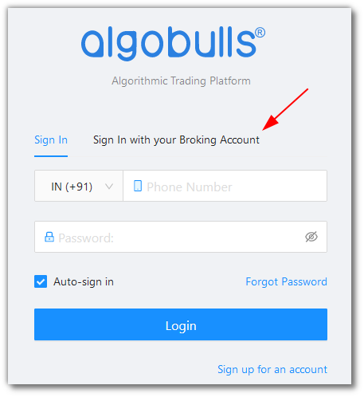
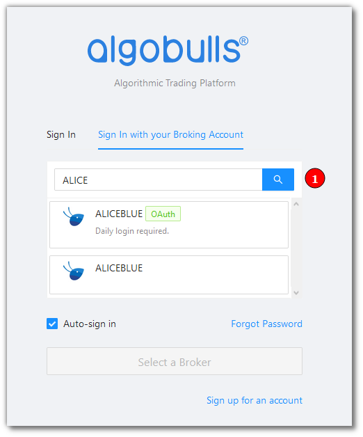
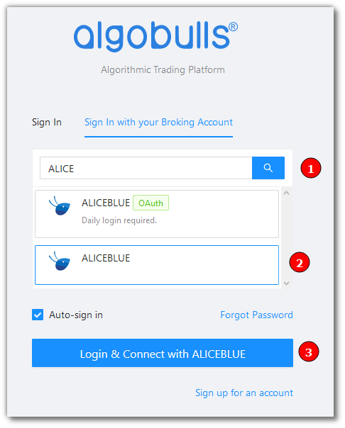
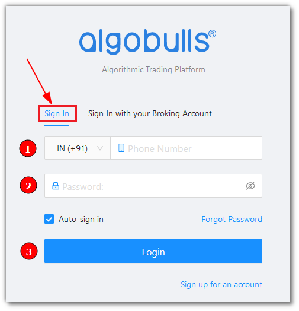
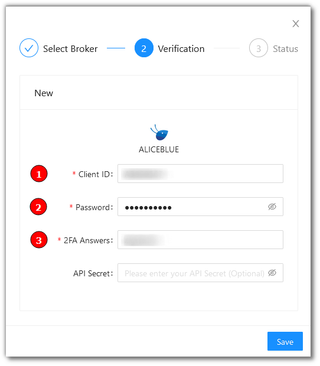
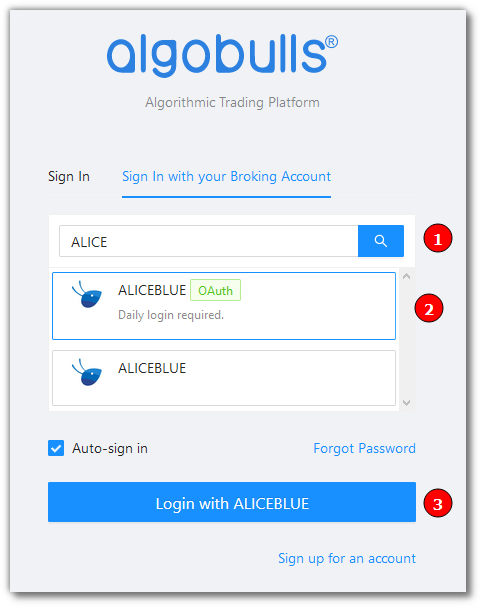
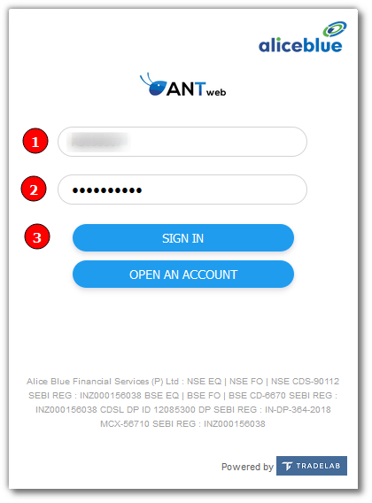
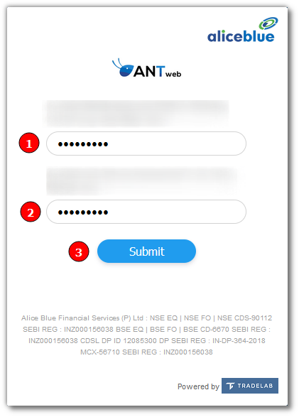
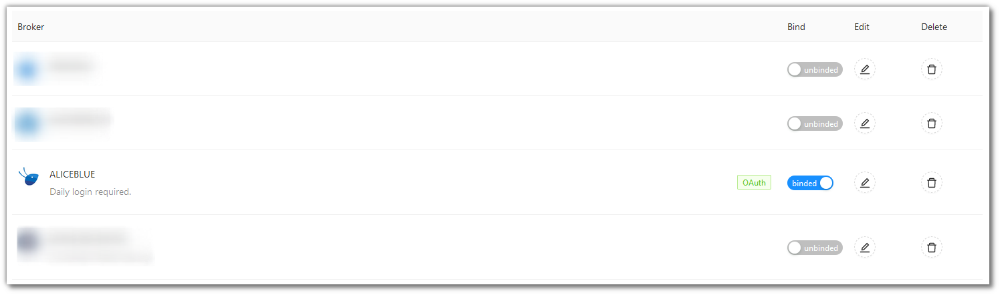

# AliceBlue
---
* Official Website: [https://aliceblueonline.com/](https://aliceblueonline.com/)

* Trading Website: [https://ant.aliceblueonline.com/](https://ant.aliceblueonline.com/)

* Markets Supported: India

## Login and Setup the AliceBlue Broking Details 
---

This section will take you through the step wise instructions to login, setup and bind your broker into your AlgoBulls Account.

### Before you Start
---
Keep the following information available before you start:

1) Algobulls Account Credentials - Phone Number and Password

2) Broking Account Credentials - ClientID, Password and 2FA Answers 

### Let's Start
---
* Visit the AlgoBulls [Login Page](https://app.algobulls.com/user/login)
* Click on `Sign In with your Broking Account`

* Type the first few characters of your Broker Name as shown in Step 1 below

### Login with Username and Password
---
* To Login with Username and Password, select the option as shown in Step 2 below. Then click the button as shown in Step 3

* Login to you AlgoBulls account. Provide data for the following fields and then click `Login` as shown in Step 3 below:

1) Phone Number: The Phone Number you have used to Register/Sign-Up to the AlgoBulls website.

2) Password: The Password you have given to Register/Sign-Up to the AlgoBulls website.

* You will be re-directed to the Verification Page. Provide data for the following fields:

1) Client ID: The ID given to you by your broker
   
2) Password: The password given to you by the broker
   
3) 2FA Answers: The answer you have given for the security question

* If the verification is successful, you will see the following message

### Login with OAuth Credentials
---
* To Login with OAuth, select the option as shown in Step 2 below. Then click the button as shown in Step 3

* You will be re-directed to the broker login page. Provide data for the following fields:

1) Client ID: The ID given to you by your broker
   
2) Password: The password given to you by the broker
   
3) Click `SIGN IN`

* Give the 2FA Answers for the questions asked in as shown Step 1 and Step 2 below. Then click the `Submit` button as shown in Step 3 

* Once your sign in is successful, you will re-directed back to the AlgoBulls website

## Bind your Broker Account
---
* Visit the AlgoBulls [Broker Settings Page](https://app.algobulls.com/account/broking)

* Bind your account using the Toggle button

