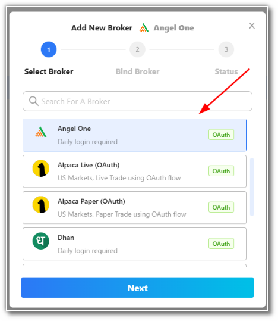
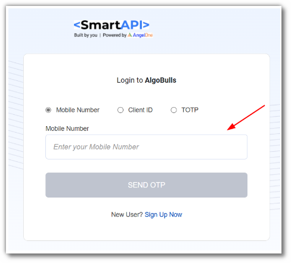
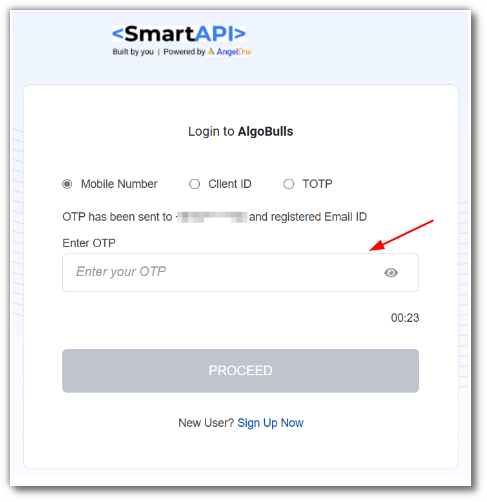
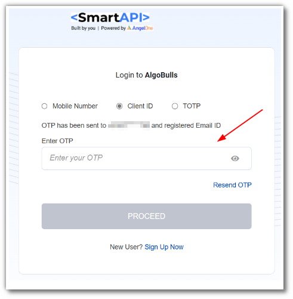
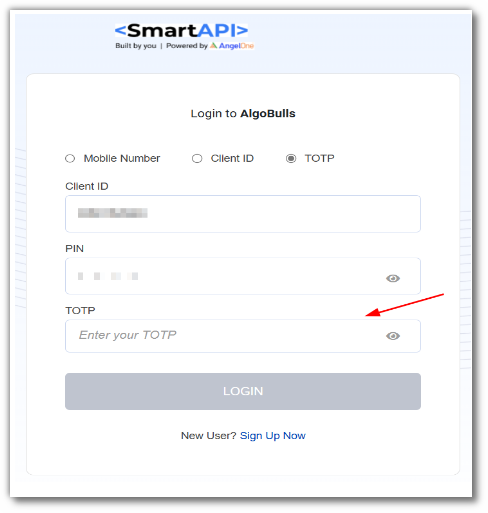
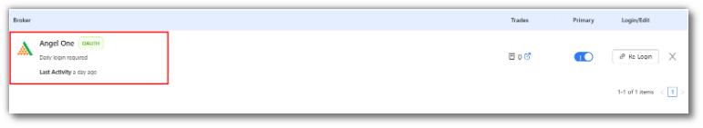

# Angel Broking
---
* Official Website: [https://www.angelbroking.com/](https://www.angelbroking.com/)

* Trading Website: [https://trade.angelbroking.com/](https://trade.angelbroking.com/)

* Markets Supported: India

## Important Points to Note

To enable the TOTP please [click here](https://smartapi.angelbroking.com/enable-totp).

## 1. Login and Set up your Angel Broking Account 
---
This section will take you through the step-wise instructions to log in, setup, and bind your broker into your AlgoBulls Account.

### i. Before you Start
---
Keep the following information available before you start:

1) AlgoBulls Account Credentials

* Phone Number

* Password

2) Broking Account Credentials

* User ID
      
* Password
      
* API Key

* API Secret

!!! note
    * To know more about API Key and Secret, see the following video (Only for Non-Oauth based login):

<iframe width="560" height="315" src="https://www.youtube.com/embed/75vlLNRD3IA" frameborder="0" allow="accelerometer; autoplay; clipboard-write; encrypted-media; gyroscope; picture-in-picture" allowfullscreen></iframe>

### ii. Let's Start
---
* Visit the AlgoBulls [Login Page](https://app.algobulls.com/user/login) and click on **login with your Broking Account**.

* Type the first few characters of your Broker Name.

As seen here, Angel Broking supports OAuth Method of logging in:

### iii. Login with OAuth Method
---
* You will be re-directed to the broker login page. Provide data for the following fields:

(1). Mobile Number: Enter registered Mobile Number with Angel One.

* Click on send OTP

* Enter OTP and click on PROCEED
* If the sign-in is successful, you will re-directed back to the AlgoBulls website.

(2). Client ID: Enter Client ID provided by Angel One.

* Click on send OTP

* Enter OTP and click on PROCEED
* If the sign-in is successful, you will re-directed back to the AlgoBulls website.

(3). TOTP: Enter Client ID and the PIN you use to login to Angel One.you need to add the TOTP which can be found in the authenticator app used to set up the TOTP.

* click on LOGIN
* If the sign-in is successful, you will re-directed back to the AlgoBulls website.
  
(4). Once the broker binding process is completed you can see your broker in you Algobulls account.

## 2. Support
---
For Help and Support, contact us on +91 80692 30300 or [email us](mailto:support@algobulls.com).
