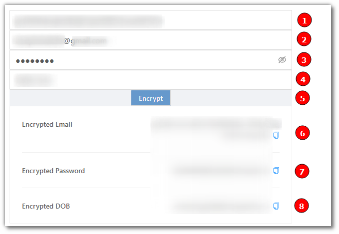
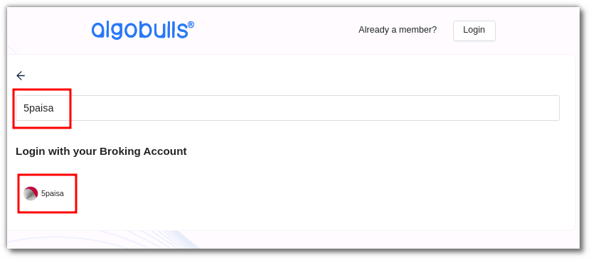
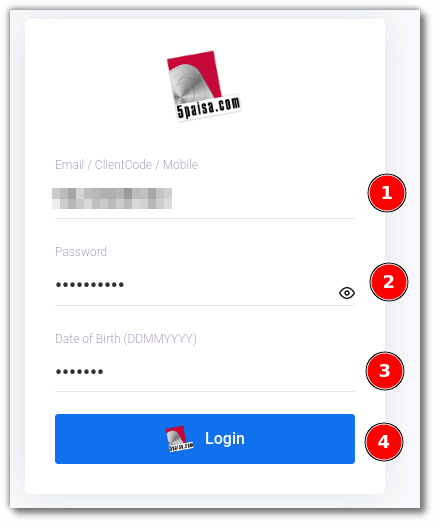
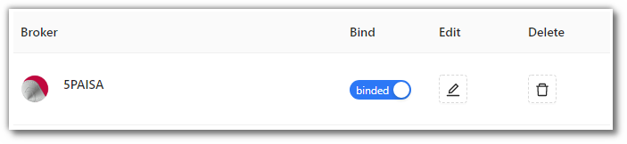

# 5PAISA
---

* Official Website: [https://www.5paisa.com/](https://www.5paisa.com/)

* Trading Website: [https://login.5paisa.com/](https://login.5paisa.com/)

* Markets Supported: India

## Login and Set up your 5PAISA Account 
---
This section will take you through the step-wise instructions to log in, setup, and bind your broker into your AlgoBulls Account.

### Before you Start
---
Keep the following information available before you start:

1) AlgoBulls Account Credentials

* Phone Number

* Password

2) Broking Account Credentials

* Encrypted EMail

* Encrypted Password

* Encrypted DOB

### Encrypting your Credentials
---
To encrypt your credentials, perform the follwing steps:

* Visit [https://www.5paisa.com/developerapi/authorization](https://www.5paisa.com/developerapi/authorization)

(1). Enter your encryption key here

(2). Enter your email

(3). Enter your password

(4). Enter your DOB in YYYYMMDD format (If your DOB is 30-11-2020, then type 20201130 in the given field)

(5). CLick `Encrypt` button

(6). Copy the Encrypted Email 

(7). Copy the Encrypted Password

(8). Copy the Encrypted DOB

### Let's Start
---
* Visit the AlgoBulls [Login Page](https://app.algobulls.com/user/login) and click on `login with your Broking Account`

* Type the first few characters of your Broker Name

* Select the `5PAISA` broker

* You will be re-directed to the Verification Page. Provide data for the following fields:

(1). EMail/ClientCode/Mobile: Provide any one of the following generated by you

(2). Password: The Password generated by you

(3). DOB: The DOB generated by you

* If the sign-in is successful, you will re-directed back to the AlgoBulls website

## Bind your Broking Account
---
The following steps will help you to make sure you have binded your broker account

* Visit the AlgoBulls [Broker Settings Page](https://app.algobulls.com/account/broking)

* Bind your account using the Toggle button marked below

## Support
---
For Help and Support, contact us on +91 80692 30300 or [email us](mailto:support@algobulls.com).
