# Fyers
---

* Official Website: [https://login.fyers.in/](https://login.fyers.in/)

* Trading Website: [https://login.fyers.in/](https://login.fyers.in/)

* Markets Supported: India

## 1. Important Point(s) to Note

---

* It is required to login **once** daily (at the start of the trading day).

## 2. Login and Set up your Fyers Account
---
This section will take you through the step-wise instructions to log in, setup, and bind your broker into your AlgoBulls Account.

### i. Before you Start
---
Keep the following information available before you start:

1) AlgoBulls Account Credentials

* Phone Number

* Password

2) Broking Account Credentials

* Fyers App Key

* Fyers Secret Key

* Fyers Pin

!!! Note
    To get get the App Key and Secret Key, you'll have to create an [App](https://myapi.fyers.in/docsv3#tag/App-Creation/Individual-Apps) in your Fyers account.

### ii. One-Time Activity
---
* Visit the AlgoBulls [Login Page](https://app.algobulls.com/user/login).

[//]: # (* If you do not see your broker name, then click on **+ x more** where x is the number of brokers.)

* If you do not see your broker name, then type **Fyers** in the Search Box. and then click on the Broker Link that shows **1-time-activity** when hovered over it.

[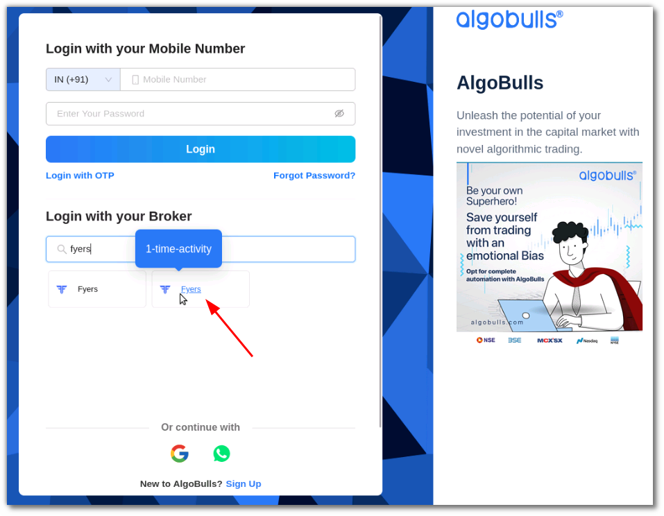 ](imgs/fyers/one_time_activity.png)

* Login to your AlgoBulls account.

* Once you login you'll be redirected to the with the Fyers one time activity selected. Click on **Next**.

[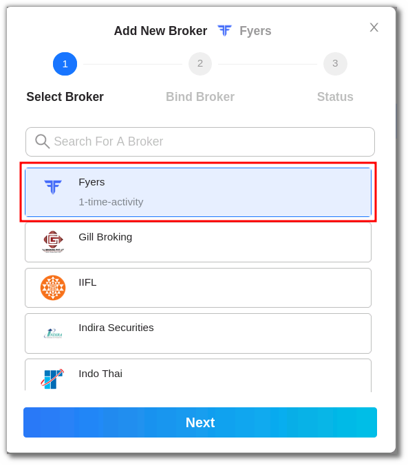 ](imgs/fyers/one_time_activity_selected.png)

* Enter your Fyers App Key in the **CLIENT_API_KEY** field and Fyers Secret Key in the **CLIENT_SECRET_KEY** field. Click on **Confirm**.

[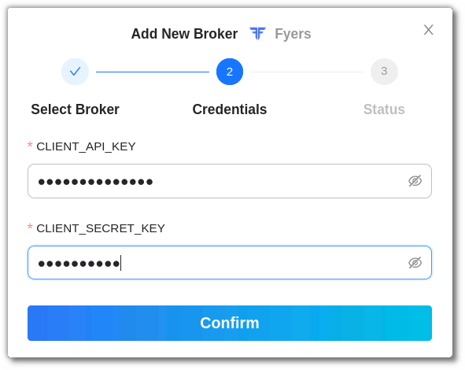 ](imgs/fyers/one_time_activity_creds.png)

* Broker is binded to your account.

[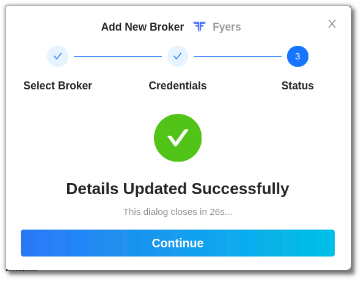 ](imgs/fyers/non_oauth_broker_added.png)

* You can see the broker added in the Broking Details section.

[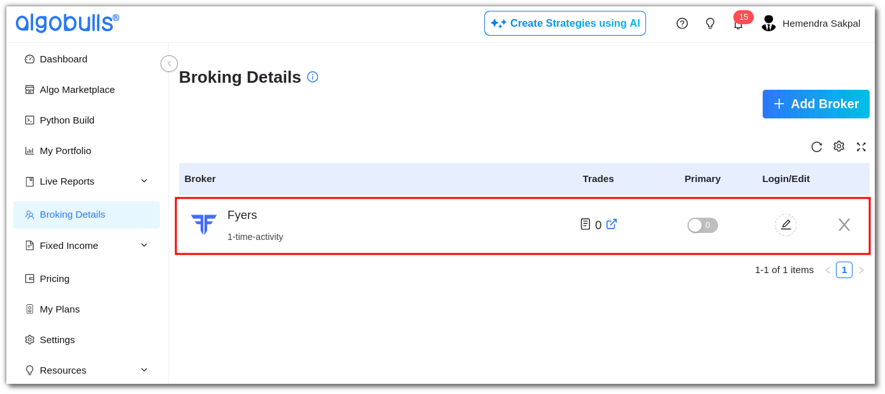 ](imgs/fyers/non_oauth_broker_visible.png)

### iii. Daily Activity (Login)

* Now click on **Add Broker**, type **Fyers** in the search bar and select the broker.

[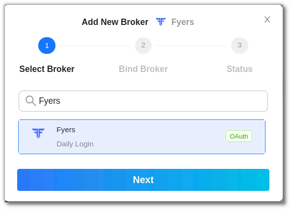 ](imgs/fyers/select_oauth_broker.png)

* You'll be redirected to the **Fyers** login page, add your mobile number and click on **Continue**.

[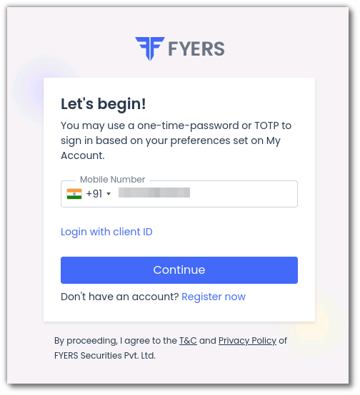 ](imgs/fyers/oauth_login_1.png)

* Type the OTP you received and click on **Confirm OTP**.

[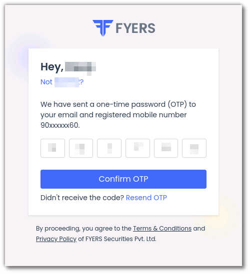 ](imgs/fyers/oauth_login_2.png)

* Enter your Fyers account four digit pin and click on **Sign in**.

[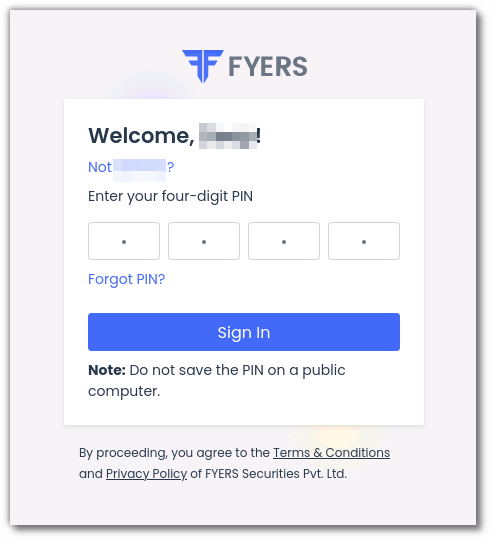 ](imgs/fyers/oauth_login_3.png)

* You'll be redirected back to the AlgoBulls Broking Details section where you can see the broker added.

[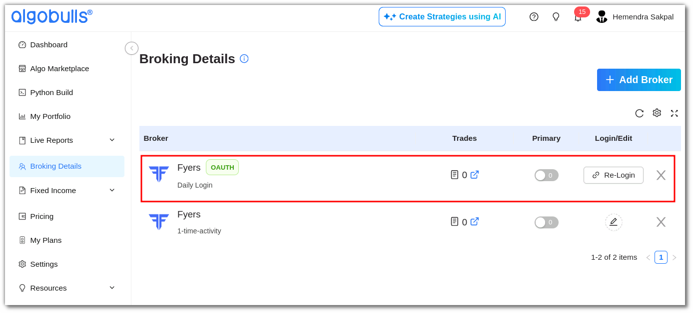 ](imgs/fyers/oauth_broker_added.png)

### iv. Another way to login

#### a. One-Time Activity

* Login to your AlgoBulls account

* Go to the **Broking Details** section and click on **Add Broker**.

* Select the Non OAuth broker and click **Next**.

[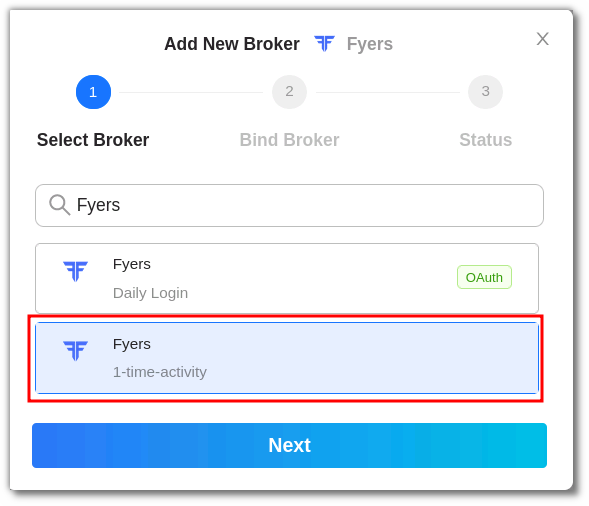 ](imgs/fyers/search_broker_nonoauth.png)

* Enter your Fyers App Key in the **CLIENT_API_KEY** field and Fyers Secret Key in the **CLIENT_SECRET_KEY** field. Click on **Confirm**.

* Broker is binded to your account.

#### b. Daily Activity (Login)

* Click on **Add Broker**, type **Fyers** in the search bar and select the broker.

* You'll be redirected to the **Fyers** login page, add your mobile number and click on **Continue**.

* Type the OTP you received and click on **Confirm OTP**.

* Enter your Fyers account four digit pin and click on **Sign in**.

* You'll be redirected back to the AlgoBulls Broking Details section where you can see the broker added.

## 3. Support
---

For Help and Support, contact us on +91 80692 30300 or email us.