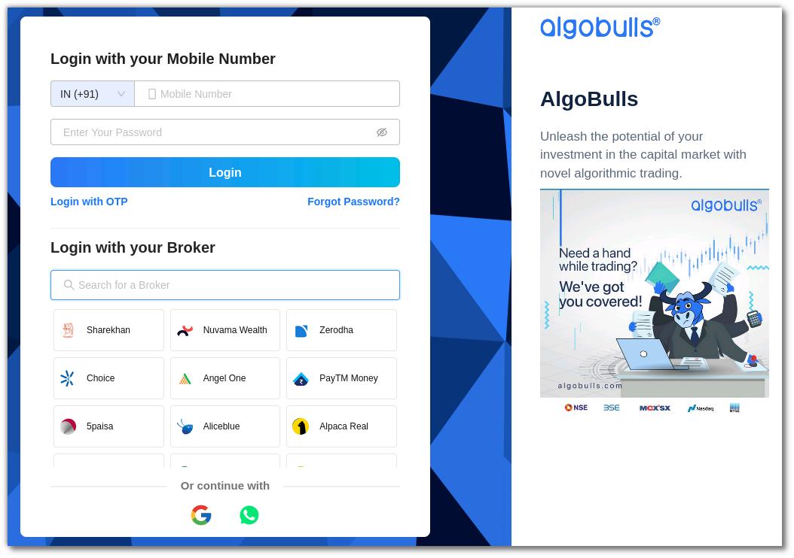
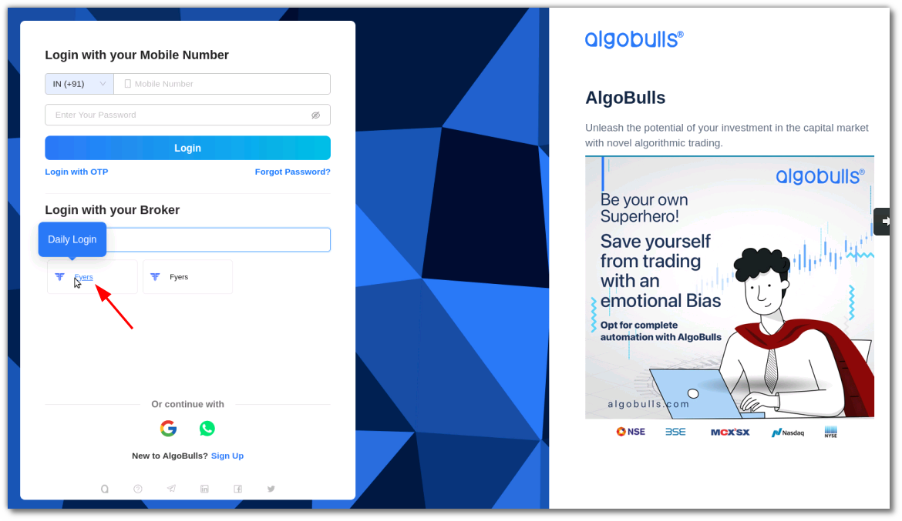

# Goodwill
---

* Official Website: [https://www.moneysukh.com/](https://login.fyers.in/)

* Trading Website: [https://www.moneysukh.com/](https://login.fyers.in/)

* Markets Supported: India

## 1. Important Point(s) to Note
===
* It is required to login **once** daily (at the start of the trading day).

## 2. Login and Set up your Fyers Account
---
This section will take you through the step-wise instructions to log in, setup, and bind your broker into your AlgoBulls Account.

### i. Before you Start
---
Keep the following information available before you start:

1) AlgoBulls Account Credentials

* Phone Number

* Password

2) Broking Account Credentials

* Fyers App Key

* Fyers Secret Key

* Fyers Pin

### ii. Let's Start
---
* Visit the AlgoBulls [Login Page](https://app.algobulls.com/user/login).

[//]: # (* If you do not see your broker name, then click on **+ x more** where x is the number of brokers.)

* If you do not see your broker name, then type **Fyers** in the Search Box. and then click on the Broker Link that shows **1-time-activity** when hovered over it.

* Login to your AlgoBulls account.

* Once you login you'll be redirected to the with the Fyers one time activity selected. Click on **Next**.

* Enter your Fyers App Key in the **CLIENT_API_KEY** field and Fyers Secret Key in the **CLIENT_SECRET_KEY** field. Click on **Confirm**.

* Broker is binded to your account.

* You can see the broker added in the Broking Details section.

!!! Note
    This is a one time activity.

### iii. OAuth binding

* Now click on **Add Broker**, type **Fyers** in the search bar and select the broker.

* You'll be redirected to the **Fyers** login page, add your mobile number and click on **Continue**.

* Type the OTP you received and click on **Confirm OTP**.

* Enter your Fyers account four digit pin and click on **Sign in**.

* You'll be redirected back to the AlgoBulls Broking Details section where you can see the broker added.

!!! Note
    * Next time before logging in you can search for the broker and click on the Daily Login tab this will take to the broker login page.
    
    

    * You have to do the OAuth login everyday 

### iv. Another way to login

* Login to your AlgoBulls account

* Go to the **Broking Details** section and click on **Add Broker**.

* Select the Non OAuth broker and click **Next**.

* Enter your Fyers App Key in the **CLIENT_API_KEY** field and Fyers Secret Key in the **CLIENT_SECRET_KEY** field. Click on **Confirm**.

* Broker is binded to your account.

* You can see the broker added in the Broking Details section.

!!! Note
    This is a one time activity

* Now click on **Add Broker**, type **Fyers** in the search bar and select the broker.

* You'll be redirected to the **Fyers** login page, add your mobile number and click on **Continue**.

* Type the OTP you received and click on **Confirm OTP**.

* Enter your Fyers account four digit pin and click on **Sign in**.

* You'll be redirected back to the AlgoBulls Broking Details section where you can see the broker added.

!!! Note
    * Next time before logging in you can search for the broker and click on the Daily Login tab this will take to the broker login page.
    
    

    * You have to do the OAuth login everyday 
