# ICICI Securities
---

* Official Website: [https://www.icicidirect.com/](https://www.icicidirect.com/)

* Trading Website: [https://www.icicidirect.com/](https://www.icicidirect.com/)

* Developer Website: [https://api.icicidirect.com/apiuser/home](https://api.icicidirect.com/apiuser/home)

* Markets Supported: India

## Important Points to Note
---
* It is required to login **once** daily (at the start of the trading day) using the steps given in the [Daily Activity](#daily-activity-login) section

## Login and Setup your ICICI Securities Account 
---
This section will take you through the step-wise instructions to log in, setup, and bind your broker into your AlgoBulls Account.

### Before you Start
---
Keep the following information available before you start:

1) Developer and Broking Account Credentials at [https://api.icicidirect.com/apiuser/home](https://api.icicidirect.com/apiuser/home)

* User ID

* Password

* PAN No./ DOB 

### One-Time Activity
---
This activity will help you to link your broking account to the AlgoBulls account via the oauth method.

!!! Note
    * If you have done this activity once before, then you can directly skip to the [Daily Activity](#daily-activity-login) section

* Visit [https://api.icicidirect.com/apiuser/home](https://api.icicidirect.com/apiuser/home)

[ 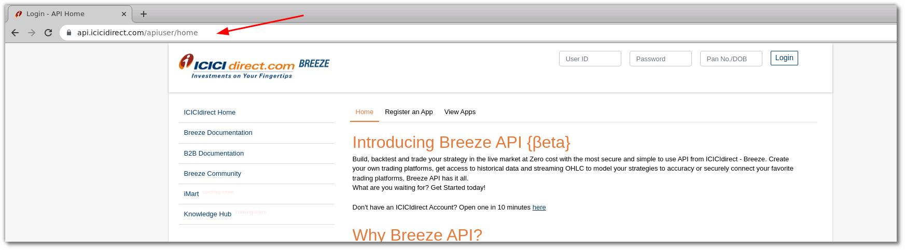 ](imgs/icici_securities/home.png)

* Enter your User ID, Password and PAN No./DOB. Click the `Login` button

[ 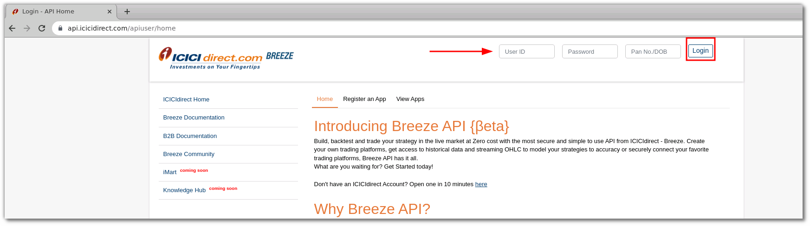 ](imgs/icici_securities/login.png)

* Click the `Register an app` button

[ 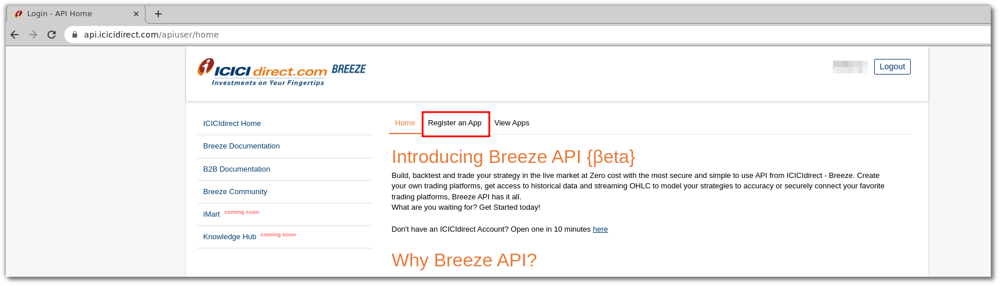 ](imgs/icici_securities/register_app.png)

* On the `Register an app` page, fill the following fields:

    * App name: Give the app name. Example: icici_algobulls
    * Redirect URL: Give the value `https://app.algobulls.com/loading`
    
* Click the `Submit` button
* 
[ 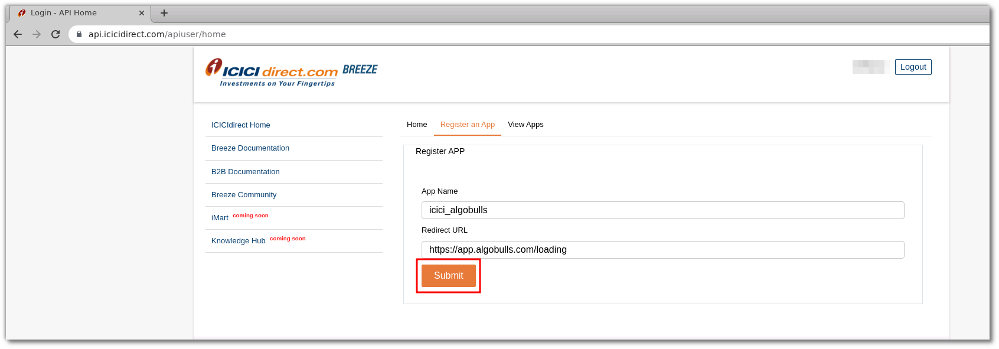 ](imgs/icici_securities/submit.png)


* Now Copy and Save APP key and Secret Key

[ 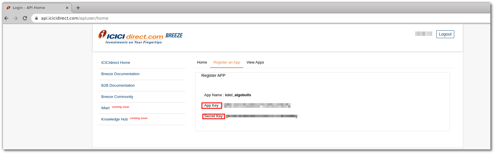 ](imgs/icici_securities/save.png)


* Now click on the 'View Apps' button

[ 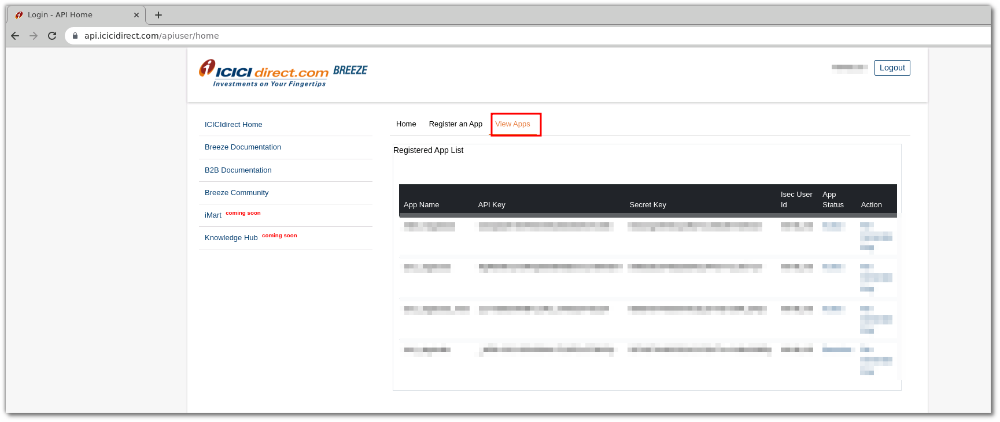 ](imgs/icici_securities/view_apps.png)


* Current App Status is 'Deactive' click on it to activate

[ 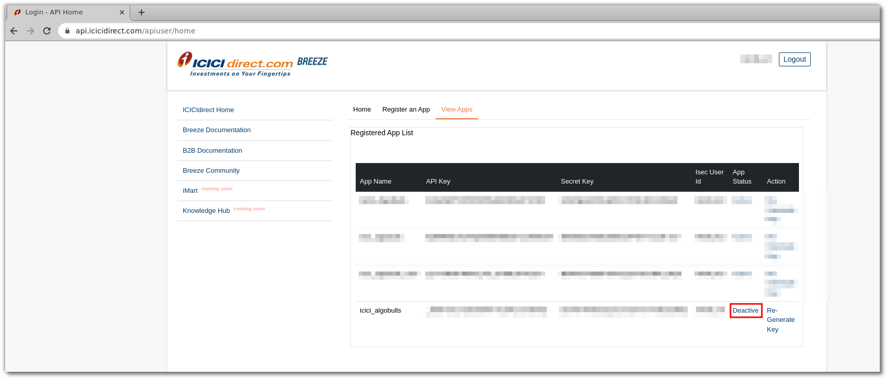 ](imgs/icici_securities/deactive.png)


* Click 'Yes' to confirm

[ 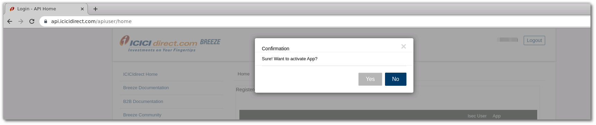 ](imgs/icici_securities/click_yes.png)


* App Status changes to 'Active'

[ 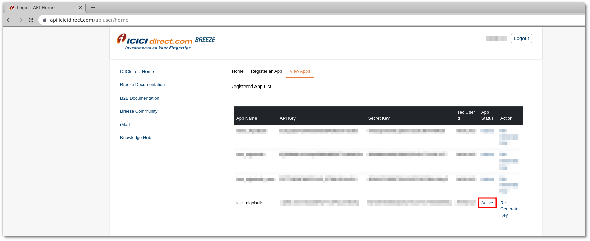 ](imgs/icici_securities/active.png)


### Daily Activity (Login)
---

!!! Note
    * Perform the following steps at the start of every trading day

* Visit the AlgoBulls [Login Page](https://app.algobulls.com/user/login) and click on `login with your Broking Account`

[ 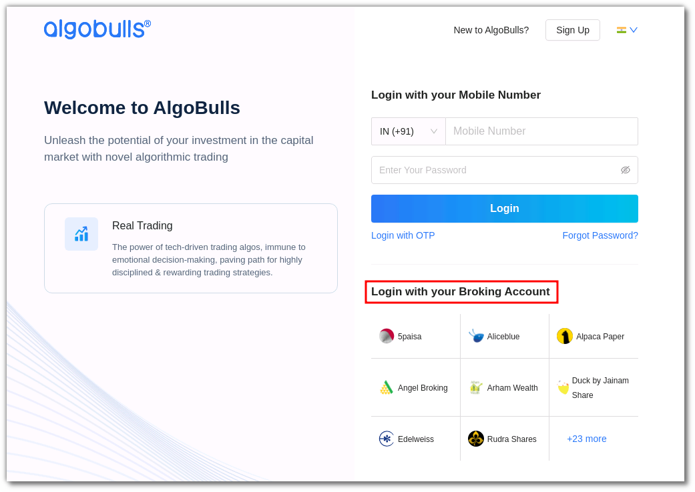 ](imgs/icici_securities/algo_home.png)

(1). Type the first few characters of your Broker Name
(2). Select the `ICICI Securities` broker
(3). Click on the `Login with ICICI Securities` button

[ 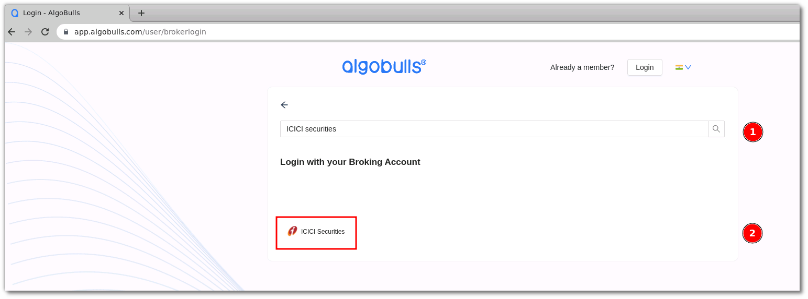 ](imgs/icici_securities/select_broker.png)

# DONE TILL HERE.

Now paste your saved API key in the URL

Example: If the API key is uS3r@piKey and the URL is:

```html
https://api.icicidirect.com/apiuser/login?api_key=placeapikeyhere
https://kite.zerodha.com/connect/login?api_key=pleaseenteryourapikey
```

[  ](imgs/icici_securities/zerodha_oauth_2.png)

then the new URL will be:

```html
https://kite.zerodha.com/connect/login?api_key=uS3r@piKey
```

[  ](imgs/icici_securities/zerodha_oauth_3.png)

Press Enter after modifying the URL with your API key

Now provide data for the following fields:

(4). User ID: The ID given to you by your broker

(5). Password: The password given to you by the broker

(6). Click `Login` button

[  ](imgs/icici_securities/zerodha_oauth_4.png)

(7). PIN: The PIN given to you by the broker

(8). Click `Continue` button

[ 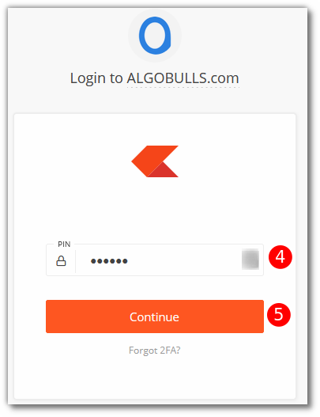 ](imgs/icici_securities/zerodha_oauth_5.png)

!!! Note

* If you are facing issues with login, try the following steps:

    * Open a new tab

    * Visit [https://kite.zerodha.com/](https://kite.zerodha.com/)

    * Login with your credentials

    * Logout

    * Close the tab

    * Perform steps (1). to (8). again

## Bind your Broking Account
---
The following steps will help you to make sure you have binded your broker account

* Visit the AlgoBulls [Broker Settings Page](https://app.algobulls.com/account/broking)

* Bind your account using the Toggle button marked below

[  ](imgs/icici_securities/zerodha_binded.png)

## Important Points to Note
---
* It is required to login **once** daily (at the start of the trading day) using the steps given in the [Daily Activity](#daily-activity-login) section

## Support
---
For Help and Support, contact us on +91 80692 30300 or [email us](mailto:support@algobulls.com).
