# Upstox
---

* Official Website: [https://login.upstox.com/](https://login.upstox.com/)

* Trading Website: [https://login.upstox.com/](https://login.upstox.com/)

* Markets Supported: India

## 1. Important Point(s) to Note

---

* It is required to login **once** daily (at the start of the trading day).

## 2. Login and Set up your Upstox Account
---
This section will take you through the step-wise instructions to log in, setup, and bind your broker into your AlgoBulls Account.

### i. Before you Start
---
Keep the following information available before you start:

1) AlgoBulls Account Credentials

* Phone Number

* Password

2) Broking Account Credentials

* Mobile Number

* App Key

* App Secret

* 6-digit Pin

!!! Note
    To get the App Key and Secret Key, you'll have to create an [App](https://account.upstox.com/developer/apps) in your Upstox account. Please follow the below steps to create an app in your Upstox account.

### ii. App Creation

* Login to your Upstox account and click on the **App** tab and click on **+New app**.

[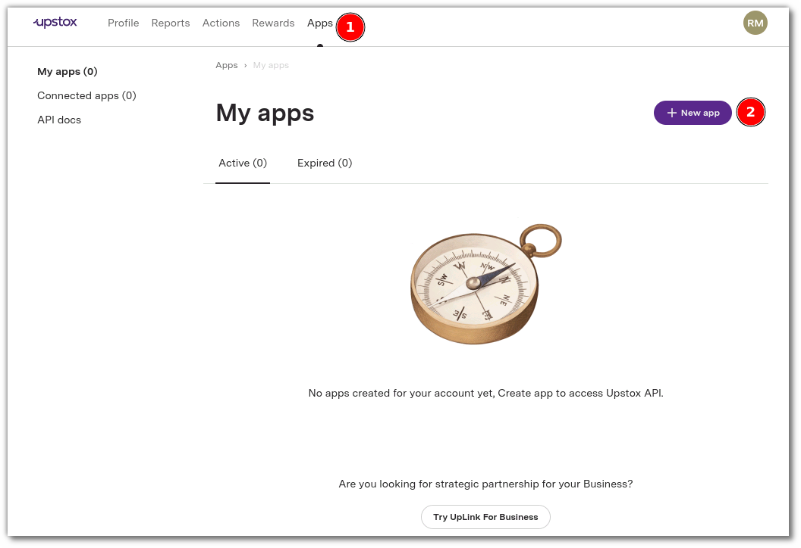 ](imgs/upstox/app_tab.png)

* Give the **App Name** as **AlgoBulls**
* Give the **Redirect URL** as [https://app.algobulls.com/loading](https://app.algobulls.com/loading)

1. Check the **Terms and Conditions** checkbox.

2. Click on **Continue** button at the bottom.

[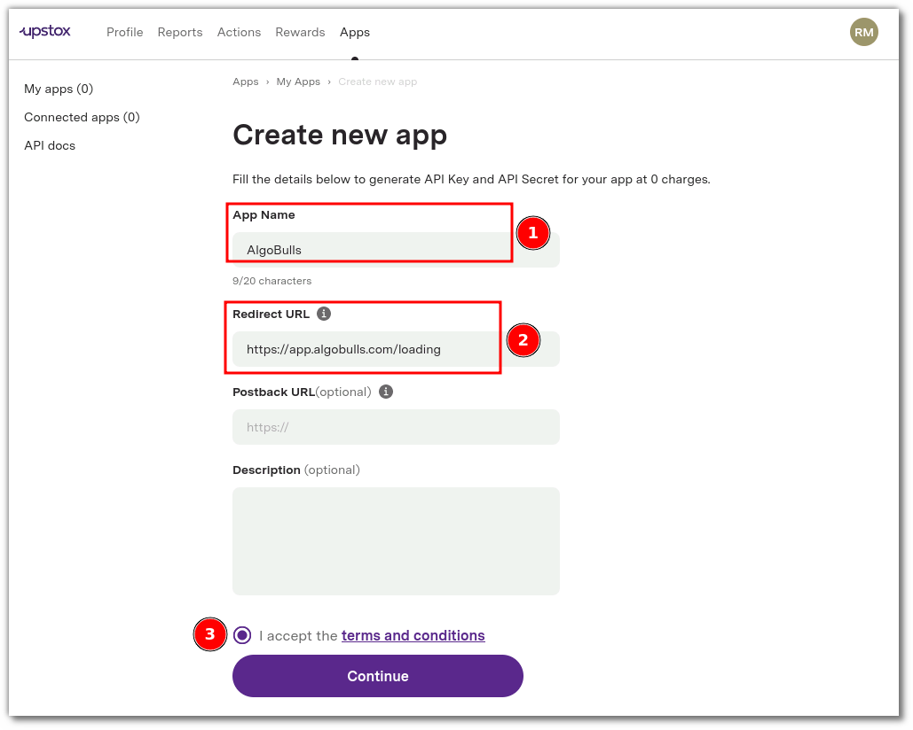 ](imgs/upstox/app_details.png)

3. Click on **Confirm Plan**.

[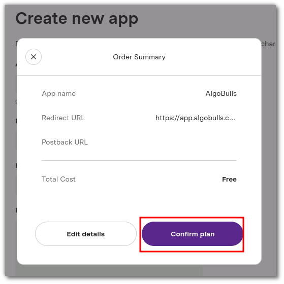 ](imgs/upstox/app_confirmation.png)

4. Your app is created successfully.

[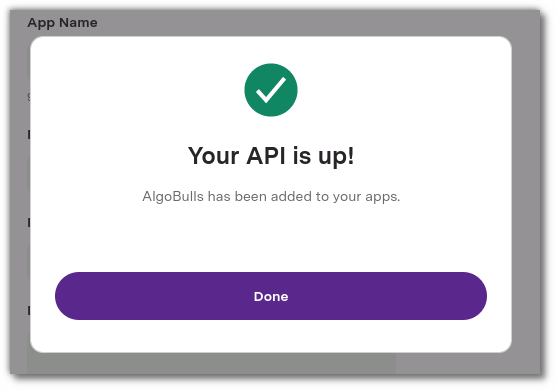 ](imgs/upstox/app_created_successfully.png)

* Once the app is created, click the copy icon to copy the App Key and Secret Key for the next steps. You can also edit/delete the app if required.  

[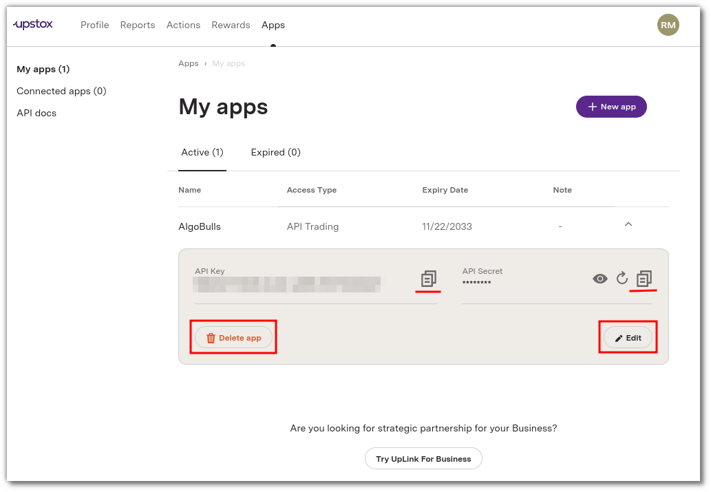 ](imgs/upstox/copy_creds.png)

### iii. One-Time Activity
---
* Visit the AlgoBulls [Login Page](https://app.algobulls.com/user/login).

* If you do not see your broker name, then type **Upstox** in the Search Box. and then click on the Broker Link that shows **1-time-activity** as the tooltip.

[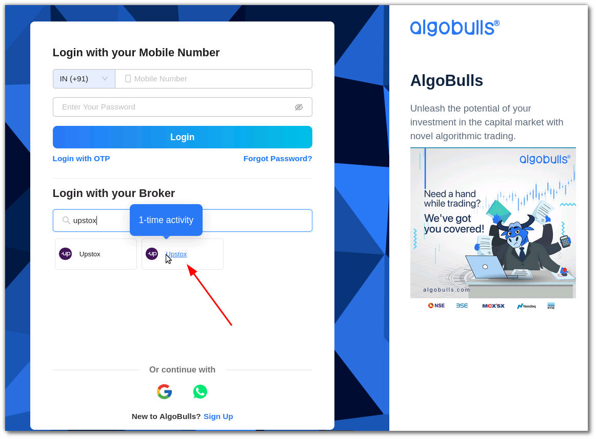 ](imgs/upstox/select_one_time_activity.png)

* Login to your AlgoBulls account.

* Once you login you'll be redirected to the pane with the Upstox 1-time activity selected. Click on **Next**.

[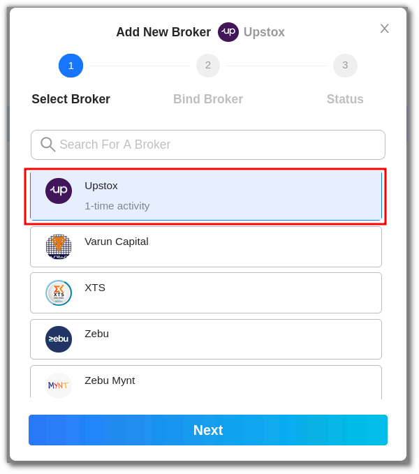 ](imgs/upstox/select_broker.png)

* Enter your App ID in the **CLIENT_API_KEY** field and your Secret ID in the **CLIENT_SECRET_KEY** field. Click on **Confirm**.

[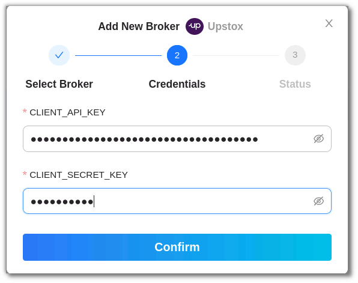 ](imgs/upstox/add_creds.png)

* Your 1-time activity is complete.

[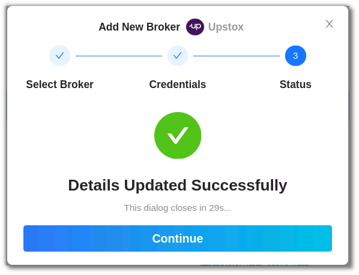 ](imgs/upstox/broker_added_successfully.png)

* You can see the broker added in the Broking Details section. Click on **Add Broker** again.

### iv. Daily Activity (Login)

* Now click on **Add Broker**, type **Upstox** in the search bar and click on the Broker Link that shows **OAuth** to the right hand side of the option.

[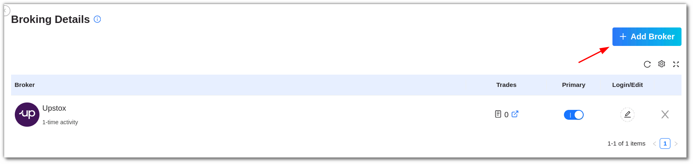 ](imgs/upstox/daily_activity_add_broker.png)

or if you haven't logged into the website, then search **Upstox** and select **Daily Login** and login into your AlgoBulls account.

[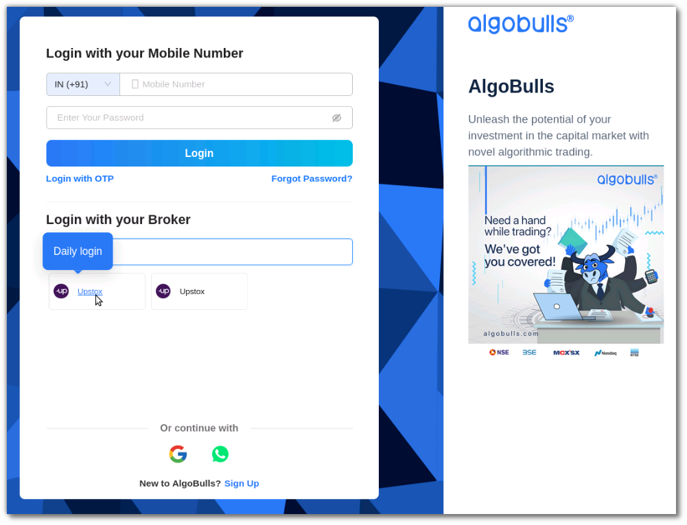 ](imgs/upstox/daily_login.png)

* You'll be redirected to the **Upstox** login page. Enter your mobile number and click on **Get OTP**.

[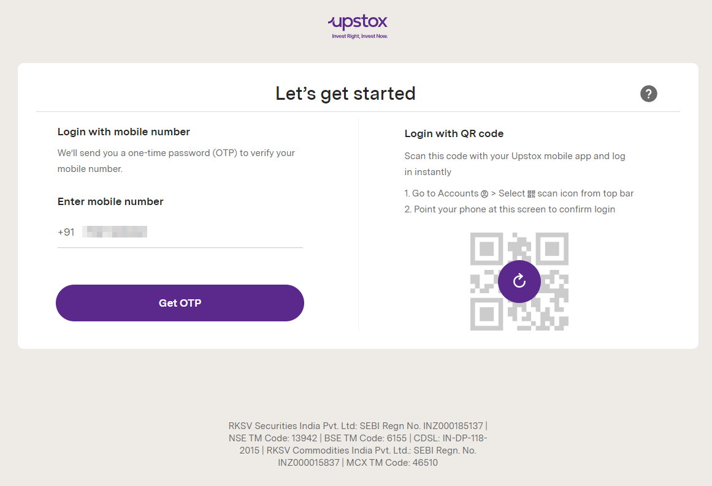 ](imgs/upstox/enter_mobile_number.png)

* Type the OTP that you receive and click on **Continue**.

[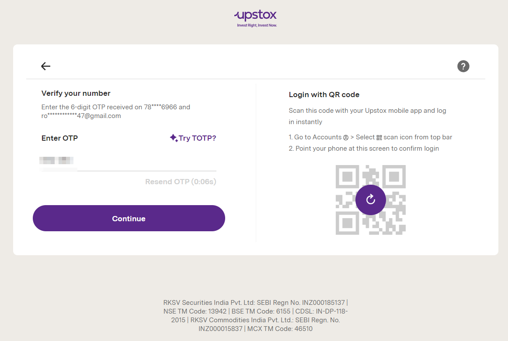 ](imgs/upstox/enter_otp.png)

* Enter your 6-digit Pin and click on **Continue**.

[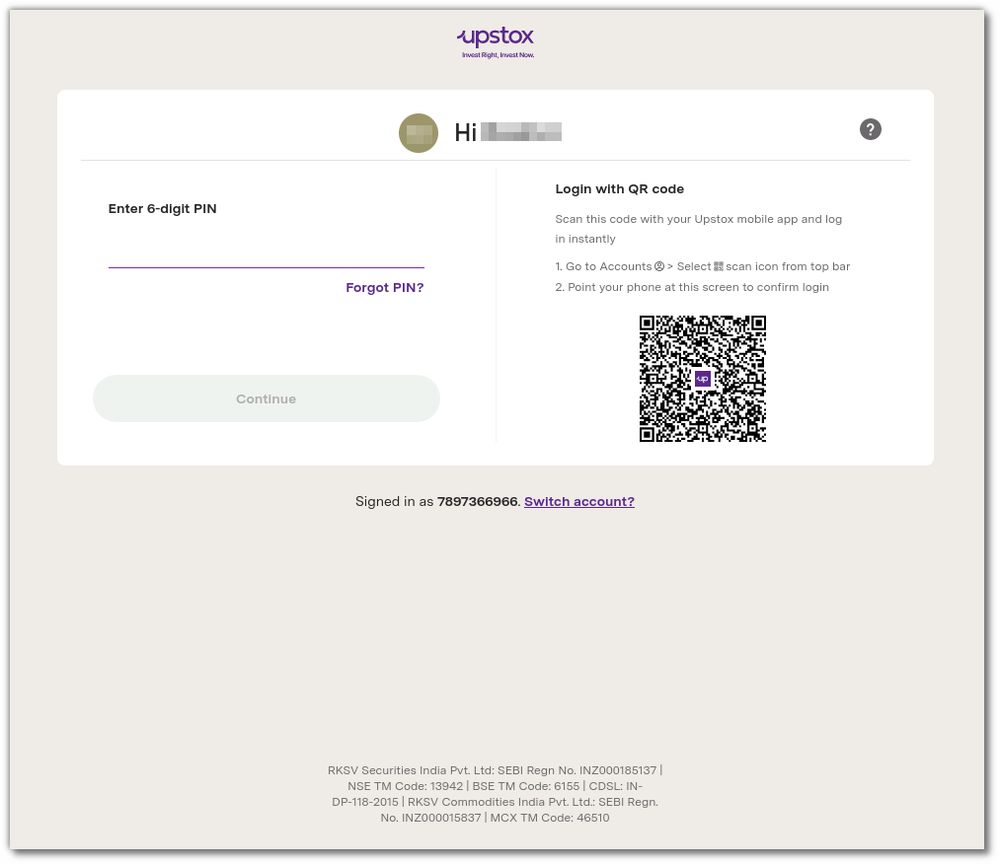 ](imgs/upstox/enter_pin.png)

* You'll be redirected back to the AlgoBulls Broking Details section where you can see the broker added.

[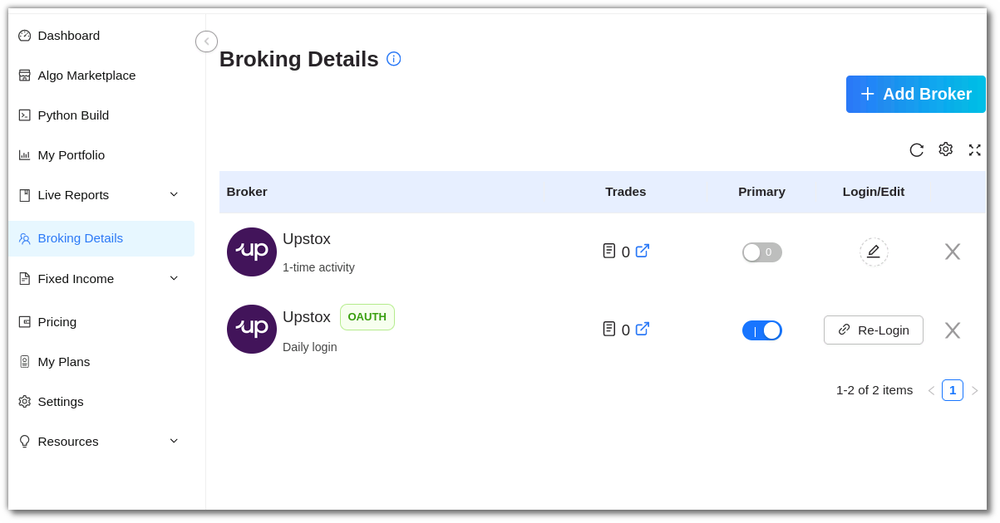 ](imgs/upstox/oauth_broker_added.png)

!!! Note
    Ensure that the OAuth entry is marked as primary.
    

### v. Another way to login

#### a. One-Time Activity

* Login to your AlgoBulls account

* Go to the **Broking Details** section and click on **Add Broker**.

* Select the Non OAuth broker and click **Next**.

* Enter your App Key in the **CLIENT_API_KEY** field and Secret Key in the **CLIENT_SECRET_KEY** field. Click on **Confirm**.

* Broker is binded to your account.

#### b. Daily Activity (Login)

* Click on **Add Broker**, type **Upstox** in the search bar and select the **OAuth** broker.

[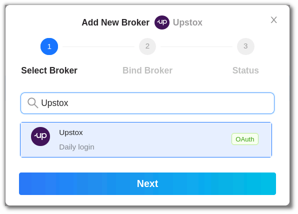 ](imgs/upstox/select_broker_2.png)

* You'll be redirected to the **Upstox** login page, Enter your mobile number and click on **Continue**.

* Type the OTP that you receive and click on **Continue**.

* Enter your 6-digit Pin and click on **Continue**.

* You'll be redirected back to the AlgoBulls Broking Details section where you can see the broker added.

## 3. Support
---
For Help and Support, contact us on +91 80692 30300 or [email us](mailto:support@algobulls.com).