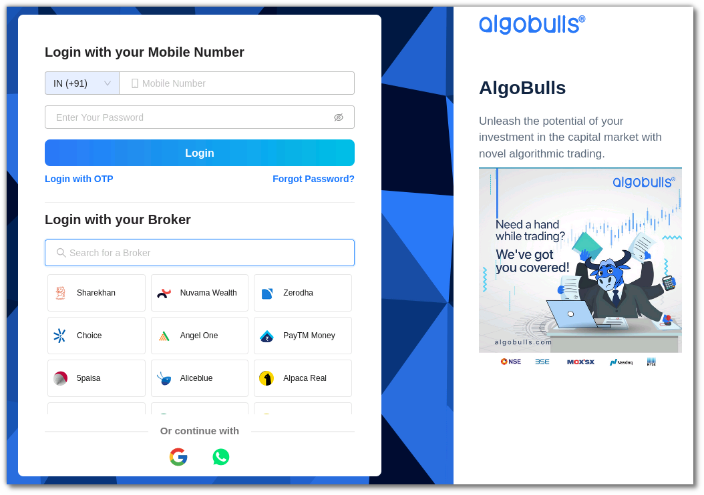
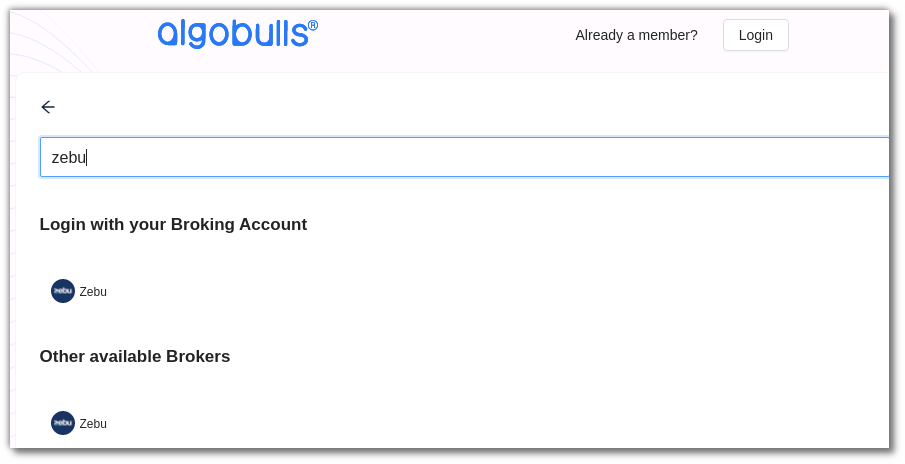
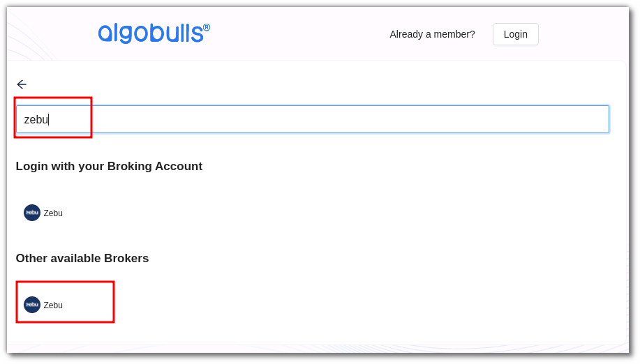
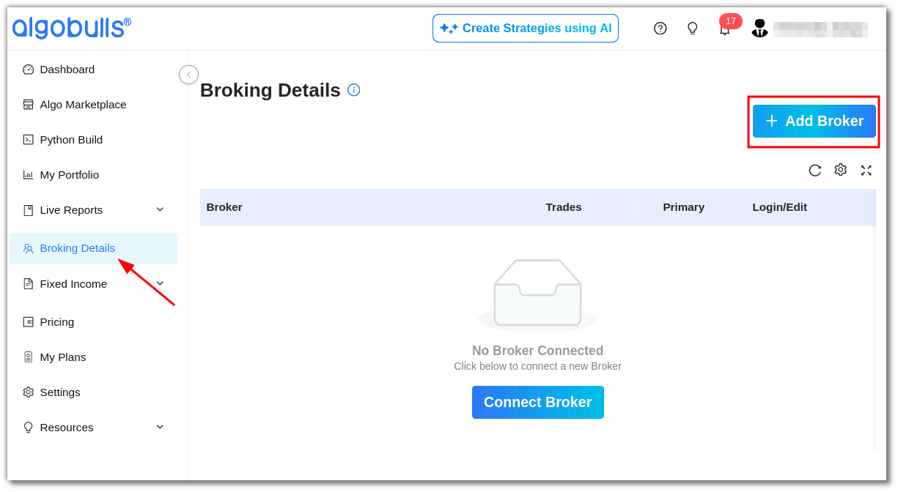
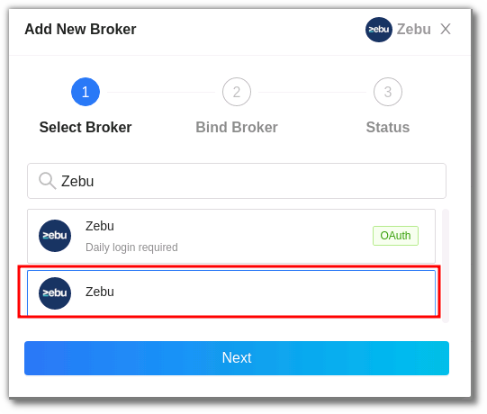
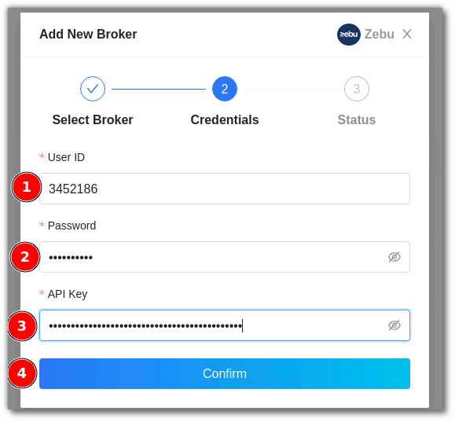
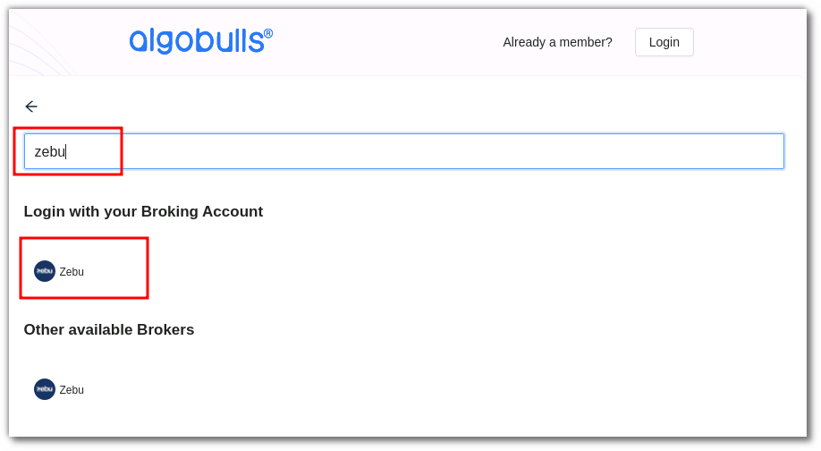
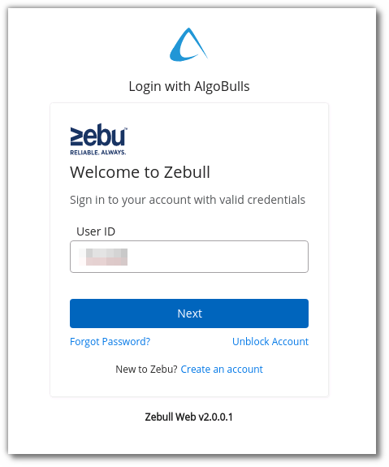
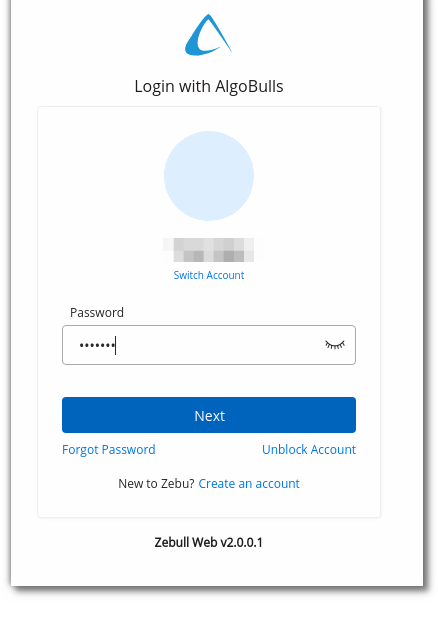

# Zebu
---

* Official Website: [https://zebuetrade.com/](https://zebuetrade.com/)

* Trading Website: [https://zebull.in/](https://zebull.in/)

* Markets Supported: India

## Important Points to Note
---
* It is required to log in **once** daily (at the start of the trading day) using the link [https://zebull.in](https://zebull.in) before executing any strategy. Also, do not logout, but it is ok to close the tab directly.

## Login and Set up your Zebu Account 
---
This section will take you through the step-wise instructions to log in, setup, and bind your broker into your AlgoBulls Account.

### Before you Start
---
Keep the following information available before you start:

1) AlgoBulls Account Credentials

* Phone Number

* Password

2) Broking Account Credentials

* User ID

* Password

* API Key

### Let's Start
---
* Visit the AlgoBulls [Login Page](https://app.algobulls.com/user/login) and click on `Sign In with your Broking Account`

* Type the first few characters of your Broker Name

As seen here, Zebu supports 2 ways of logging in:

1. non-OAuth Method 

2. OAuth Method.
     
Both are explained below

### Login with non-OAuth Method
---
* Type the first few characters of your Broker Name

* Select the `ZEBU` broker under `other available brokers`

Now Login to your AlgoBulls account. Provide data for the following fields and then click the `Login` button

* Phone Number: The Phone Number you have used to Register/Sign-Up to the AlgoBulls website.

* Password: The password you have given to Register/Sign-Up to the AlgoBulls website.

* Now go to `Broking Details` and click add broker

* choose the broker 

* Now Provide data for the following fields:

(1). User ID: The ID given to you by your broker

(2). Password: The password given to you by the broker

(3). API Key: The API Key given to you by the broker

(4). Click `Confirm`

* If the verification is successful, you will see the following message

### Login with OAuth Method
---
* Type the first few characters of your Broker Name

* Select the `ZEBU` broker

* You will be re-directed to the broker login page. Provide data for the following fields:

(1). User ID: The ID given to you by your broker

(2). Password: The password given to you by the broker

* If the sign-in is successful, you will re-directed back to the AlgoBulls website

## Bind your Broking Account
---
The following steps will help you to make sure you have binded your broker account

* Visit the AlgoBulls [Broker Settings Page](https://app.algobulls.com/account/broking)

* Bind your account using the Toggle button marked below

## Important Points to Note
---
* It is required to log in **once** daily (at the start of the trading day) using the link [https://zebull.in](https://zebull.in) before executing any strategy. Also, do not logout, but it is ok to close the tab directly.

## Support
---
For Help and Support, contact us on +91 80692 30300 or [email us](mailto:support@algobulls.com).
