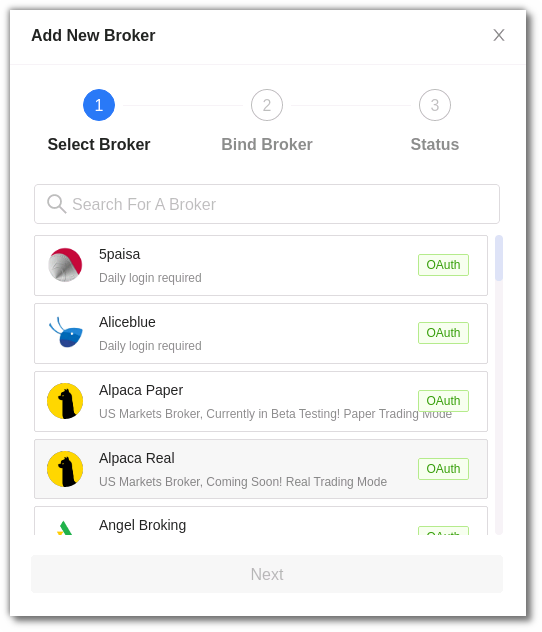

# AlgoBulls Help Site

## Introduction
Welcome! We think you should go through the list below and see that you have understood and ticked off all the points!

## Before you start
---
* Customers looking to do only Backtesting and Paper Trading can do the `Registration and Sign-Up` step and `Add funds into your AlgoBulls account` step given below.

* Customers looking to do Real Trading on Indian Markets and Exchanges will need to tick-off all steps given below.

You may also visit the [FAQ](member/faq.md) page to know more.

## 1) Registration and Sign-Up
Visit [the site](https://www.algobulls.com/) and sign-up to the AlgoBulls platform.

## 2) Add funds into your AlgoBulls account
Click [here](member/wallet.md) to know more about your Wallet. All pricing, packages and adding funds into your AlgoBulls account are covered here.

## 3) General Settings
After signing up to the platform, visit [here](member/settings.md) to know more about updating your KYC details.

Your KYC details like Aadhar ID, PAN, etc. are required as per the governmental regulations for trading online.

!!! Note
    * You can skip this step if you are looking to do Backtesting and Paper Trading (**but not Real Trading**)

## 4) Broker Account and Binding

Before you begin algorithmic trading with AlgoBulls, you must have a valid functional broking account. Multiple brokers are supported by the AlgoBulls platform. 

You can select your broker from the Add Broker button in the [Broking Details](https://app.algobulls.com/broking) section

Before proceeding, make sure you sign up and set up your account with any of these brokers. You will need to provide these details to [bind your broking account](member/broking-details.md) with AlgoBulls. 

You need to have a valid working broking account before you start algorithmic trading using AlgoBulls.

!!! Note
    * If you want to perform backtesting and paper trading, you can skip this step (Mandatory for Real Trading)
---
If you're unable to trade, consider the factors listed below. If you believe there is another reason why your trade has not begun, please contact your relationship manager. Alternatively, you can [email us](mailto:support@algobulls.com)

!!! warning
    Even after completing the all the points mentioned above, trading might not start because of the following reasons:
    
    * Your broker account may not have sufficient funds
    
    * Currency Segment in your broker account is not yet activated. (This happens with new accounts, and though some brokers activate this by default, others may take takes 24 hours or more to do so)
    
    * Due to market volatility, your broker may have stopped taking certain order requests on some of the scripts or stock.(If Any bracket such order type with such script/stock strategies currently running in your platform account will stop showing any new orders)
    * Due to market volatility, your broker may have stopped taking bracket order requests. (Any bracket order strategies currently running in your platform account will stop showing any new orders)
    
    * Certain order types don't work with certain brokers. So your binded broker account should allow those particular order to be fired
    
    * Every strategy may not run with every broker. This is due to permission issues at the broker end
    
    * Once your trading starts, the AlgoBulls platform has no control over the brokerage charges levied by your broker. Please have a look at all charges on the broker side before going ahead

!!! info
    You can help us improve this site by submitting updates on our GitHub repository. 
    Just click on the edit button on the top, and it will take you to GitHub directly.

------------
Visit [algobulls.com](https://algobulls.com/).

