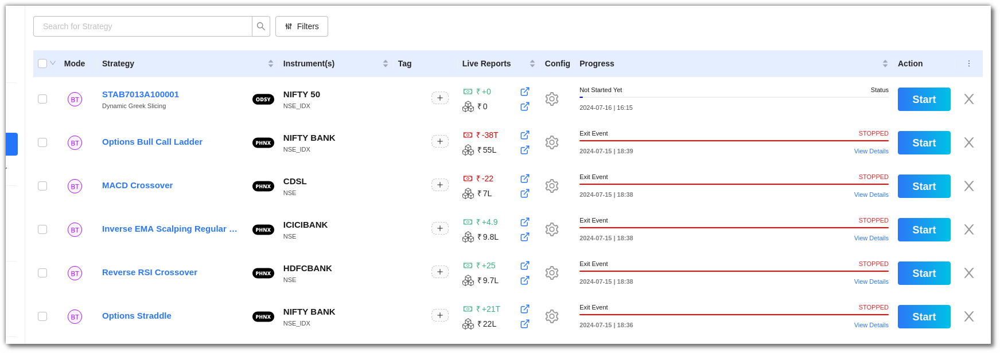

# AlgoBulls Help Site

<iframe width="560" height="315" src="https://www.youtube.com/embed/iKkvgFcV9Xk" frameborder="0" allow="accelerometer; autoplay; encrypted-media; gyroscope; picture-in-picture" allowfullscreen></iframe>

## 1. Introduction

Welcome to AlgoBulls! We are an algorithmic trading platform offering 100% automated trading algorithms, allowing you to deploy multiple trading strategies across various asset classes. You can choose from a wide range of ready-to-use strategies
or create and execute your own strategy in **Backtesting**, **Papertrading and  Livetrading mode. Additionally, AlgoBulls provides a Fixed Income marketplace where you can invest in Bonds & NCDs.

Here's a quick guide to help you start trading or investing on our user-friendly platform right away!

## 2. Sign Up with AlgoBulls

### i. **Sign Up using Google**

Register with AlgoBulls in less than a minute using the Login with Google option.

### ii. **Sign Up using WhatsApp**

You can also register with AlgoBulls using WhatsApp. Follow these simple steps:

**Step 1:** Click on the WhatsApp icon.

**Step 2:** Scan the QR code using your phone camera. Open the link that appears on your screen, which will redirect you to WhatsApp.

**Step 3:** Send the pre-formatted text in whatsapp chat. It will redirect and allow you to sign-up you to AlgoBulls.

### iii. **Sign Up in 3 simple steps**

**Step 1:**

**Profile:** Enter your Name, Email, and Phone Number. Click on **Get OTP**.

**Step 2:**

**Credentials:** Enter the OTP and other credentials such as password.

Haven't registered with AlgoBulls yet? [Register now!](https://app.algobulls.com/user/register)

## 3. Log in with AlgoBulls

If you already have an AlgoBulls account, simply log in using the following options:

### i. Login using Google

Use your Google account to **Log in**. Just click on the Google icon and log in with your Google credentials.

### ii. Login using WhatsApp

Log in using your WhatsApp account by clicking on the WhatsApp icon.

### iii. [Login with Mobile Number](https://app.algobulls.com/user/login)

Use your mobile number and password to log in.

### iv. [Login with OTP](https://app.algobulls.com/user/login?method=mobile)

You can also choose the Login with OTP option. Enter your phone number, and an OTP will be sent to your registered mobile number.

## 5. Forgot Password?

If you've forgotten your password, you can reset it [here](https://app.algobulls.com/user/login?method=forgot_password).

Ready to start trading? [Log in](https://app.algobulls.com/user/login) now.

## 6. How to Add a Broking Account?

To begin trading, it's necessary to add your broker details and link your broking account. Follow these three simple steps:

**Step 1:** From the AlgoBulls sidebar navigation, select [Broking Details](https://app.algobulls.com/broking)  and click on the [Add Broker](https://app.algobulls.com/broking?addBroker=true) button.

**Step 2:** Select your broker and fill in the necessary information. Click **Confirm**.

**Step 3:** Once confirmed, the broker will be added to your account.

For more information on adding, removing, and editing broker details, [click here](https://help.algobulls.com/member/broking-details.html).

To visit the broker details page, [click here](https://app.algobulls.com/broking).

## 7. Adding Funds to Your AlgoBulls Account

After linking your broker with AlgoBulls, you can add funds by navigating to the [My Plans](https://app.algobulls.com/myplans) page from the sidebar menu and clicking on [Payment Gateway Transactions](https://app.algobulls.com/myplans?query=e30%3D&section=transactions).

**Step 1:** Edit or continue with the default amount of **1000** and click **Add Money**.

**Step 2:** Enter your phone number and click **Proceed**.

**Step 3:** Choose your preferred payment method. Once the payment is successful, the balance will be added to your AlgoBulls account.

Running low on funds? [Add money now!](https://app.algobulls.com/wallet?defaultCategory=backtesting%26PaperTrading)

Learn more about [Pricing](https://help.algobulls.com/member/wallet.html).

## 8. How to Subscribe to a Plan

To [subscribe to a plan](https://app.algobulls.com/pricing?section=Odyssey%20%28Marketplace%29), choose from various plans on the [Pricing](https://app.algobulls.com/pricing?section=Odyssey%20%28Marketplace%29) page. These plans are active for a specific duration, and all included services will not incur additional charges during that period.

Find out more about [Pricing](https://help.algobulls.com/member/wallet.html).

AlgoBulls also offers free plans. Visit the pricing page to explore available free plans.

## 9. How to Select a Strategy

After subscribing to a plan, choose an Algo Strategy from the Odyssey section, which features over 150+ strategies created by industry experts. Odyssey is divided into three categories: Retail, Premium & HNI.

[Retail Strategies](https://app.algobulls.com/marketplace/category/retail): Ideal for all levels of experience, these include strategies for Equity, Futures, and Commodities cash segments. [Learn more](https://help.algobulls.com/member/choose-strategy.html#2-retail-marketplace) about Retail Strategies.

[Premium Strategies](https://app.algobulls.com/marketplace/category/premium): Access intelligent and powerful Index Option Strategies. [Read more](https://help.algobulls.com/member/choose-strategy.html#3-premium-marketplace) about Premium Strategies.

[HNI Strategies](https://app.algobulls.com/marketplace/category/hni): AI-driven trading algorithms tailored to individual needs and risk appetites, including Index Option Strategies. [Learn more](https://help.algobulls.com/member/choose-strategy.html#4-hni-marketplace) about HNI Strategies.

Select a strategy from the AlgoBulls [Odyssey now!](https://app.algobulls.com/marketplace/category/retail)

## 10. My Portfolio

All strategies deployed from the **Odyssey** page are accessible here as well as **Phoenix** Strategies. You can leverage these strategies for Live Trading (LT), Paper Trading (PT), and Back Testing (BT). The key functionalities include:

- **Start Button:** Execute a strategy using the Start button.

- **Strategy:** This column displays the name of the strategy.

- **Instruments:** This column shows the instruments added to the strategy.

- **Tweak Button:** Adjust and fine-tune a strategy using the tweak button.

- **Live Reports Section:** View real-time P&L and trade volume for all active strategies.

- **Mode:** Indicates whether the strategy is in LT, PT, or BT mode.

- **Tags:** Add tags to strategies for better organisation and categorisation.

You can initiate a strategy by clicking on the Start button. When you do so, a modal will appear with several options. To run the strategy in live market, select the Live Trading option from the modal. Additionally, you have the flexibility to perform Back Tests and paper trades by choosing the respective options within the same modal. This allows you to thoroughly evaluate and refine your strategies before deploying them in real market conditions.

## 11. Live Reports

The Live Reports section is divided into three parts: [P&L Book](https://app.algobulls.com/book/pl), [Trade Book](https://app.algobulls.com/book/trade).

- The P&L Book displays the Profit & Loss of your trades in your account. All trades/orders in your account are updated in real-time as transactions occur. [Learn more](https://help.algobulls.com/member/Books/pnl.html).

- The Trade Book displays the activities of chosen strategies in your account. [Read more](https://help.algobulls.com/member/Books/tradebook.html).

Want to check Live Reports for your Strategies? Visit the [P&L Book](https://app.algobulls.com/book/pl) and [Trade Book](https://app.algobulls.com/book/trade) now!

## 11. The Dashboard

Once you have successfully registered with AlgoBulls, you will be redirected to the <a href="https://help.algobulls.com/member/dashboard.html">AlgoBulls Dashboard</a>. The AlgoBulls Dashboard gives you an overview of your account and trades.

Go to <a href="https://app.algobulls.com/dashboard">my dashboard</a>.

## 12. Settings

The AlgoBulls <a href="https://app.algobulls.com/settings">Settings</a> page allows you to:

- Update your profile

- Update Password

- Add Trade Manager

- Manage notification preferences

- Generate and manage API keys

- Set trading preferences

- Manage Execution Mode Preference

This page provides a centralized location to tailor your AlgoBulls account to your specific needs and preferences.

For further information regarding the AlgoBulls platform you can always reach out to our customer service team at <a href="mailto:support@algobulls.com">support@algobulls.com</a> OR call us on +91 8069 230 300.

