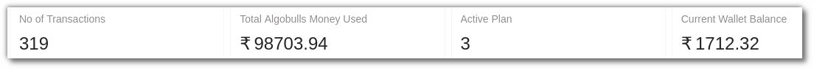
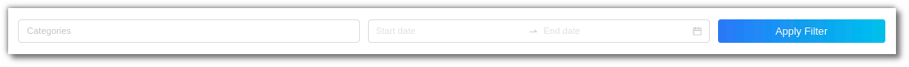
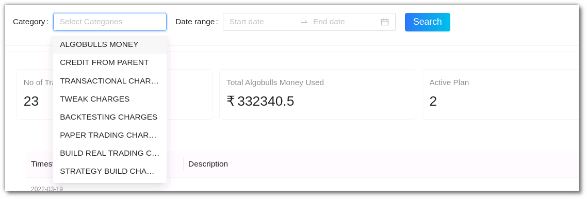
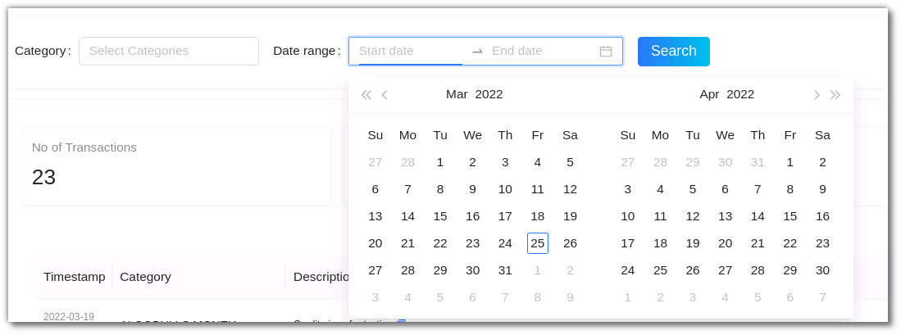
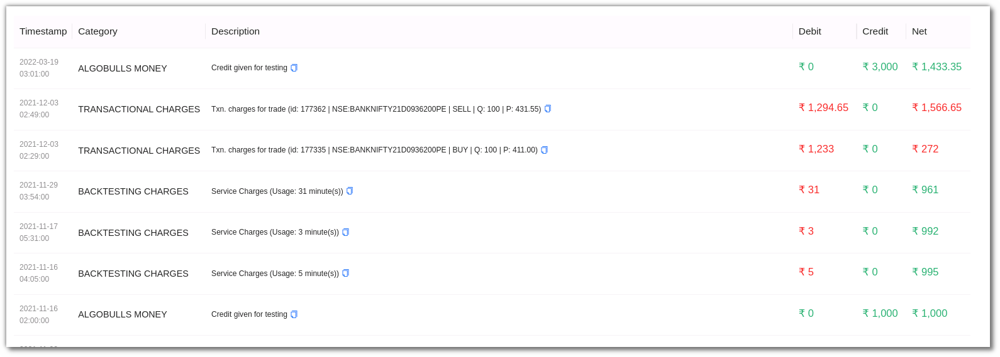
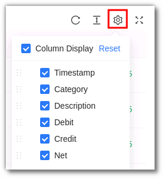

# Fundbook

The Fund Book displays all the charges that have been applied to your account. Your most recent charges are displayed first, followed by earlier charges farther down the page. 

* View all transactions made. 
* Check plans that are currently active. 
* View total AlgoBulls money that has been used & your current wallet balance. 

The Fund Book displays the `Number of Transactions` made, `Total AlgoBulls Money` that has been used, `plans` that are currently active and your `current wallet balance`. 

## Filters
---
The Filter option allows you to narrow down your search further. The following filters are available in the fund book:

`Category` - From the category search filter you can choose from upto 8 categories such as the AlgoBulls Money, Credit from Parent, Transactional Charges, Tweak Charges, Backtesting Charges, Build Real Trading Charges and Strategy Build Charges. 

`Date Range (Start to End Date)` - Here you can select a date range to view the table for the selected category (if any).

## Fields
---
The fund book includes the following fields: 

* `Time Stamp` - This includes the date and time of the transaction made.
* `Category` -  This includes the nature/category of the transaction that has taken place.
* `Description` - A detailed description of the transaction which includes service charge details, package charge details and other charges for the trades placed.
* `Debit` - This column displays the amount debited from your AlgoBulls account.
* `Credit` - This column displays the amount credited into your AlgoBulls.
* `Net` - A sum total of the amount debited and credited into your account. This includes the balance in your AlgoBulls wallet.

## Toolbar
---

`Refresh` - If you can't see an entry in the table (perhaps the most recent one), click Refresh to check again.

`Density` - View data comfortably by choosing the density. The options include Larger, Middle and Compact. 

`Settings` - Select the columns that you want to view in this settings option.

`Full Screen` - With this option you will be able to view your current tab on the browser in full Screen. To go back to the normal viewing mode click on it again. This is similar to pressing F11 on most browsers and operating systems.

