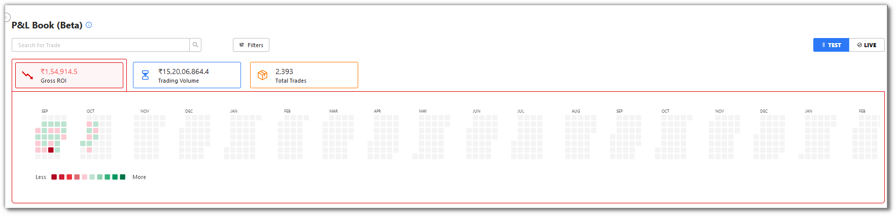
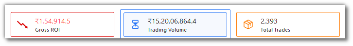
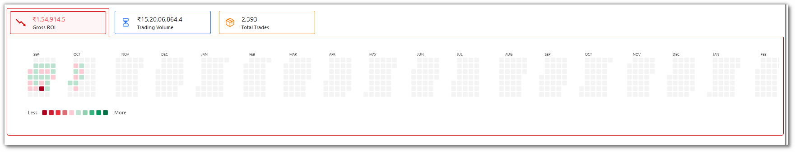
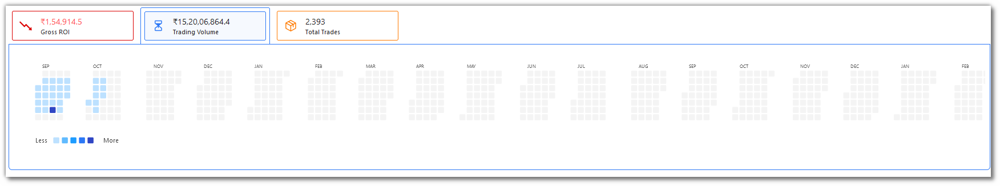
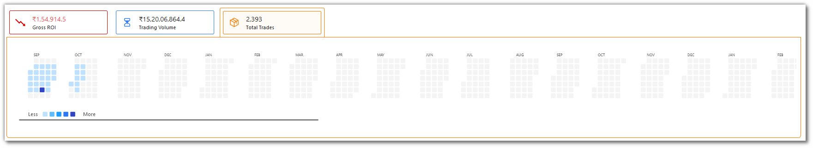
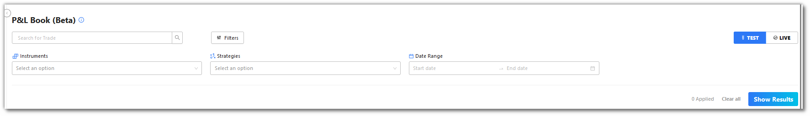
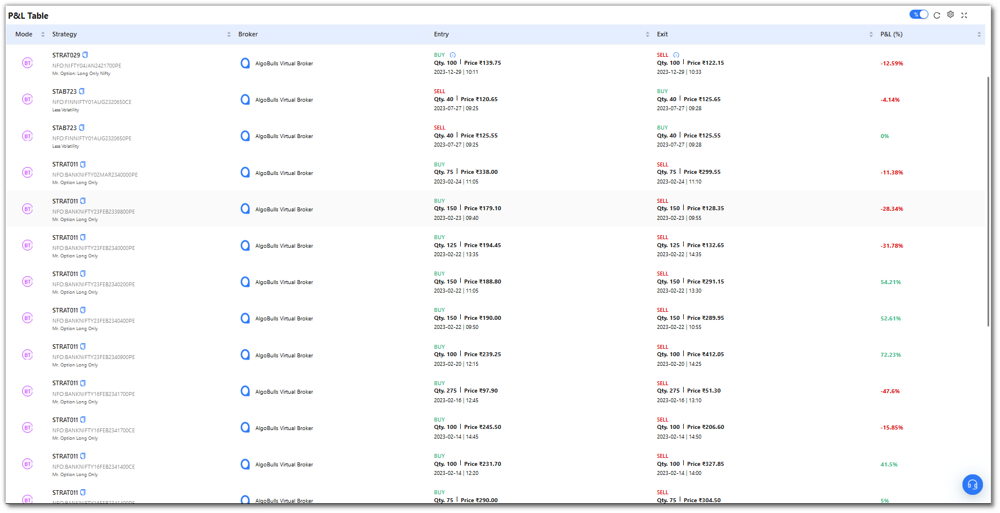
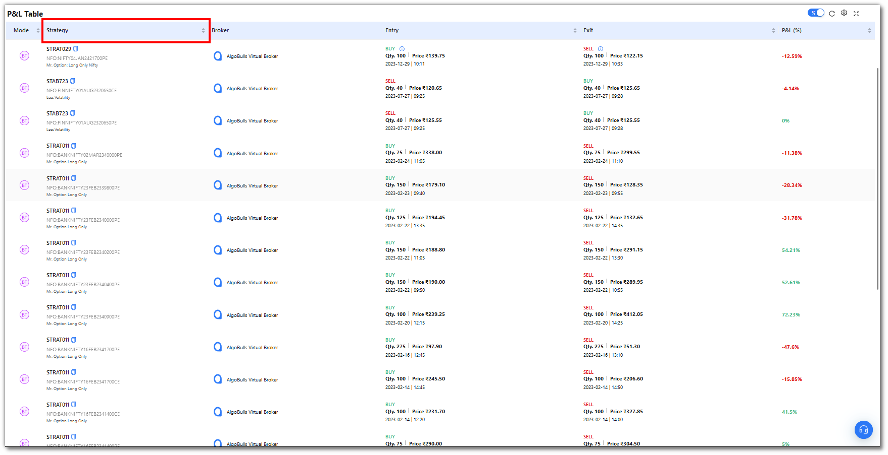
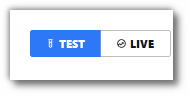

# P&L Book

## 1. What is a P&L Book?
---

Track the **profit and loss** of your trades in the [P&L Book](https://app.algobulls.com/book/pl).

* All trades/orders in your account are updated real-time as and when the transactions take place.
* Filter your activities using filters such as **strategies, instrument and date range**.
* View data in **heatmaps**.

## 2. Summary Bar
---

The P&L Book shows the **gross roi**, which is your total profit and loss, the **trading volume**, which is the maximum traded volume to date, and the **total trades**, which is the total number of trades made to date.

## 3. Heatmaps
---

Each box in the heatmap represents a day. Your P&L data is segregated in shades of green and red. Dark green denotes highest profit and red denotes maximum loss for that day.

* Gross Roi

* Trading Volume

* Total Trades

## 4. Filters
---

* Filters will allow you to selectively search for a specific entry or multiple entries.

* **Instrument**: Select one or more instruments to display in the table below.
  These entries are populated as per the instruments on the strategies that were executed.

* **Strategies**: Choose one or more strategies to display them in the table below.
  These entries are populated as per the strategies chosen by you.

* **Date Range (Start Date & End Date)**: Give the date range to view the table for the selected strategy and instrument (if any).

## 5. Fields
---

The table covers the following fields:

* **Mode**: Mode of the strategy.

* **Strategy**: Name of the strategy.

* **Broker**: Broker name.

* **Entry**: Quantity, price, date & entry time of trade.

* **Exit**: Quantity, price, date & exit time of trade.

* **P&L (% or INR)**: The P&L % or INR can be changed using the toggle option in the tools section in the top right corner. You can view the P&L in rupees or P&L percentage of the trade.

## 6. Sort Results
---

You can also sort the P&L Table by **Mode, Strategy, Entry, Exit, P&L**. Click on the respective column headings to sort results.

## 7. Live/Test Mode
---

To check results for Live Trades or Backtest/PaperTrade results on a strategy, you can do this using Live/Test button.

