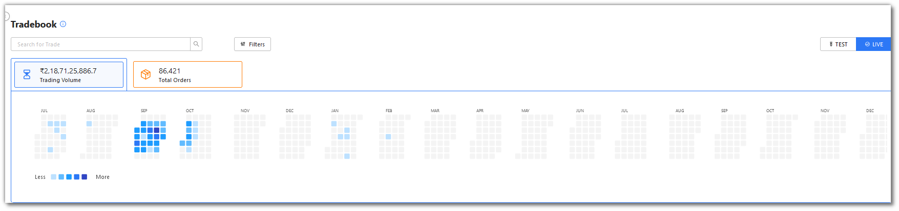
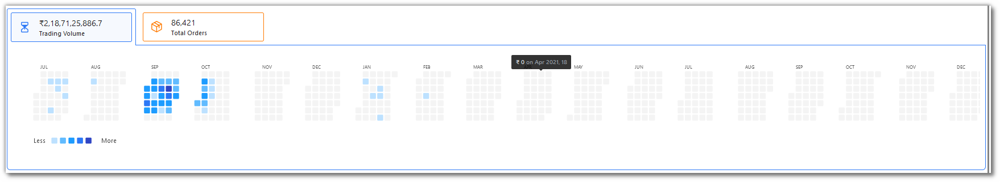
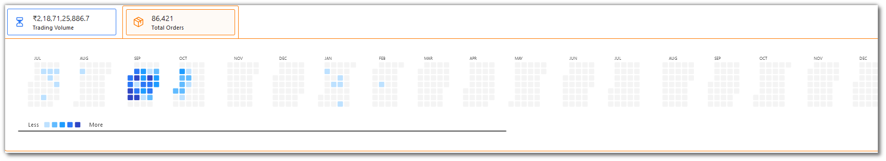
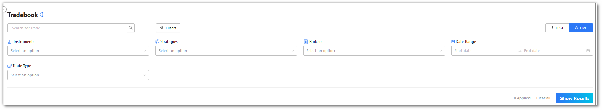
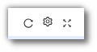
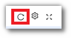
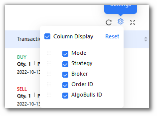
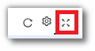

# Trade Book

<iframe width="560" height="315" src="https://www.youtube.com/embed/TQXRd9ABMf4" frameborder="0" allow="accelerometer; autoplay; encrypted-media; gyroscope; picture-in-picture" allowfullscreen></iframe>

## 1. What is a [Trade Book](https://app.algobulls.com/book/trade)?
---

All strategies executed in your account are updated real-time as and when the transactions take place.

* Check trading **volume & total trades**.

* View data in **heatmaps**.

## 2. Summary Bar
---

The Trade Book shows the **trading volume**, which is the maximum traded volume to date, and the  **total trades**, which is the total number of trades made to date.

## 3. Heatmaps
---

Your trades are segregated in shades of blue and white. Dark blue denotes the highest number of trades and white denotes no trades made on that particular day/week/month/year.

* Trading Volume

* Total Trades

## 4. Filters
---

Filters will allow you to selectively search for a specific entry or multiple entries.

* **Instrument**: Select one or more instruments to display in the table below. These entries are populated as per the instruments on which your strategies were activated.

* **Strategies**: Choose one or more strategies to display them in the table below.
  These entries are populated as per the strategies chosen by you.

* **Brokers**: Choose one or more brokers to display them in the table below.
  These entries are populated as per the brokers selected by you.

* **Date Range (Start Date & End Date)**: Give the date range to view the table for the selected strategy and instrument (if any).

* **Trade Type**: filter trades with trading type **Buy or Sell**.

## 5. Fields
---

The table covers the following fields:

* **Strategy**: Name of strategy that placed the trade.

* **Broker ID**: This includes a **unique broker order ID**. This helps in mapping correct entry/exit orders.

* **AlgoBulls Order ID**: Unique AlgoBulls order ID. This helps in mapping correct entry/exit orders.

* **Transaction**:  The transaction section includes the transaction type such as **buy or sell, quantity, price, date & time**.

## 6. The Toolbar

---

**Refresh** - If you can't see an entry in the table (perhaps the most recent one), click **refresh** to check again.

**Settings** - Select the columns that you want to view in this **settings** option.

**Full Screen** - With this option, you will be able to view your current tab on the browser in full Screen. To go back to the normal viewing mode click on it again. This is similar to pressing F11 on most browsers and operating systems.

## 7. Live/Test Mode
---

To check results for Live Trades or Backtest/PaperTrade results on a strategy, you can do this using Live/Test button.

