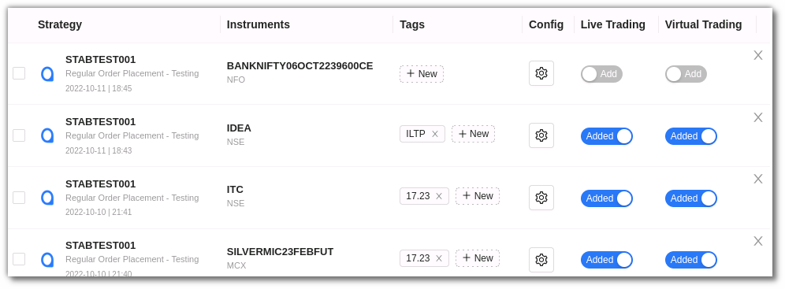

# My Strategies

This page displays a list of all your strategies that you may set as Real Trading (Live Mode) or Backtesting & Paper Trading (Test Mode/virtual trading). You can also add strategies and manage them here. 

To add strategy from the My Strategies section, click the Add strategy button and choose from the Retail, Premium and HNI marketplace. 

Once you choose your marketplace, select the strategy of your choice and click execute. In this way you can add the strategy to your ‘My Strategies’ and ‘Portfolio’ page. 

## Toolbar
---
The Dashboard toolbar includes the refresh, density, settings and full screen tools. 

`Refresh` - If you can't see an entry in the table (perhaps the most recent one), click Refresh to check again.

`Density` - View data comfortably by choosing the density. The options include Larger, Middle and Compact. 

`Settings` - Select the columns that you want to view in this settings option

`Full Screen` - With this option you will be able to view your current tab on the browser in full Screen. To go back to the normal viewing mode click on it again. This is similar to pressing F11 on most browsers and operating systems.

## Fields
---
My Strategies section includes the following fields: 

* `Strategy` - This field displays the strategy name, code, date and time  

*`Instrument(s)` - This includes the instrument on which the strategy is being run 

* `Tag` - This is a user defined tag for the strategy. Users can tag different strategies under different tags.

* `Config` - You can change parameters and other configuration settings here. 
The strategy configuration field includes Instrument and Strategy Settings such as general settings, strategy parameters, resume, exit and misc options. 

* `Live Trading` - To add a particular strategy in the Live Trading section use the add Live Trading Toggle button. 

* `Virtual Trading` - To add a strategy in the virtual trading environment use the add toggle button.

