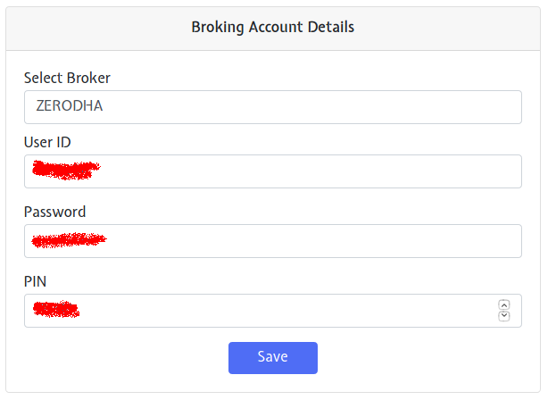
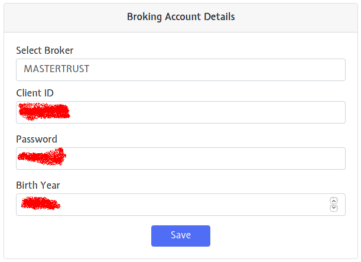

# Broking Account

This page allows you to add a broker of your choice. Simply give the broker details, and then your strategy can be fired in connection with that broker. This gives you a great way to have complete control over your broking account, and the transactions that happen with it. 

Different broking accounts need different details, and this page helps you to supply those details according to the broking account of your choice!

We consider 2 broking accounts as examples below:

* Zerodha

* Mastertrust

## Zerodha
---

## Fields
The following list gives a short brief about each field.

`Select Broker` - Select Zerodha

`User ID` - Give the user id for the selected broker.

Note: You need an existing working account with the selected broker.

`Password` - Your password for the user id given above.

`PIN` - The PIN provided by your broker (or the one that you have set in your broking account)

## Mastertrust
---

## Fields
The following list gives a short brief about each field.

`Select Broker` - Select Mastertrust

`Client ID` - Give the client id for the selected broker.

Note: You need an existing working account with the selected broker.

`Password` - Your password for the user id given above.

`Birth Year` - Your Birth Year.

---

Note: Sensitive details like your Password and PIN are safe with us owing to our industry standard encryption algorithms used for storing data.