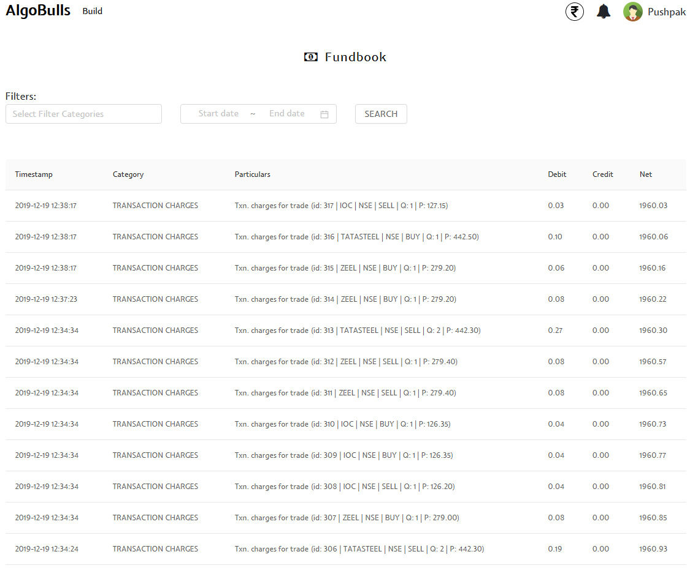
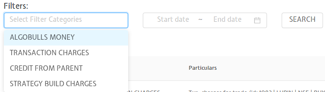

# Fundbook

This page shows all the charges that your account has been charged against. The page shows your most recent charges, followed by older ones down the line. To get a better understanding, you can filter your transactions by type, and/or check your transactions within a date range.

## Fields
The following list gives a short brief about each field.

`Table Fields` - The table covers the following fields: Date/Time, Category, Description/Particular, Debit, Credit, Remaining Amount/Net.

`Filters` - Choose one or more filters to display those particular categories. Choose among the options shown below.

`Start/End Date` - Give the date range to view the table for the selected filters (if any)