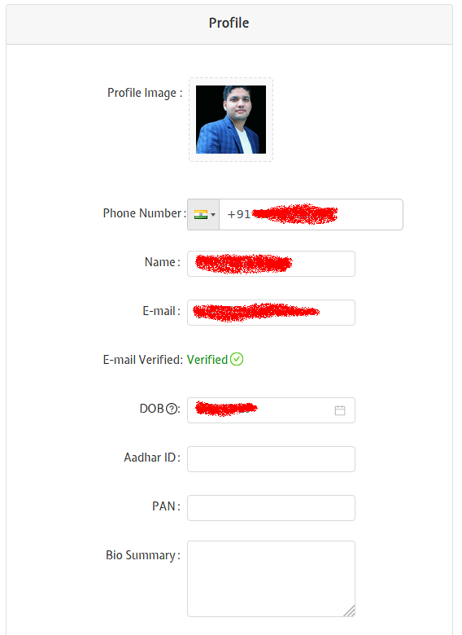

# Profile

This page helps you to build/edit your Profile.

## Fields
The following list gives a short brief about each field.

`Profile Image` - Clicking this will help you to add/change your profile picture. 

`Phone Number` - Our experts will communicate with you over the phone/email.

`Name` - Your Name. Preferably, as per a legal document, like an Aadhar Card.

`E-mail` - Our experts will communicate with you over the phone/email.

`E-mail Verified` - Shows whether your email id has been verified at our end. When a new user makes an account, an email is sent to the given email id for verification. The user has to click the link given in the email to verify the email id.

`Aadhar ID` - Your Aadhar ID number. This is required as per the governmental regulations for trading online.

`PAN` - Your PAN Card number. This is required as per the governmental regulations for trading online.

`Bio Summary` - A quick "About Me" that helps us to know more about you to interact with you suitably.

`Bio Detailed` - A link to your bio, like LinkedIn.

`Experience` - Our experts can interact with you better over phone/email if we know the extent of your market knowledge.

`Education` - Our experts can interact with you better over phone/email if we know whether you have some prior financial background. (like Commerce, MBA Finance, etc.)