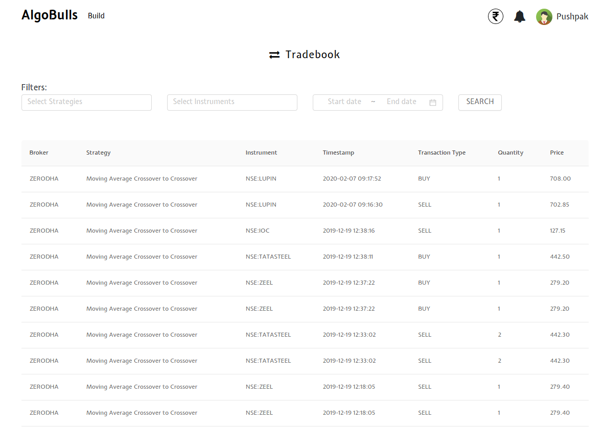
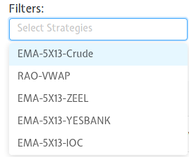
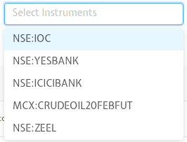

# Tradebook

This page shows all the activities done by your strategies in your account. All strategies fire and currently running in your account are updated real-time as and when the transactions take place. To get a better understanding, you can filter your activities using the filters, instruments and date range.

## Fields
The following list gives a short brief about each field.

`Table Fields` - The table covers the following fields: Broker, Strategy, Instrument, Date/Time, Transaction Type, Quantity, Price.

`Filters` - Choose one or more filters to display those activities in the table below.

Note: The `Filter` fields are listed below.

---

`Strategies` - Choose one or more strategies to display them in the table below.
These entries are populated as per the strategies opted/created by you. An example is shown below.

`Instruments` - Choose one or more instruments to display them in the table below.
These entries are populated as per the instruments on which your strategies are fired on. An example is shown below.

`Start/End Date` - Give the date range to view the table for the selected filters (if any)

---

Tip: Press the Bell icon to see your most recent activities/events.