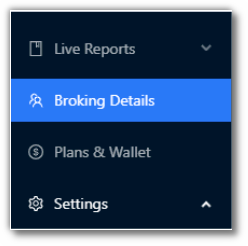
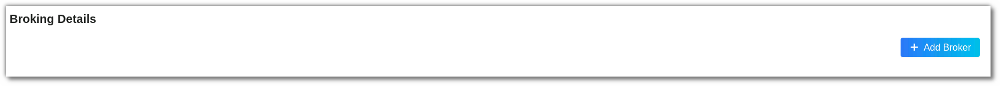
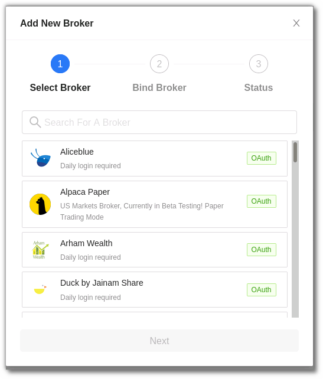
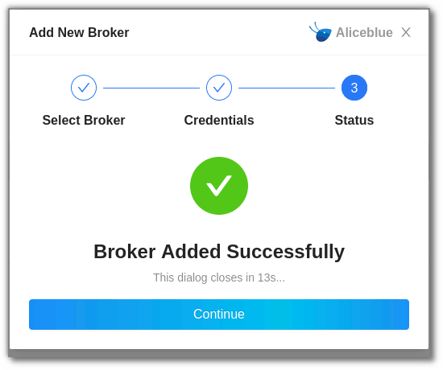
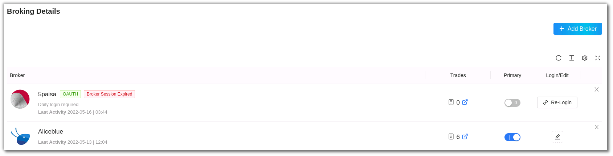
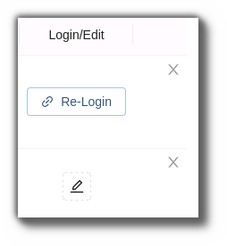
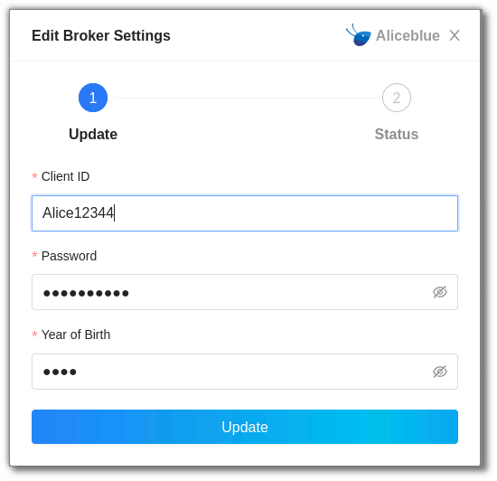
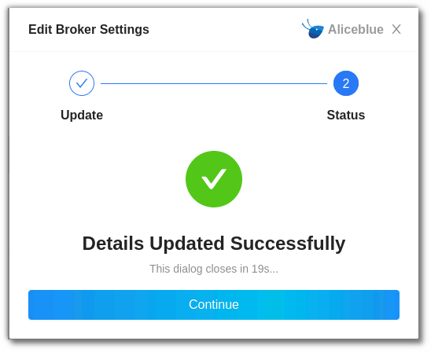

# Broking Details

## 1. Introduction
To begin algo trading with AlgoBulls, it is necessary to add your broker details and bind your broking account. 

## 2. How to add your broking account? 

To add a broker account follow these steps: 

From the AlgoBulls sidebar navigation select **Broking Details** in **Live Mode**

Click the [Add Broker](https://app.algobulls.com/broking?addBroker=true) button. 

From the **Add New Broker** list select your broker.

Add your broking account credentials. Click on **confirm**.

Once confirmed the **broker will be added** to your account.

The Broker will now be added to your **Broking Details** page. If you have multiple broker accounts you can choose which one you would like to add as a **primary account** by switching the toggle button in the **primary column**.

## 3. How to edit or remove your broking account?

If you wish to edit details click on **Login/Edit** option.

Edit the **Broker Details** and click on **update**. If you wish to remove the broker, click on **X** sign on the top right side of the screen.

You will get a confirmation once the details have been updated successfully.

If you haven't added your broker yet, [add now](https://app.algobulls.com/broking?addBroker=true).