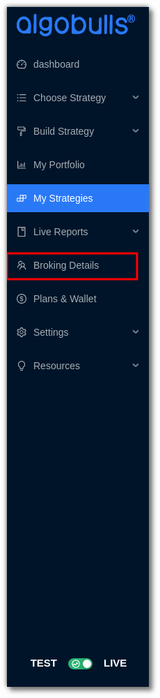
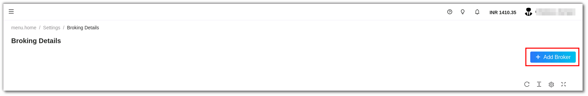
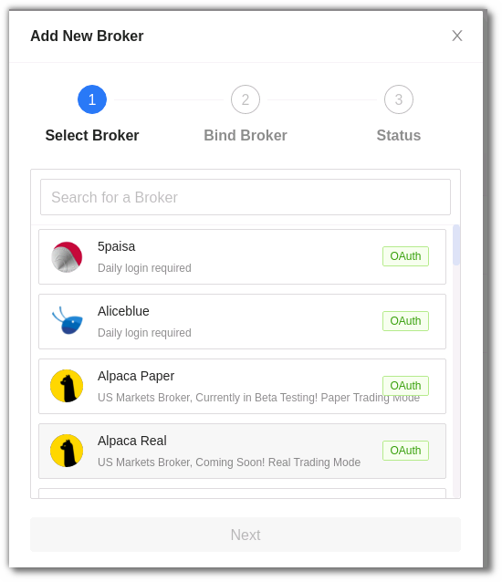
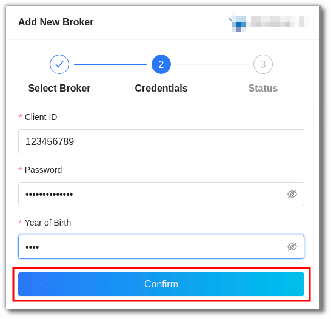
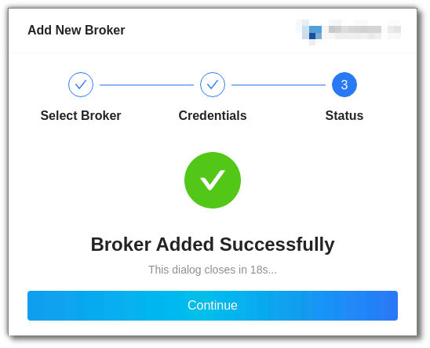
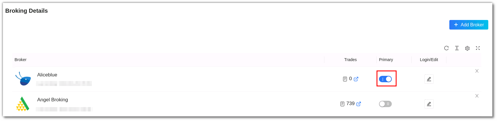
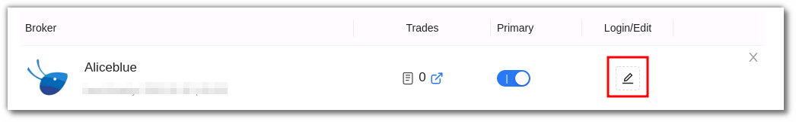
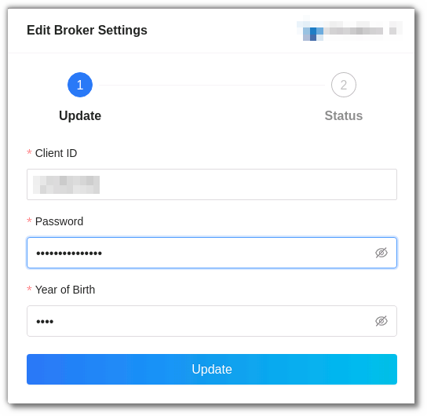
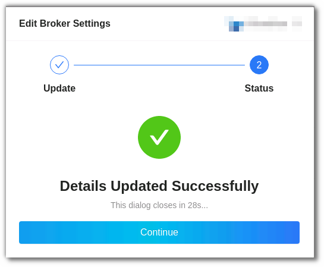

# Broking Details

<iframe width="560" height="315" src="https://www.youtube.com/embed/fYeZjPn3jUY" frameborder="0" allow="accelerometer; autoplay; encrypted-media; gyroscope; picture-in-picture" allowfullscreen></iframe>

To begin algo trading with AlgoBulls, it is necessary to add your broker details and bind your broking account. To add a broker account follow these steps: 

From the AlgoBulls sidebar navigation select Broking Details in Live Mode 

Click the Add Broker button. 

From the Add New Broker list select your broker 

Add the User ID, Password and Date of Birth. Click on Confirm 

Once confirmed the broker will be added to your account. 

The Broker will now be added to your Broking Details page. If you have multiple broker accounts you can choose which one you would like to add as a Primary account by switching the toggle button in the primary column. 

If you wish to edit details click on Login/Edit option  

Edit the Broker Details and click on Update. 

You will get a confirmation once the details have been updated successfully. 

You can also check the help site to view your broker requirements. To view your broker information now [click here](../archive_v1/member/faq.md). 

