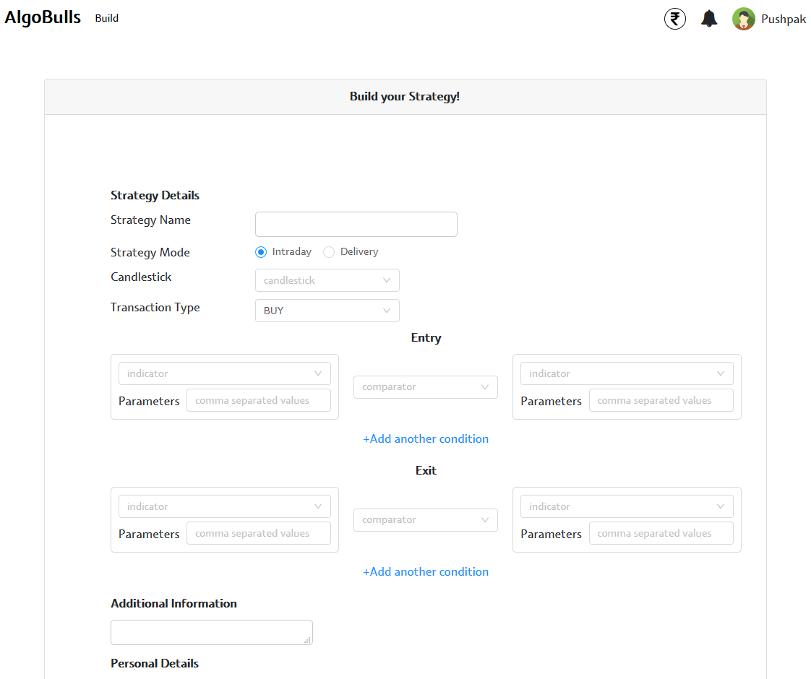
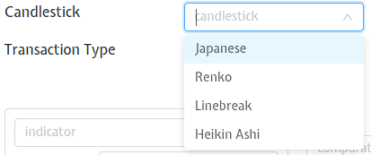
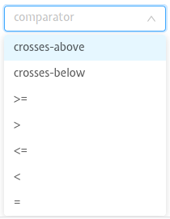
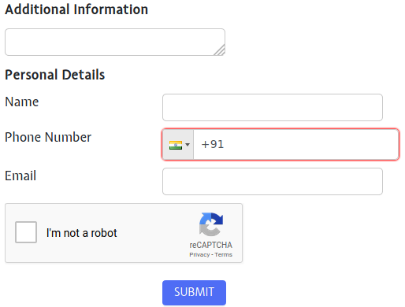

# Build your Strategy

This page allows you to build your strategy using a host of customization and conditions. A detailed breakdown of each field is given below.

## Fields
The following list gives a short brief about each field.

`Strategy Name` - A short name given to your strategy. 

Example: 'Moving Average Crossover to Crossover'

`Strategy Mode` - Choose among 2 options, namely Intraday/Delivery 

`Candlestick` - Choose the candlestick type. Choose one among the options shown below.

`Transaction Type` - Choose among 2 options, namely BUY/SELL

`Entry` - Choose the Entry Strategy. Choose an Indicator, its parameters, and compare it with one more indicator using a comparator. You can add more conditions using the `Add another condition` link.

`Exit` - Choose the Exit Strategy. Choose an Indicator, its parameters, and compare it with one more indicator using a comparator. You can add more conditions using the `Add another condition` link.

Note: The `Entry/Exit` common fields are listed below.

---

`Indicator` - Choose among a variety of indicators.

Examples: 

* MACD - Moving Average Convergence/Divergence
* RSI - Relative Strength Index

`Parameters` - Give parameters for the selected Indicator. You can give comma-separated values for multiple parameter values.

`Comparator` - You can compare your first Indicator with the second indicator. Choose one among the options shown below.

`Add another condition` - Create more complex strategies by adding more conditions to your `Entry/Exit` conditions.

---

Note: Submit your strategy to get a call from our experts. Give your details for the following fields.

`Additional Information` - Describe anything that you would like our experts to take note of.

`Personal Details` - Give your Name, Phone Number, Email and solve the captcha.

Note: Captcha is a security measure to guard against software bots.
