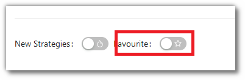
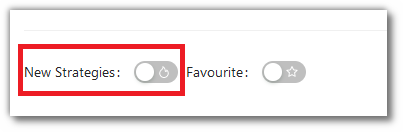
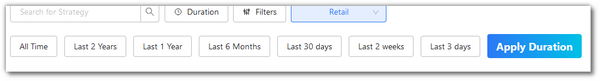
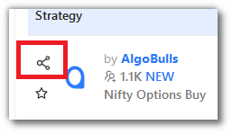

# Odyssey

## 1. Introduction
---

Explore a wide range of advanced, AI-driven strategies developed with cutting-edge technology. Odyssey offers over 150 sophisticated algo strategies crafted by industry-leading experts. These strategies combine complex formulas and mathematical
models to provide superior speed and accuracy compared to manual trading.

* Odyssey is divided into three categories: [Retail](https://app.algobulls.com/marketplace/category/retail), [Premium](https://app.algobulls.com/marketplace/category/premium), and [HNI](https://app.algobulls.com/marketplace/category/hni). You can
  select your preferred strategy category from the dropdown menu.

  

## 2. [Retail Strategies](https://app.algobulls.com/marketplace/category/retail)
---

Retail strategies include a curated selection of trading algos suitable for all experience levels, from novice to expert. This category encompasses strategies for equity, futures, and commodities cash segments.

- Filter strategies by name or strategy code.
- Search for strategies using the **sort** or **duration** filter.
- Add strategies to your **favourites** list.
- To add a strategy to your **My Portfolio** page, click on **Execute**.
- Click **Know More** to obtain additional information about any strategy.

  

## 3. [Premium Strategies](https://app.algobulls.com/marketplace/category/premium)
---

Our Premium Strategies feature powerful and intelligent trading algos designed for index options strategies. These advanced strategies leverage state-of-the-art technology to optimise trading performance.

- Filter strategies by name or strategy code.
- Search for strategies using the **sort** or **duration** filter.
- Add strategies to your **favourites** list.
- To add a strategy to your **My Portfolio** page, click on **Execute**.
- Click **Know More** to discover more about any strategy.

  

## 4. [HNI Strategies](https://app.algobulls.com/marketplace/category/hni)
---

HNI Strategies are AI-driven trading algorithms tailored to the needs and risk appetites of high-net-worth individuals (HNI). These strategies are designed for personalised portfolio management and optimisation.

- **AI-Driven Trading Algorithms**: Utilise advanced algorithms for enhanced trading.
- **Personalised Portfolio Management**: Customise strategies based on individual needs.
- **Risk Assessment**: Evaluate risk tolerance using historical data, investment goals, and market conditions.
- **Investment Strategy**: Develop strategies aligned with your risk profile, financial goals, and market opportunities.

- Filter strategies by name or strategy code.
- Search for strategies using the **sort** or **duration** filter.
- Add strategies to your **favourites** list.
- To add a strategy to your **My Portfolio** page, click on **Execute**.
- Click **Know More** to access detailed information, including parameters and backtesting reports, to evaluate strategy performance.

  

## 5. Explore Strategies
---

You can find strategies using the following options:

### i. Search Bar

- Use the search bar to type in the **strategy name** or **strategy code** to quickly locate specific strategies.

  

### ii. Filters

- Filter your view based on  **brokers, exchanges, segments, modes, candle types, candle sizes,** and **tags** are also available. Click **Apply Filters** to see the results.

  

### iii. Favourites

- Activate the Favourite Mode to view strategies marked as **Favourite** (**☆**).

  

### iv. New Strategies

- Activate the New Strategies Mode to view strategies which are newly added to Odyssey.

  

### v. Sort

- Sort strategies by clicking on the heading of each column:

    - **Strategy**
    - **Instruments**

      

### vi. Duration

- Search for strategies added to the marketplace in the last 3 days, 14 days, 30 days, 6 months, 1 Year, 2 Year, or All Time. Click **Apply Duration** to save changes.

  

### vii. Pagination

- Navigate between pages using the **<** and **>** buttons. You can also choose to view **4, 8,** or **12** strategies per page.

  

### viii. Share

- Share your favourite strategy with friends and family by clicking the share icon in the strategy column.

  

### ix. Know More

- Click the **Know More** button below the **Execute** button to discover additional details about the strategy.

  
