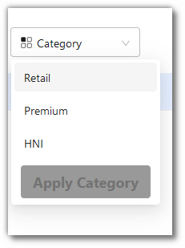
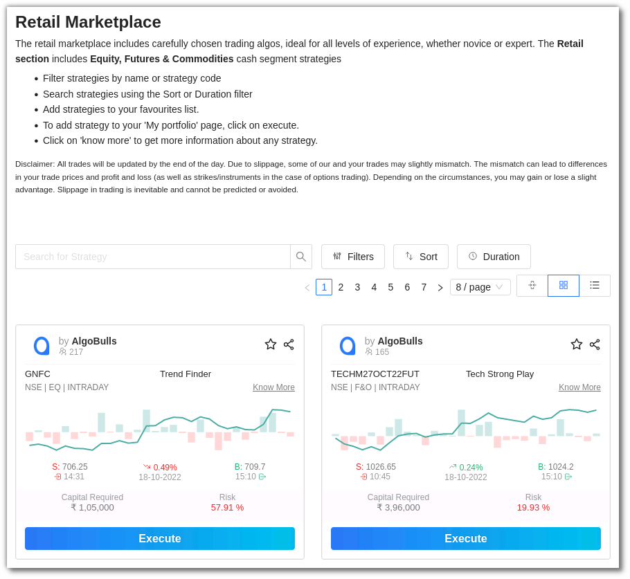
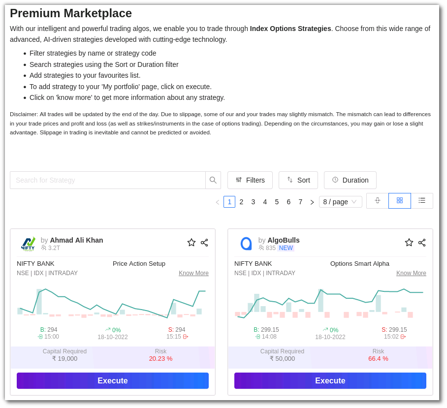
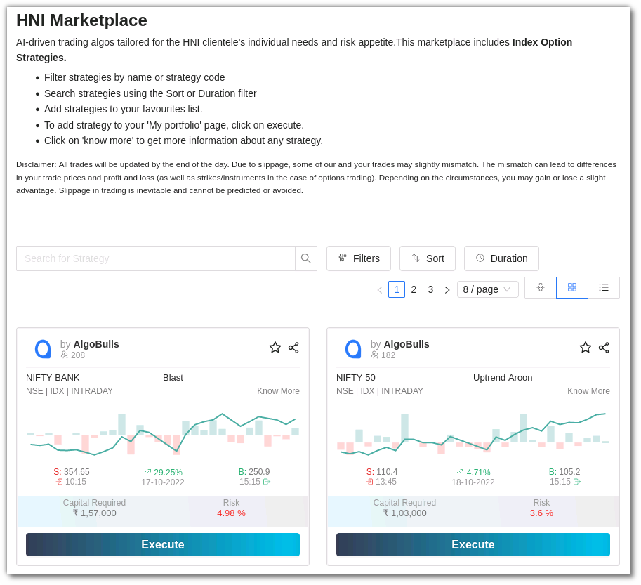
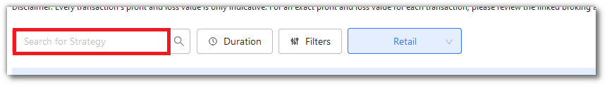

# Choose Strategy

## 1. Introduction

Choose from a wide range of advanced, AI-driven strategies developed with cutting-edge technology. 

* This Marketplace has more than 100+ Algo Strategies created by industry leading experts. 

* The AlgoBulls strategies are a combination of complex formulas and mathematical models that offer excellent speed and accuracy in comparison to Manual trading. 

* The Choose strategy marketplace is divided into 3 parts - [Retail](https://app.algobulls.com/marketplace/category/retail), [Premium](https://app.algobulls.com/marketplace/category/premium) & [HNI](https://app.algobulls.com/marketplace/category/hni) marketplace.

## 2. Retail Marketplace
---

The [Retail Marketplace]((https://app.algobulls.com/marketplace/category/retail)) includes carefully chosen trading algos, ideal for all levels of experience, whether novice or expert. The Retail section includes **Equity, Futures & Commodities** cash segment strategies.

## 3. Premium Marketplace
---

With our intelligent and powerful trading algos, we enable you to trade through Index Option Strategies in the [Premium Marketplace](https://app.algobulls.com/marketplace/category/premium). 

## 4. HNI Marketplace
---

AI-driven trading algos tailored for the HNI clientele's individual needs and risk appetite.The [HNI Marketplace](https://app.algobulls.com/marketplace/category/hni) includes Index Option Strategies.

Before adding strategies to your **My Portfolio** section, you can explore the strategy details, parameters and back testing reports to evaluate the strategy's performance in the Choose Strategy section. Know more about the [Strategy Card](strategy-card.md).

## 5. Exploring strategies on Choose Strategy Marketplace
---
You can find strategies using the following options: 

### i. Search Bar

Use this to type in the Strategy Name or Code .

### ii. Fitlers

You can filter your view as per the ROI%, Risk %, Capital Required & Hit Ratio. You can also use the filter option for Brokers, Exchanges,Segments, Modes, Candle Types, Candle Sizes and Tags. Click on the **Apply Filters** button to see the results.

### iii. Favourites

You can also switch the favourites toggle button **On** to view the strategies marked as Favourite (☆).

### iv. Sort

You can sort the strategies into the following:
* ROI 
* Risk 
* Transaction Charges 
* Recent Transactions 

Click on the **Apply Sort** button to categorise the strategies. 

### v. Duration

This option allows you to search for strategies that have been added to the marketplace in the last 3 days, 14 days, 30 days and All Time. Click on **Apply Duration** to save the changes. 

### vi. Pagination

You can click the < and > for changing pages. You can also choose to view 4/8/12 strategies per page.

### vii. Density

You can adjust the density by choosing the Compact mode, Regular Mode & List Mode.

