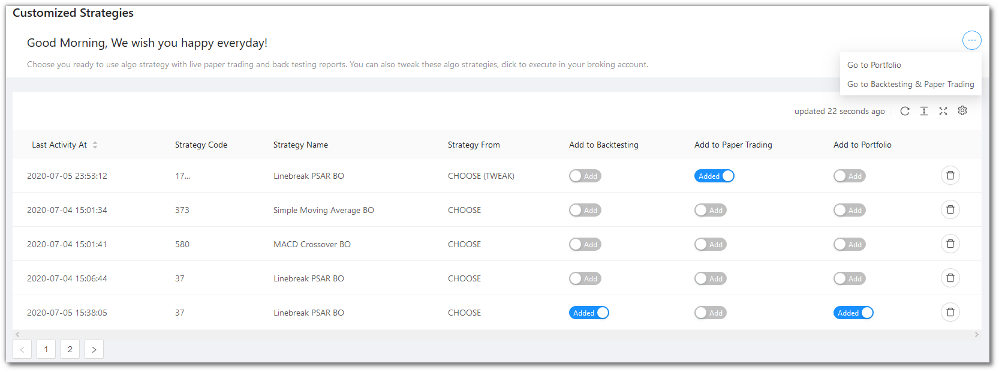

# Managr Strategies

<iframe width="560" height="315" src="https://www.youtube.com/embed/c8c-GeIhibY" frameborder="0" allow="accelerometer; autoplay; encrypted-media; gyroscope; picture-in-picture" allowfullscreen></iframe>

This page displays a list of all your strategies that you may set as Backtesting, Paper Trading or Real Trading (Portfolio).

The ...(Ellipsis) to the right give some navigation options, like switching to [Portfolio](portfolio.md) or jumping to Backtesting / Paper Testing.

## Paper Trading Fields
---
`Table Fields` - The table covers the following fields: Last Activity At, Strategy Code, Strategy Name, Strategy From, Add to Backtesting, Add to Paper Trading, Add to Portfolio.

!!! note
    The `Strategy From` field will have one of the three values - Choose / Choose Tweak / Choose Premium. 
    
    Choose reflects in `Choose Strategy` from the `Summary Bar`.
    
    Choose Tweak reflects in `Tweak Strategy` from the `Summary Bar`.
    
    Choose Premium reflects in `Build Strategy` from the `Summary Bar`.

## A look at the toolbar
---

`Refresh` - If you are not able to see an entry (possibly a most recent one) in the table, click Refresh to check again.

`Density` - Choose the density of the data you see. Options are Larger, Middle and Compact

`Full Screen` - The current tab on your browser goes Full Screen. Click again to go back to normal. This is similar to pressing F11 on most browsers and operating systems.

`Settings` - You can select which columns should be visible through here.

