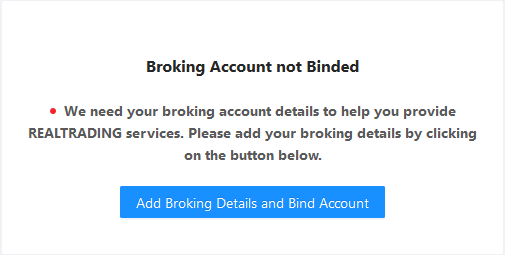
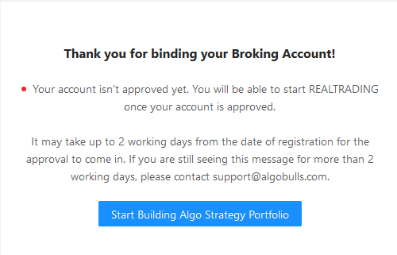
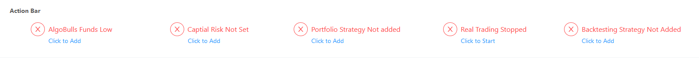
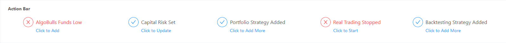
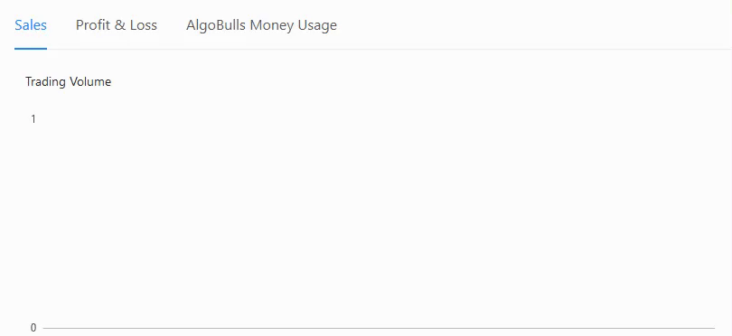

# Dashboard

This page gives an overview of your account and trades.

Click `Add Money` to add funds into your AlgoBulls wallet.

Click `Add Broking Details and Bind Account` to bind a broker account to the AlgoBulls platform.

Before binding an account, you will see this.

After binding an account, you will see this.

The Action Bar gives the following information: `AlgoBulls Funds`, `Capital Risk`, `Portfolio Strategy`, `Real Trading` and `Backtesting Strategy`.

If all the information is missing, you will see this. 

You will see this, if some of the information is added.

You can see Strategy & Transaction Status for today, this week, this month, this year or any custom date range of your choosing.

As per the range chosen by you, the following data is reflected and updated as a graph: `Sales`, `Profit & Loss` and `AlgoBulls Money Usage`.

As per the range chosen by you, the following data is reflected and updated as a table: `Total Transactions`, `Algo. Strategy Name`, `Volume (₹)` and `P & L (₹)`.

Each strategy listed on this page can be tweaked with many parameters, including the quantity with which you want to execute that particular strategy. Also, you can start/stop strategies from here, giving you complete control over what strategies you want to currently execute and monitor.

Note: Once you click `Start` to run a strategy, wait patiently for the button to change to `Stop`. When the button finally changes to `Stop`, you can be sure that your strategy is now successfully running. 

## Available AlgoBulls Money
This section gives you fine control over a strategy through a variety of sections.

The sections are:

**General, Strategy, Instruments, RMS, Resume, Exit and Misc**

Note: Press **Save** once you have finished tweaking.

Note: Press **Reset Defaults** to reset default parameters for that strategy.

# Binded Broker Account Details

The following list gives a short brief about each field within each section.

## Action Bar
---
* `AlgoBulls Funds` - Give the start time for the strategy.

* `Capital Risk` - Give the end time for the strategy.

* `Portfolio Strategy` - Give the end time for the strategy.

* `Real Trading` - Give the end time for the strategy.

* `Backtesting Strategy` - Give the end time for the strategy.

## Algo Strategy & Transaction Status
---
* `Sales` - Give the Candle Size here with which you want to trade (in number of minutes).

* `Profit & Loss` - Choose among Intraday/Delivery

* `AlgoBulls Money Usage` - Parameters are specific to a particular strategy. The parameters will be always filled with default values. You may choose to keep the default values or change them as required. 

Example: For the image shown below, the strategy is `Exponential Moving Average Crossover`, having 2 parameters: `Small Average` and `Big Average`. 

## Instruments
---
`Instrument` - Choose the instrument on which you would like to fire the strategy.

Example: Stocks, Commodities, Currencies or Futures.

## RMS (Risk Management System)
---

`Target (%)` - Give that target percentage that you would like to reach.

A price target is the projected future price level of an asset as stated by an investment analyst or advisor. The price target is based on assumptions about the asset's future supply and demand, technical levels.

`Stoploss (%)` - Give the stoploss percentage where you would like to cut your losses.

A stop-loss order is an order placed with a broker to buy or sell once the stock reaches a certain price. A stop-loss is designed to limit an investor's loss on a security position.

`Trailing Stoploss (%)` -  Give the trailing stoploss percentage where you would like to cut your losses.

You also get an ability to trail your stoploss. So, if the contract/stock moves in your direction by a particular number of ticks, the stoploss will go up/down based on that.

## Resume
---

This is applicable only for Delivery Based Trading Strategies.

Tick the relevant values if you wish to continue on the next day on the same carry-forward instrument. Unticking the values will square off everything a few minutes before the market closes.

The values are: **Resume Positions on start, Resume Holdings T+1 on start, Resume Holdings T+2 on start**

---

## Exit
---

If you tick the Exit options given here, then the Resume options mentioned above will be unticked automatically.

You can tick these values to choose the required exit options for your strategy.

The values are: **Resume Holdings T+1 on start, Resume Holdings T+2 on start, Exit Intraday Orders on Stop, Exit T+0 Delivery orders on stop, Exit T+1 Delivery orders on stop, Exit T+2 Delivery orders on stop**

## Misc
---

`Instrument max orders count` - Give the maximum order count that you would like the strategy to consider.

After the count is reached, your strategy stops running automatically.

`Remove instrument if order rejected` - Tick this if you want the strategy to stop if the order is rejected for any reason by the broker.

`Crossover accuracy decimals` - Give the number of decimals that you would like the strategy to consider for accuracy.

This value is generally 2 for stocks and 4 for currencies.

