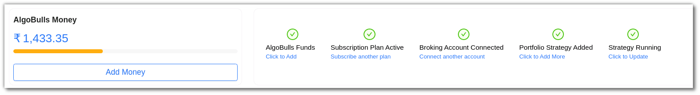
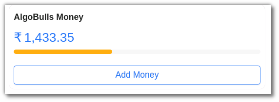
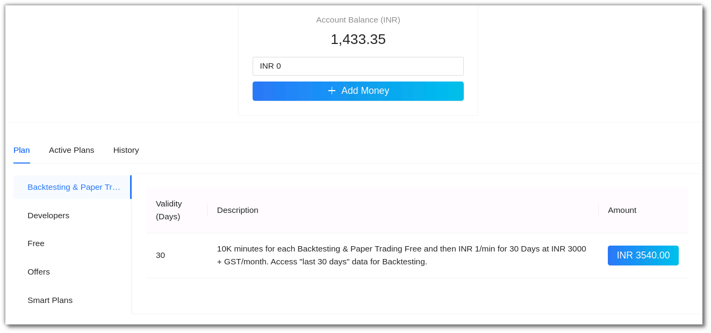
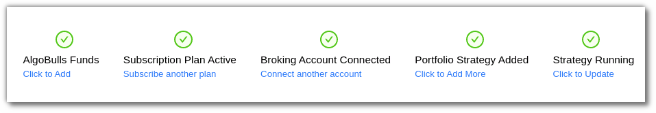
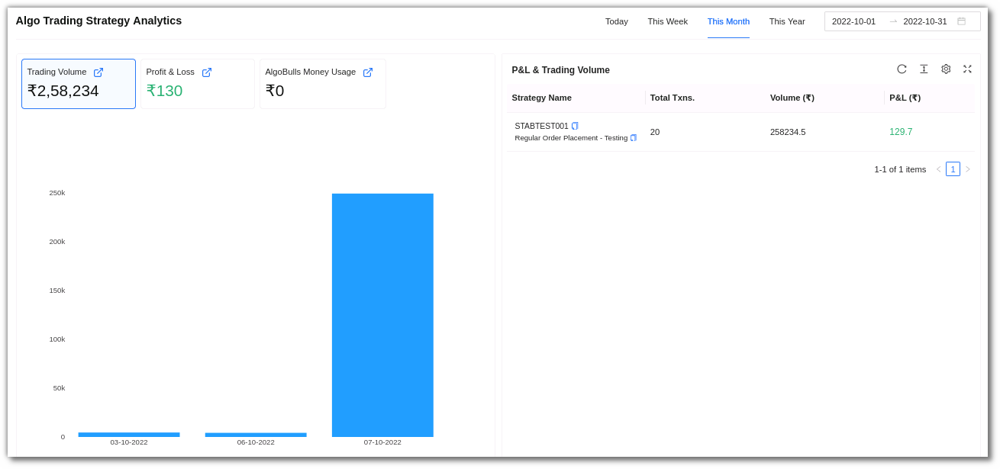
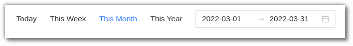
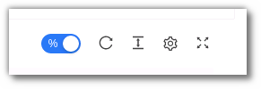
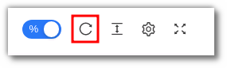
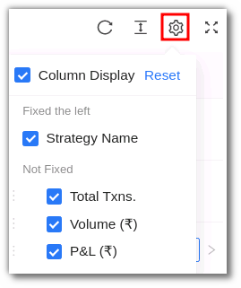
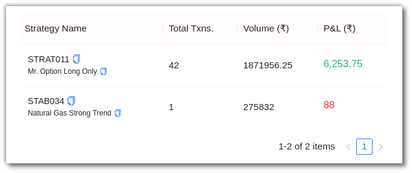

# Dashboard

The AlgoBulls dashboard gives you an overview of your account and trades. 

## AlgoBulls Money
---

You can view your current balance in your AlgoBulls Dashboard. To add money in your AlgoBulls account click on the Add Money button in the dashboard. You will be directed to the ‘Plans & Wallet’ section where you can add money. 

## Action Bar
---

The action bar displays your AlgoBulls Funds, Subscription Plan Status, Broker Account and Portfolio Strategy. You can also add funds, subscribe to a plan, connect to another broker account and add more strategies to your portfolio page from the action bar. 

## Algo Strategy
---

You can see the overall trading volume, profit and loss, and your AlgoBulls current balance in this section. On the left side of the page, you can see the data in a graphical representation, and on the right side, you can see strategy details such as strategy name, total transactions, Volume, and P&L.

You can narrow down your search by selecting the following options: 

* `Today`- Trades for the day 
* `This week` - Trades for the week 
* `This month` - Trades placed in the month 
* `This year` - Trades placed this year 

You can also customise your search by using the date range option where you can put the start and end date for the selected period to get results.

As per the range chosen by you, the following data is reflected and updated as a table: 

## Toolbar
---
The Dashboard toolbar includes the refresh, density, settings and full screen tools. 

`Refresh` - If you can't see an entry in the table (perhaps the most recent one), click Refresh to check again.

`Density` - View data comfortably by choosing the density. The options include Larger, Middle and Compact. 

`Settings` - Select the columns that you want to view in this settings option.

`Full Screen` - With this option you will be able to view your current tab on the browser in full Screen. To go back to the normal viewing mode click on it again. This is similar to pressing F11 on most browsers and operating systems.

## Fields
---
The Dashboard fields include: 

* `Strategy Name` - This consists of the strategy name and strategy code .
* `Total Txns` - This consists of the total number of transactions made by you for that strategy.
* `Volume (₹)`- This includes the total volume in INR.
* `P&L (₹)` - This field includes the total P&L.
