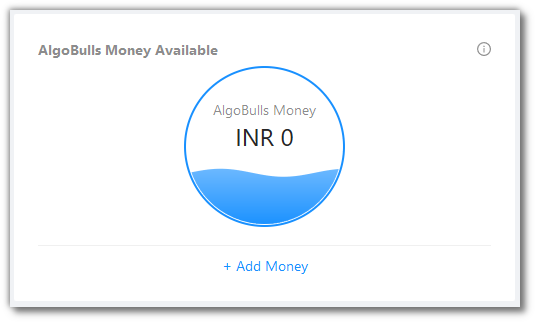

# Dashboard

<iframe width="560" height="315" src="https://www.youtube.com/embed/J9msKNweQvI" frameborder="0" allow="accelerometer; autoplay; encrypted-media; gyroscope; picture-in-picture" allowfullscreen></iframe>

This page gives an overview of your account and trades.

Click `Add Money` to add funds into your AlgoBulls wallet.

Click `Add Broking Details and Bind Account` to bind a broker account to the AlgoBulls platform.

Before binding an account, you will see this.

After binding an account, you will see this.

The Action Bar gives the following information: `AlgoBulls Funds`, `Capital Risk`, `Portfolio Strategy`, `Real Trading` and `Backtesting Strategy`.

You can see Strategy & Transaction Status for today, this week, this month, this year or any custom date range of your choosing.

As per the range chosen by you, the following data is reflected and updated as a graph: `Sales`, `Profit & Loss` and `AlgoBulls Money Usage`.

As per the range chosen by you, the following data is reflected and updated as a table: `Total Transactions`, `Algo. Strategy Name`, `Volume (₹)` and `P & L (₹)`.

