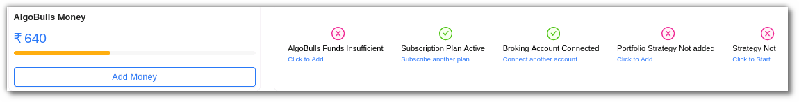
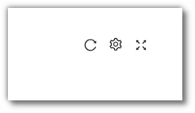

# Dashboard

## 1. Introduction
---

The AlgoBulls [Dashboard](https://app.algobulls.com/dashboard) provides an overview of your account and trades.

## 2. AlgoBulls Money
---

Your current balance is displayed on the AlgoBulls Dashboard. To add money to your AlgoBulls account, click the "Add Money" button on the dashboard. A pop-up will open for payment gateway to complete your payment.

## 3. The Action Bar
---
The action bar shows your AlgoBulls funds, subscription plan status, broker account information, and portfolio strategy. From the action bar, you can
also [add funds](https://app.algobulls.com/wallet?defaultCategory=backtesting%26PaperTrading), [subscribe to a plan](https://app.algobulls.com/wallet?defaultCategory=backtesting%26PaperTrading), connect another broker account, and add more strategies
to your portfolio.

## 4. Strategy Analytics
---
In this section, you can view overall trading volume, profit and loss, and your current AlgoBulls balance. The left side of the page displays data in a graphical format, while the right side provides strategy details such as strategy name, total
transactions, volume, and P&L.

You can filter your view by selecting the following options:

* **Today:** Trades executed today.
* **This week:** Trades executed this week.
* **This month:** Trades executed this month.
* **This year:** Trades executed this year.
* **Custom Range:** Use the date range option to specify a start and end date for your search.

## 5. Fields
---
The Dashboard fields include:

* **Strategy Name:** Displays the name and code of the strategy.
* **Total Txns:** Shows the total number of transactions for that strategy.
* **Volume (₹):** Indicates the total volume in INR.
* **P&L (₹):** Displays the total profit and loss.

## 6. The Toolbar
---
The Dashboard toolbar includes options for refresh, density, settings, and full screen mode.

**Refresh:** Click refresh if you do not see a recent entry in the table.

**Settings:** Use this option to select which columns you want to view.

**Full Screen:** View your current tab in full screen mode. To exit full screen, click the icon again or press F11 on most browsers and operating systems.

