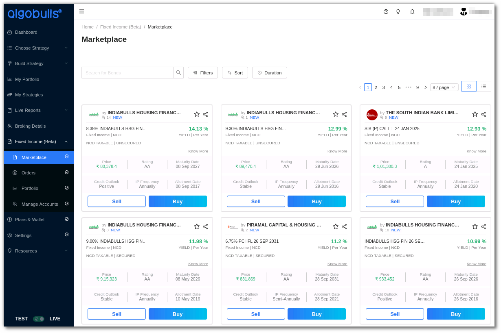
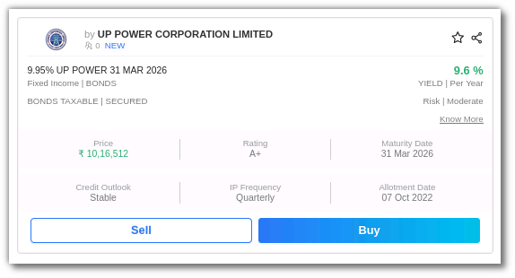
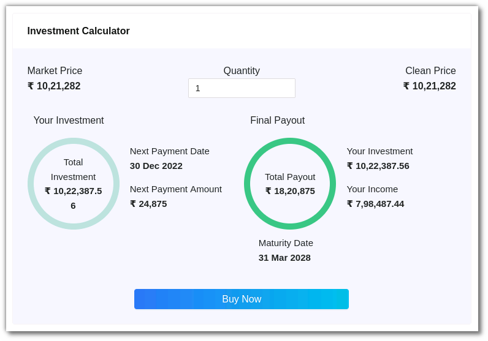

# Fixed Income

## 1. Introduction:

Fixed income is an investment that focuses on capital and income preservation. It frequently includes investments such as government and corporate bonds/NSDs/MLDs. Fixed income can provide a consistent stream of income while posing less risk than stocks.
If you are just entering the world of **investment, bonds, NCDs & MLDs** can be a great place to begin!
So let’s understand what are Bonds, NCDs & MLDs and how investing in these securities can be beneficial for you?

BONDS:
A bond is a financial instrument that allows individuals to lend money to institutions such as governments or businesses. The institution will pay a set interest rate on the investment for the duration of the bond, then return the original amount at the end of the loan's term.
Bond investing provides a predictable income stream, and in many cases, bonds pay interest multiple times in a year. Since the investor receives the entire principal amount if the bond is held until maturity, these are regarded as the best way to protect one's capital.

NCDs:
NCDs are Non-convertible Debentures. Companies use non-convertible debentures as a tool to raise long-term capital through a public issue. When compared to convertible debentures, lenders typically receive a higher rate of return to compensate for the disadvantage of non-convertibility.
NCDs also provide the owner with a number of additional advantages, including increased liquidity due to their listing on the stock market, source tax exemptions, and safety due to the fact that only companies with strong credit ratings are permitted to issue NCDs in accordance with RBI-established guidelines.

MLDs:
MLDs are Market Linked Debentures. MLDs are non-convertible debentures with variable returns that are correlated to the market. The performance of the underlying index affects the return from a Market Linked Debenture.

Now let’s understand how you can begin trading on the AlgoBulls Fixed Income marketplace.

## 2. An Overview:

To begin using the Fixed Income marketplace, download the AlgoBulls App or register on [www.algobulls.com](http://www.algobulls.com)

After signing in, go to the Fixed Income section in the sidebar navigation. You will see the following fields:

**i. Marketplace:** Find all the bonds, NCD & MLD cards in this marketplace. You can Buy or Sell these securities, view Security Details, use the Investment Calculator & view the Payment Cycle.

**ii. Fixed Income Card:** Get complete details, such as the Bond & NCD name, price, rating, maturity date, yield per year % and more here.

**iii. Search Bar:** To find a specific Security, enter the name or ISIN number into the search bar.

**iv. Filters, Sort & Duration:** You can filter your search, sort the categories, or look for a Security based on the duration and multiple other options.

**v. Viewing Mode:** View Fixed income securities in Compact, Regular or List Mode.

## 3. Exploring the Fixed Income Card:

Get complete details, such as the Bond name, price, rating, maturity date, yield per year % and more here. Click on the bond card to view the expanded version.

Click on know more to get detailed information of the bond.

* Details

* Investment Calculator

* Payment Cycle

**i. Fixed Income Summary:**  The Issuer name, Bond/NCD/MLD name, Price, Rating, Yield, Credit Outlook, IP Frequency, Maturity Date, Allotment Date, Next Interest Payment Date and Security is displayed here.

**ii. Security Details:** Get the complete details of the security such as the issuer details, Coupon Rate, Ownership, ISIN, Credit Agency Details, Debenture Trustee, Taxable or not, Secured or not and more in the Details section.

**iii. Investment Calculator:**  Check the market price, add your quantity and calculate the total investment using the Investment Calculator. You can check the total investment and payout along with the maturity date from here. Click on Buy Now to buy the bond.

**iv. Payment Cycle:**  This section will display the payment cycle of the security, this includes the price considered, interest rate and principal + interest.

**v. Orders:** In the orders section you can sell any bond, search for your orders or get the complete order details.

* **Sell Any Security:** To sell a security you will need details such as the ISIN, Settlement Date, Quantity, Settlement Amount or Principal Amount & Accrued Interest. Before you sell a security, ensure your KYC is completed.

* **Search Bar:** Search any order using the search bar.

* **Filters & Sort:** Filter your orders by Issuer, IP Frequency, Taxation Criteria, Type & Status. You can Sort your orders by applying the Yield or Safety options.

* **All Orders:** Check all your orders in this section. This includes the Issuer & security name, Settlement amount, Maturity Date, Status, Deal Sheet and more.

**vi. Portfolio:** This is your Fixed Income portfolio you can sell any security, search or filter the securities and view the complete portfolio details.

* **Sell Any Security:** To sell a security you will need details such as the ISIN, Settlement Date, Quantity, Settlement Amount or Principal Amount & Accrued Interest. Before you sell a security, ensure your KYC is completed.

* **Search Bar:** Search any order using the search bar.

* **Filters & Sort:** Filter your orders by Issuer, IP Frequency, Taxation Criteria, Type & Status. You can sort your orders by applying the Yield or Safety options.

* **Portfolio:** This is your fixed income portfolio section where the security details, purchase date, Interest Payment Date, Total Cost Price, Total Current Value and Action are displayed.

**vii. Manage Accounts:** Manage your Fixed Income details such as add your Bank Account, Demat Details & KYC Information.

## 4. How To Buy a security?

It is crucial to update your KYC, bank information, and demat account information in the Manage Account section in the sidebar navigation before you buy a security.

After updating the above information, from the Marketplace, select a security that you would like to invest in and click on Buy.

You can now add the quantity in the Investment Calculator and click on Buy now.

You will be redirected to the Plans & Wallet section’s checkout page, where you can pay the amount. Ensure that you check all the details before making a payment. Click on the total amount payable, you will be taken to a payment gateway page where you can enter your information and complete the payment.

## 5. How to Sell a Security?

It is crucial to update your KYC, bank information, and demat account information in the Manage Account section in the sidebar navigation before you sell a security.

After updating the above information, from the Marketplace, select a security that you would like to invest in and click on Sell.

Add details such as ISIN, Settlement Date, Quantity.

Select from the following options: Principal Amount and Accrued Interest or Settlement Amount.

If you wish to choose the Principal amount, add the settlement amount. If you wish to add the Accrued or Settlement amount, add the principal amount and accrued interest details.

Click Next to review it. Once submitted, the security will be sold successfully.

We hope this section has helped you understand the Fixed Income section on AlgoBulls. If you have further questions related to this, please feel free to contact our customer service team on support@algobulls.com
