# Live Trading and Virtual Trading

<iframe width="560" height="315" src="https://www.youtube.com/embed/n7b-OEZZxSc" frameborder="0" allow="accelerometer; autoplay; encrypted-media; gyroscope; picture-in-picture" allowfullscreen></iframe>

## 1. Introduction
---
My Portfolio page displays all the strategies that have been added from Odyssey and Phoenix. You can use these strategies to Backtest, Papertrade, or Livetrade on your desired conditions.

## 2. How to Begin Live Trading?
---
Begin Live Trading on AlgoBulls with these simple steps:

**Step 1:**
Select a strategy from the Odyssey or Phoenix page

- For Odyssey click on execute button. The strategy will be added to the portfolio, and you will be redirected to the [My Portfolio](https://app.algobulls.com/portfolio) page.

- For Phoenix, click on **Add to My Portfolio** button inside the strategy below the code editor to add this strategy to My portfolio page.

**Step 2:**
To start the chosen strategy, click the start button in the Action field.

**Step 3:**

i. Select Live Trading from the modal.

ii. Select a broker

iii Add the start and end time, and specify the Quantity/Lots.

[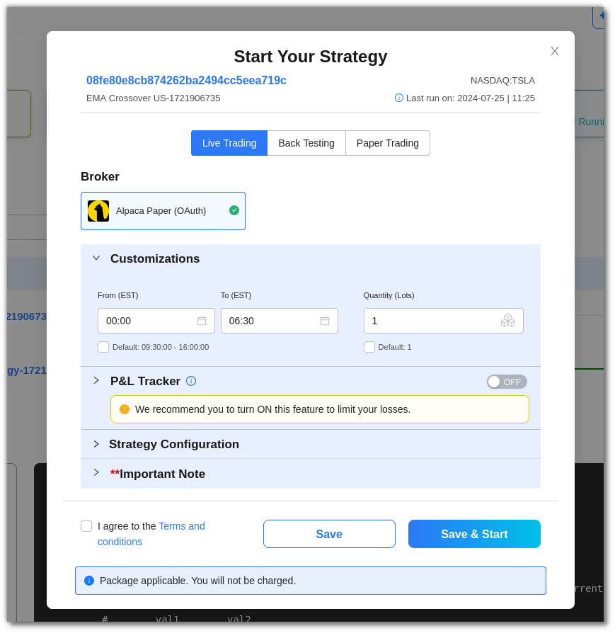](imgs/live_trade_modal.png)

**Step 4:**
Use the toggle button to activate the P&L Tracker. Add the desired profit and risk appetite here. Click on Save & Start.

!!! note

    * Please note that you will be charged for using these services.

    * To waive these charges, you can purchase a package with AlgoBulls.

!!! warning

    Even after completing all the preceding steps, trading may not begin for the following reasons:

    * Insufficient funds in your broker account.
    * A particular segment in your broker account has not been activated (this can happen with new accounts; some brokers activate this by default, while others may take 24 hours or more).
    * Due to market volatility, your broker may stop accepting certain order requests on some scripts or stocks. If any such order type with such script/stock strategy is currently running in your AlgoBulls account, new orders for the same won't be displayed.
    * Certain order types may be incompatible with certain brokers.
    * Your linked broker account must allow you to execute those orders. Not all strategies are accepted/allowed by every broker due to permission issues.
    * The AlgoBulls platform has no control over the brokerage charges imposed by your broker once your trading begins. Please review all charges on the broker's end before proceeding.

    ------------
    Visit [algobulls.com](https://algobulls.com/).

- Strategies may stop due to various reasons such as market closure, P&L achieved, or if there are any errors. To check errors, in the **Progress field** click on the **view details** option.

    - For Odyssey, logs and orders timeline will appear.

      [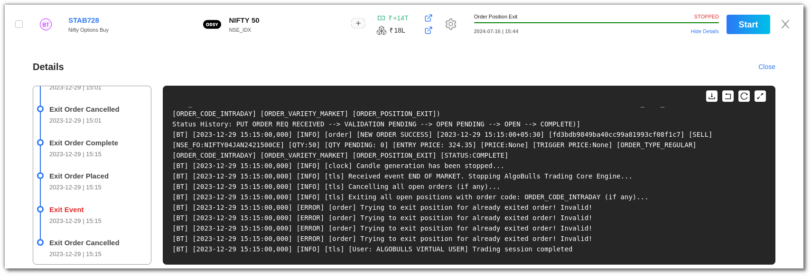](imgs/view_details_odyssey.png)

    - For Phoenix, logs and orders timeline will appear along with a button to show **detailed analytics**.

      [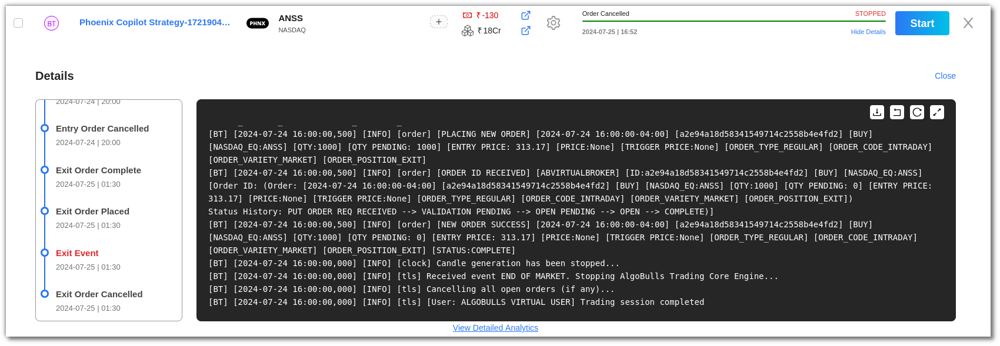](imgs/view_details_phoenix.png)

## 3. How to Begin Virtual Trading?
---

* **Step 1:**
  To start the chosen strategy, click the start button in the Action field.

  

* **Step 2:**
  i. Select Back Testing or Paper Trading from the modal.

  

* **Step 3:**

    * i. Click on Customisations and add dates for Back Testing.

  [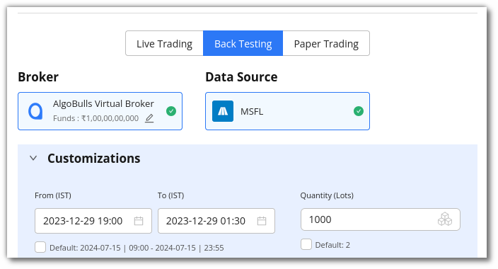](imgs/bt_customization.png)

    * ii. Click on Customisations and add time for Paper Trading.

  [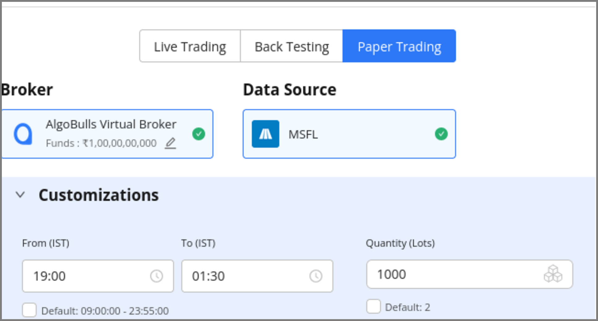](imgs/pt_customization.png)

* **Step 4:**
  Use the toggle button to activate the P&L Tracker. Add the desired profit and risk appetite here. Click on Save & Start.

  

## 4. Summary Bar
---
The **Summary Bar** in the portfolio section includes the following:

* **Odyssey Strategy**: Number of strategies from the Odyssey in your portfolio.
* **Tweak Strategy**: Number of strategies that have been tweaked by you.
* **Custom Strategy**: Number of custom strategies built by the AlgoBulls developer team for you.
* **Total Running Strategies**: Number of strategies currently active in your portfolio (during market hours).
* **Today's P&L**: The total P&L value.
  [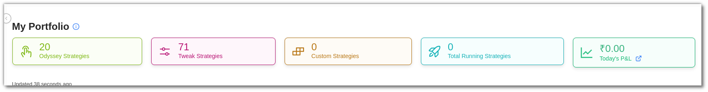](imgs/portfolio_meta.png)

## 5. Fields
---
The My Portfolio section includes the following fields:

* **Mode**: Displays the strategy mode: **LT (Live Trading)**, **BT (Back Testing)**, or **PT (Paper Trading)**.
* **Strategy**: Displays the strategy name and code.
* **Instrument(s)**: Includes the instruments on which the strategy is being run.
* **Tag**: A user-defined tag for the strategy, allowing users to categorize different strategies.
* **Live Reports**: Displays **P&L** and **Trade Volume**, with redirect links to view your results in the respective **P&L Book** and **Trade Book**.
  

* **Config**: View parameters and other configuration settings here. The strategy configuration field includes **instrument** and **strategy settings**, such as general settings, strategy parameters, resume, exit, and miscellaneous options.
  [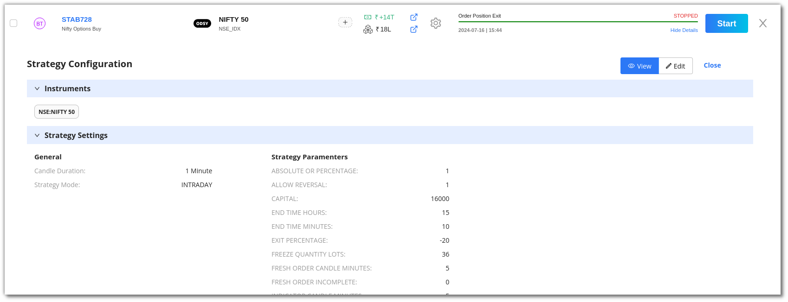](imgs/tweak_config_view.png)

* **Action**: The Action field allows you to start or stop a strategy. To execute a strategy, click on **start**. You can choose multiple brokers and run the strategies simultaneously.
  

## 6. Toolbar
---
The Dashboard toolbar includes the refresh, density, settings, and full-screen tools.
[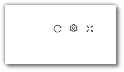](imgs/toolbar_normal.png)

- **Refresh**: If you can't see a recent entry in the table, click Refresh to check again.
  [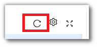](imgs/toolbar_refresh.png)

- **Settings**: Select the columns you want to view using this settings option.
  [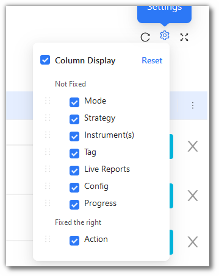](imgs/toolbar_settings.png)

- **Full Screen**: Use this option to view your current tab in full-screen mode. To return to normal viewing, click the icon again or press F11 on most browsers and operating systems.
  [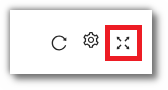](imgs/toolbar_full_screen.png)
