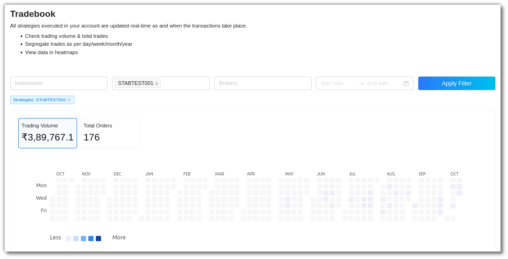
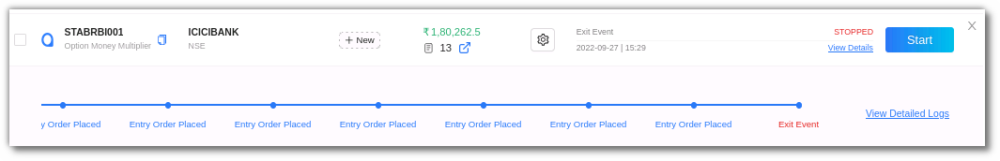

# Live Trading

You can execute strategies to begin real trading in the Live/Real Trading Mode. Switch the toggle button on the bottom left side of the website to Live Mode.

* Begin real trading with 100% automation in Live/Real Trading Mode.
* Choose from multiple brokers & execute trades directly in your Broking account.
* Monitor Live Profit & Loss and fetch strategy execution Logs in real time. There are no charges for fetching Logs.
* Start & Stop your algo strategies in one click. Charges may be applicable for START and STOP. [More details here](https://help.algobulls.com/)
* Choose a strategy from [Retail](https://app.algobulls.com/marketplace/category/retail), [Premium](https://app.algobulls.com/marketplace/category/premium) & [HNI marketplace](https://app.algobulls.com/marketplace/category/hni) now! 

The `summary bar` in the portfolio section includes the following: 

`Choose Strategy` - Number of strategies from the Marketplace in your portfolio added by you.

`Tweak Strategy` -  Number of strategies that have been tweaked by you.

`Build Strategy` - Number of custom strategies that have been built by the AlgoBulls developer team for you. 

`Total Running Strategies` - The number of strategies that are currently active on your portfolio, especially from the ones mentioned above (During the market hours).

`Today’s P&L` - The total P&L value.

## Toolbar
---
The Dashboard toolbar includes the refresh, density, settings and full screen tools. 

`Refresh` - If you can't see an entry in the table (perhaps the most recent one), click Refresh to check again.

`Density` - View data comfortably by choosing the density. The options include Larger, Middle and Compact. 

`Settings` - Select the columns that you want to view in this settings option.

`Full Screen` - With this option you will be able to view your current tab on the browser in full Screen. To go back to the normal viewing mode click on it again. This is similar to pressing F11 on most browsers and operating systems.

## Fields
---

My Portfolio includes the following fields: 

* `Strategy` - This field displays the strategy name and code.
* `Instrument(s)` - This includes the instrument on which the strategy is being run. 
* `Tag` - This is a user defined tag for the strategy. Users can tag different strategies under different tags.
* `Volume` - This includes the strategy volume. To get a detailed view you can also click the symbol highlighted in blue in the volume field that redirects you to the tradebook.

* `Config` - You can view parameters and other configuration settings here. 
The strategy configuration field includes Instrument and Strategy Settings such as general settings, strategy parameters, resume, exit and misc options. 

* `Progress` - This includes the strategy progress status. You can view if the strategy is about to begin, has begun or has stopped here. You can also click on the view details section to get a real time progress update. 

`Logs` - The log feature allows you to view the complete details of an order placed. In the ‘Progress’ field click on the ‘view details’ option and then click  ‘detailed logs’ on the right side corner. These logs can also be downloaded at any time of the day unless you override it by starting the same strategy again.

* `Action` - The action field allows you to start or stop a strategy. To execute a strategy click start. When you click on the start you will be able to choose multiple brokers and run the strategies simultaneously too.

