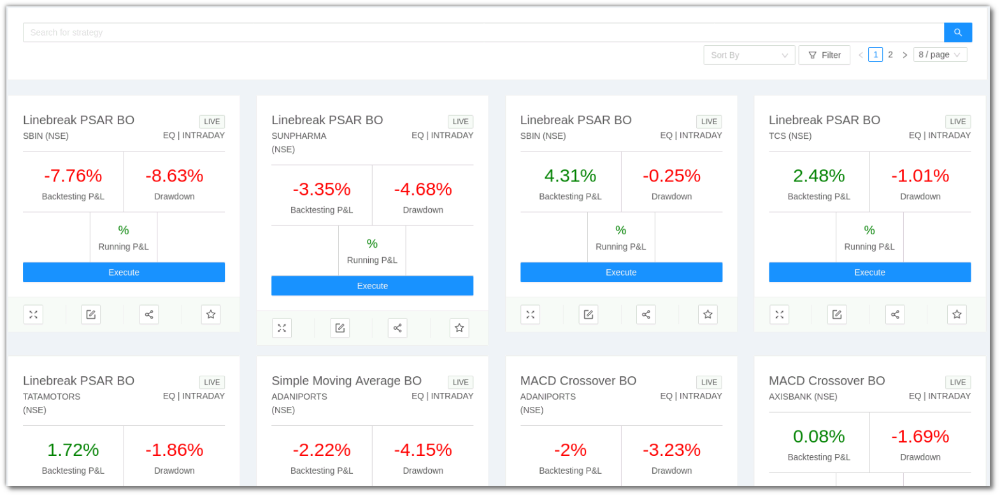
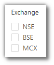
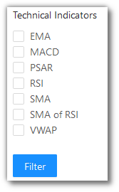
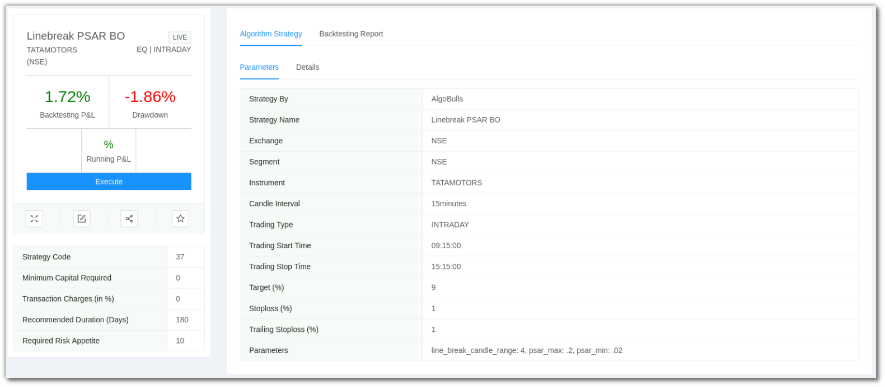
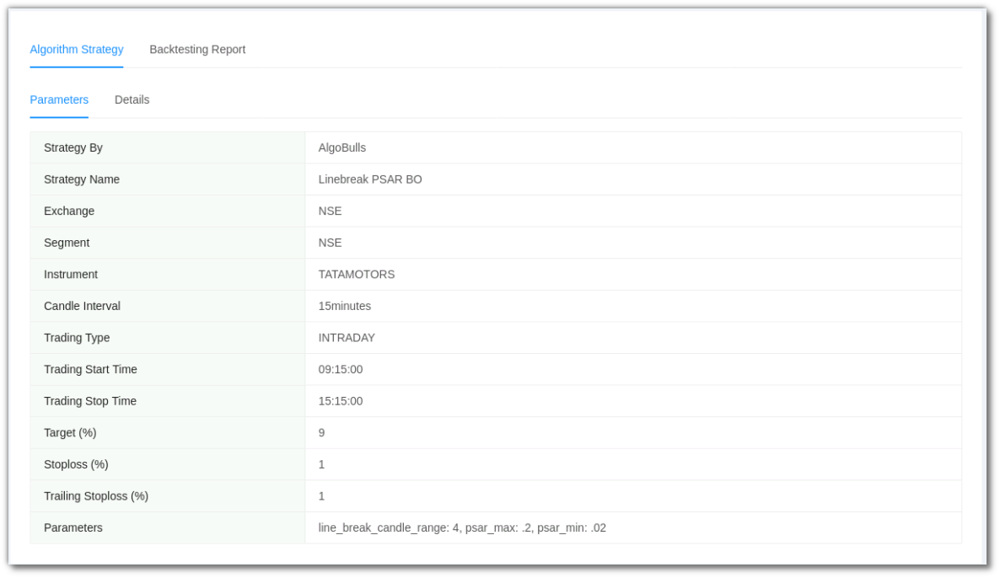
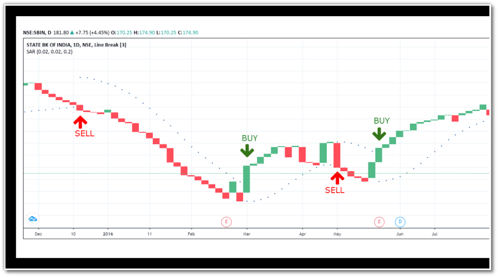
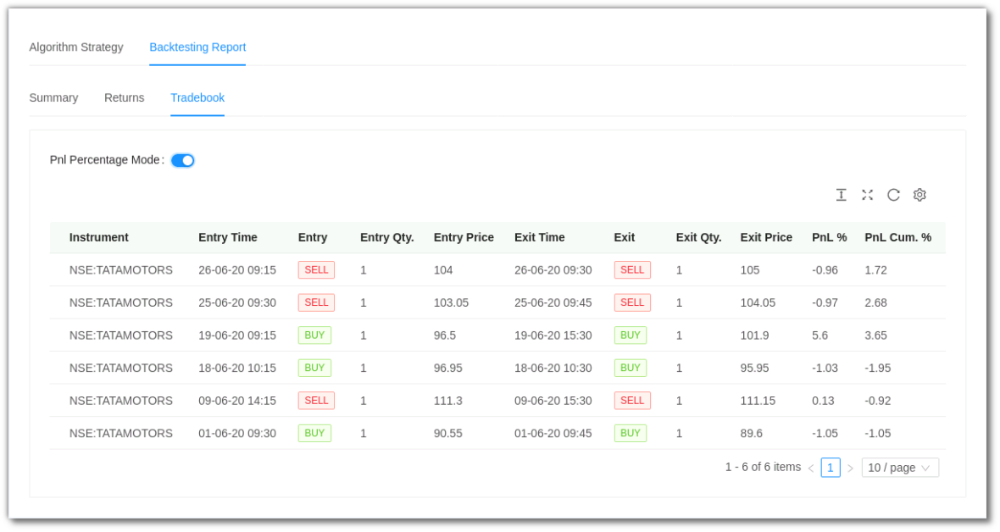

# Marketplace

This is the Algobulls Platform Marketplace for strategies.

Before adding any strategy to your Portfolio, you can search for strategies here, look into the details for each strategy, and view the backteting reports to evaluate the performance. 

## Searching for a Strategy 
---

`Search Bar` - You can type your keywords here.

`Sort By` - You can sort the strategies into the following:

* Backtest PnL - Sorted by the best Backtest PnL %.
* Drawdown - Sorted by the least worst drawdown %. 
* Transaction Frequency - Sorted by the most frequency of transactions.
* Transaction Charges - Sorted by the least transaction charges.
* Most Recent Transactions - Sorted by strategies having the most recent transactions.

`Filter` - You can filter your view as per the following categories shown.

## What does a Strategy Card look like
---

## A look at the toolbar
---

`Expand` - You see a detailed and expanded view of a strategy when you click on the card or click this button.

`Tweak` - Click this button to view and tweak the parameters of a strategy. 

`Share` - Click this button to get a shareable link for a strategy.

`Add to Favorites` - Click this button to add this strategy to Favorites for easy viewing later.

## When you click on a Strategy Card
---

Clicking on a Strategy Card will give you a detailed and expanded view of the strategy.

This is the Left Hand Side of the expanded view.

It shows the same details and the toolbar as the market place.

In addition to that, the following details are visible: `Strategy Code`, `Minimum Capital Required`, `Transaction Charges (in %)`, `Recommended Duration (Days)`, and `Required Risk Appetite`.

This is the Right Hand Side of the expanded view.

It has 2 tabs: `Algorithm Strategy` and `Backtesting Report`.

`Algorithm Strategy` has 2 tabs: `Parameters` and `Details`.

`Algorithm Strategy` -> `Parameters`

`Algorithm Strategy` -> `Details`

`Backtesting Report` has 3 tabs: `Summary`, `Returns` and `Tradebook`.

`Backtesting Report` -> `Summary`

`Backtesting Report` -> `Returns`

`Backtesting Report` -> `Tradebook` (with PnL percentages)

`Backtesting Report` -> `Tradebook` (without PnL percentages)

