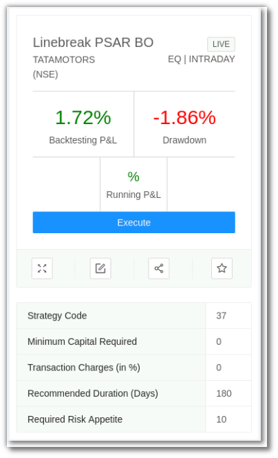
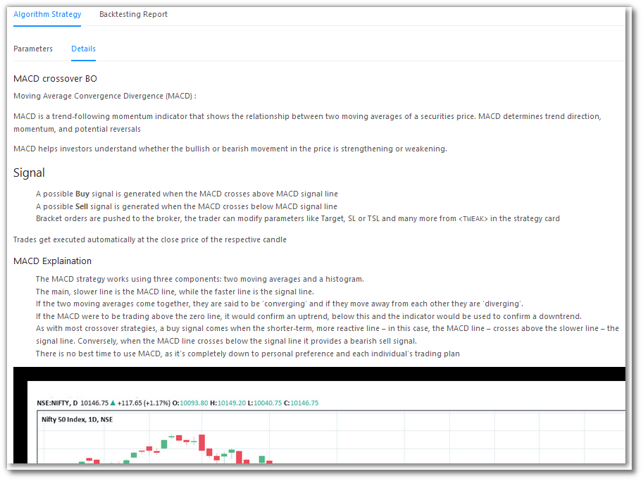
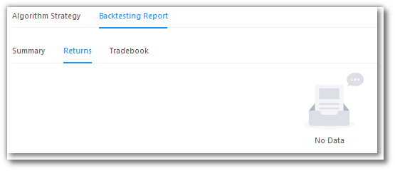
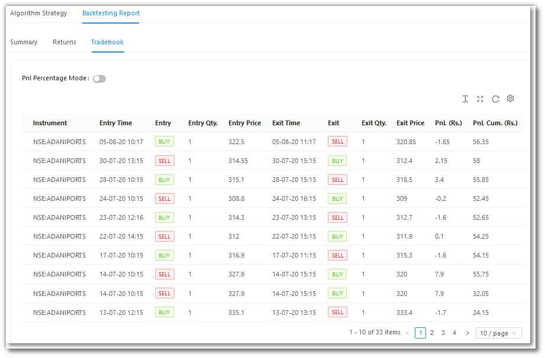

# Marketplace

<iframe width="560" height="315" src="https://www.youtube.com/embed/KpnncgSfKXY" frameborder="0" allow="accelerometer; autoplay; encrypted-media; gyroscope; picture-in-picture" allowfullscreen></iframe>

This is the Algobulls Platform Marketplace for strategies.

Before adding any strategy to your Portfolio, you can search for strategies here, look into the details for each strategy, and view the backtesting reports to evaluate the performance. 

## Searching for a Strategy 
---

<iframe width="560" height="315" src="https://www.youtube.com/embed/VQCWEm4gJHg" frameborder="0" allow="accelerometer; autoplay; encrypted-media; gyroscope; picture-in-picture" allowfullscreen></iframe>

`Search Bar` - You can type your keywords here.

`Favorites` Toggle - Toggle the switch to see the strategies marked as Favorite (☆)

`Filter` - You can filter your view as per the following categories shown.

`Sort By` - You can sort the strategies into the following:

* Backtest PnL ↑ ↓
* Drawdown ↑ ↓ 
* Transaction Frequency ↑ ↓
* Transaction Charges ↑ ↓
* Most Recent Transactions ↑ ↓

`Pagination` - You can click the < and > for changing pages. You can also choose to view 6/8/10 strategies per page.

## What does a Strategy Card look like
---

## A look at the toolbar
---

`Expand` - You see a detailed and expanded view of a strategy when you click on the card or click this button. The effect is the same when you click on a Strategy Card.

`Tweak` - Click this button to tweak the parameters of a strategy. This is what happens when you click the `Tweak` button:

* The strategy gets added to your account
* You are re-directed to the [Paper Trading & Backtesting](paperback.md) page
* Click on `Tweak` on the newly added strategy on this page

`Share` - Click this button to get a shareable link for a strategy. You will see this message:

`Add to Favorites` - Click this button to add this strategy to Favorites for easy viewing later.

## When you click on a Strategy Card
---

Clicking on a Strategy Card will give you a detailed and expanded view of the strategy.

The Left Hand Side of the expanded view shows the same details and the toolbar as the market place.

In addition to that, the following details are visible: `Strategy Code`, `Minimum Capital Required`, `Transaction Charges (in %)`, `Recommended Duration (Days)`, and `Required Risk Appetite`.

The Right Hand Side of the expanded view has 2 tabs: `Algorithm Strategy` and `Backtesting Report`.

`Algorithm Strategy` has 2 tabs: `Parameters` and `Details`.

`Backtesting Report` has 3 tabs: `Summary`, `Returns` and `Tradebook`.

Click on each tab below to know more.

=== "Algorithm Strategy"
    === "Parameters"
        This displays all the parameters of the strategy. Click on `Tweak` to edit these parameters as per your requirements.
        
        
        
    === "Details"
        This tab describes the strategy in detail. You will see the description of the strategy, the signal generation conditions, the explanation and an associated graph wih it.
        
        
        
=== "Backtesting Report"
    === "Summary"
        The report summary is displayed here.
        
        
        
    === "Returns"
        This displays all the returns given by the strategy.
        
        
        
    === "Tradebook"
        This displays all the trades punched during the Backtesting.
        
        

