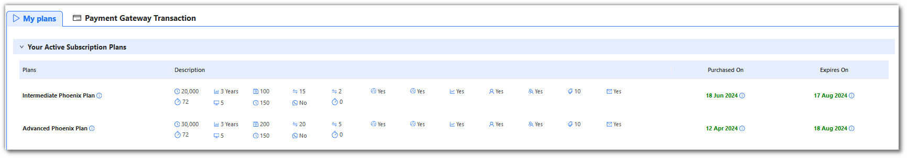
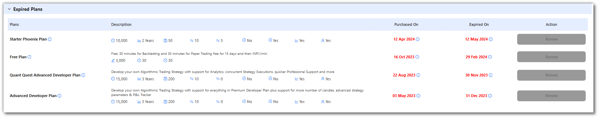
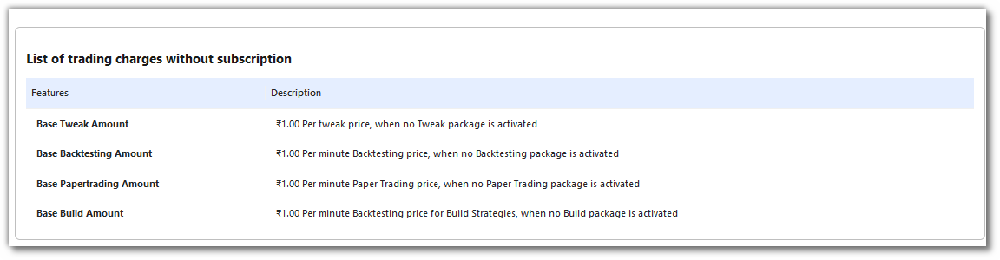
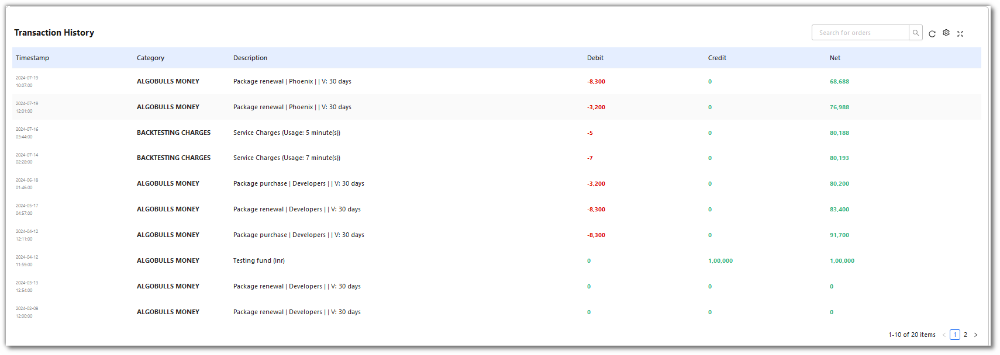

# My Plans

## 1. Overview of the Plans Page

On this page, you can view all your purchased plans. This includes detailed information about both active and expired plans. The page is designed to provide you with a comprehensive overview of your subscriptions, making it easy to manage and review
your plan history.

## 2. Active Plans

Under the "Active Plans" section, you'll find a list of all currently active subscriptions. Each plan entry provides essential details such as the plan name, purchased on, Expires on, and other specific features or benefits included inside
**Description** section. This allows you to easily track the status of your ongoing plans and ensure you are making the most of your subscription benefits.

## 3. Expired Plans

The "Expired Plans" section contains information about plans that have concluded. This includes the same level of detail as active plans, helping you keep a record of your past subscriptions. This section is useful for reviewing your subscription
history and understanding what services you previously had access to.
How to Manage Your Plans

## 4. How to Add money?

To add money to your AlgoBulls account. Go to [My Plans](https://app.algobulls.com/myplans) from the sidebar navigation. Go to **Payment Gateway Transactions** enter the amount and click on **Add Money**.

Enter your **phone number & email address** and **click on proceed**.

Choose your preferred **payment method**. Once the payment is successful the balance will be added in your AlgoBulls account.

## 4. Other charges

If no plan is purchased or a plan expires while executing a strategy, the following charges will be levied.

## 5. Transaction History

You can view all your transactions from this transaction history table. You can search for a transaction using search option

