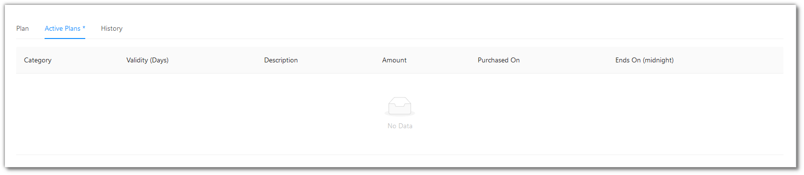
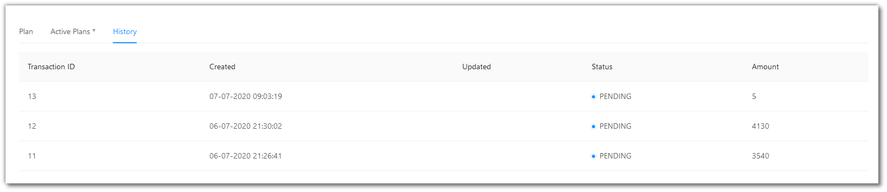

# Navigation Bar

This page displays a list of all your strategies that you may set as Backtesting, Paper Trading or Real Trading (Portfolio).

The ...(Ellipsis) to the right give some navigation options, like switching to [Portfolio](member/portfolio.md) or jumping to Backtesting / Paper Testing.

## A look at the Nav-Bar
---

Click on `?` symbol to reach this help site.

Click on the `🔔` symbol to view your notifications.

Click on your account to sign-out.

Click on the `🌐` symbol to choose your language.

Click on the `₹` symbol to access and update your wallet and choose any packages as per your requirements.

## Wallet

You can add funds to your wallet by clicking the `+ Money` button.

All your actions like tweaking, backtesting, paper trading and real trading are charged according the funds in your wallet (wherever charges are applicable).

Your funds keep decreasing as and when you are charged, and once the funds become zero, your account stops trading.

If your actions are going to be quite extensive, then consider opting for packages/plans to get more economical benefits.

There are 3 tabs here:

`Plan` - A category-wise list of packages offering by the platform.

`Active Plans` - The currently active plan(s) in you account.

`History` - A list of all amounts that you have added to your wallet over a period of time.

## Plans

The following is a list of plans currently offered by our platform.

Click on the amount button of any plan to initiate payment for that plan. 

Here is an overview of all plans offered by our platform.

Click on `Active Plans` to see the plan(s) currently active in your account.

Click on `History` to see all your activity for your wallet over a period of time.

