# Backtesting and Paper Trading

<iframe width="560" height="315" src="https://www.youtube.com/embed/wc0h930E1AU" frameborder="0" allow="accelerometer; autoplay; encrypted-media; gyroscope; picture-in-picture" allowfullscreen></iframe>

Backtesting is the method of testing the past performance of an existing or tweaked strategy. If you want to check how the strategies perform in the live markets without investing real money you can try Paper trading. 

## Steps to backtest or paper trade a strategy on AlgoBulls

You can backtest or paper trade on AlgoBulls in 4 simple steps. Before you begin, switch to Test Mode by using the toggle button on the bottom left side of the sidebar navigation.

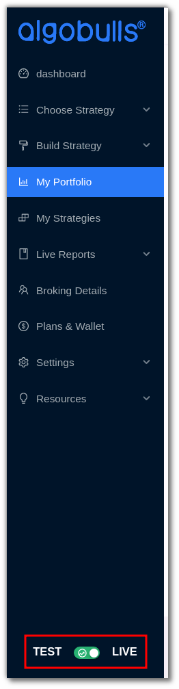

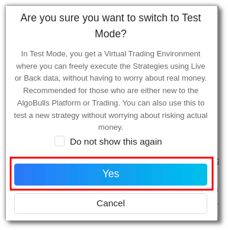

Also ensure that you’ve added a strategy from the [ChooseStrategy](Choose-Strategy.md) marketplace. 

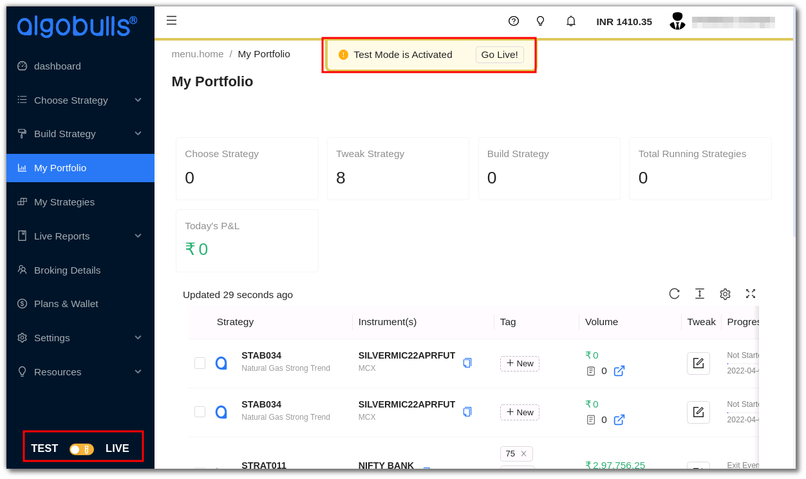

`Step 1`: In the [MyPortfolio](My-Portfolio.md) section click on the 'Start' button in the Action column. 

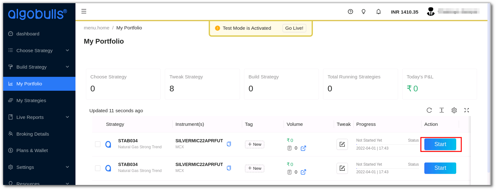

A pop-up window will appear. The AlgoBulls virtual Broker is the default broker selected in the Choose Broker option.

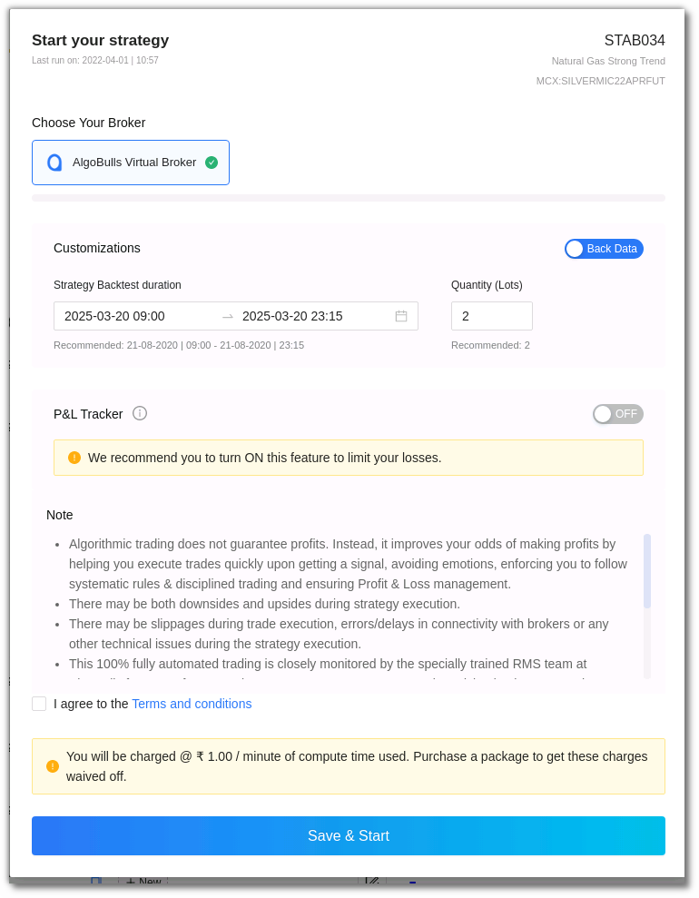

`Step 2`: In the Customizations' section choose Back Data for backtesting OR Live Data for paper trading. 

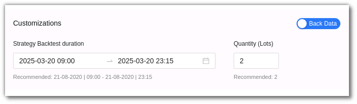

Select the duration option in the customizations section. Add the desired date and time, as well as the quantity/lots. In backtesting you will need to put the start date and end date along with time. 

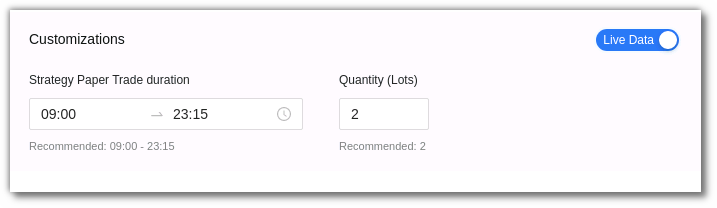

In paper trading you only need to add the start and end time. 

`Step 3`: Once you scroll below you will see the P&L tracker. Switch the P&L tracker ‘ON’ and enter your desired profit and risk appetite. 

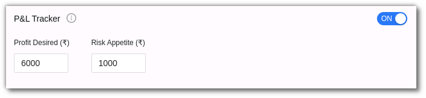

`Step 4`: Ensure you read the terms and conditions and then check the ‘I agree to the Terms and conditions’ box. Save & Start the strategy.

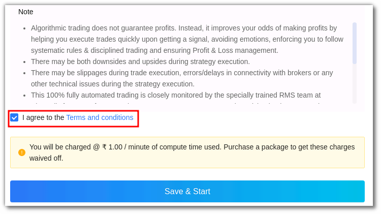

Please note that in both Backtesting and Paper Trading you will be charged if you don’t have an active AlgoBulls package. To avoid these charges you can buy the AlgoBulls package. 

You will be able to track the Backtesting or Paper Trading status in the Progress section 

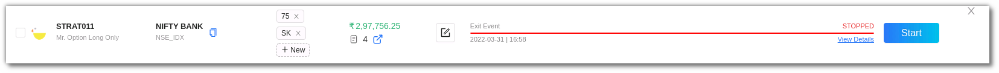

You can check the status details in the View Details feature in the Progress section. You can click on the view detailed logs option to get the logs. 

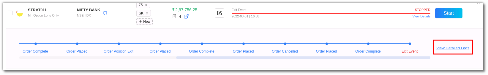

Once this process is complete, you will be able to view the strategies Past Performance (Backtesting) or Live Market Performance (Paper trading)

## Steps to apply backtested or paper traded strategies to Real Trading/Live Trading

If you are happy with the strategy after the backtesting or paper trading results you can begin real money trading by simply switching to Live Mode. You can begin real trading in 3 simple steps:  

`Step 1`: The backtested/Paper traded will be added to your My strategies section where you can simply switch them to Live Trading from the toggle button. The strategy will be added to your portfolio in Live Mode

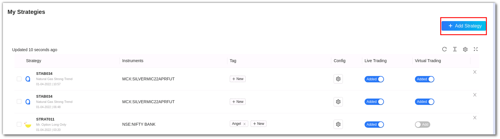

`Step 2`: Switch to Live Mode & go to the [My Portfolio](My-Portfolio.md) section in the sidebar menu. To start the chosen strategy click the start button from the Action field.

Select a broker, add the start and end time and Quantity/Lots. 

`Step 3`: Use the toggle button to activate the P&L tracker. Add the profit desired and Risk appetite here. Click on save & start.  

Please note that you will be charged for using these services, to get these charges waived off you can purchase a package with AlgoBulls instead. 

You can view the strategy status in the progress section. Once the strategy has begun the status will change to started and will change to stopped once the strategy has stopped in the Progress section. 

The strategy may stop due to various reasons such as market closure, P&L achieved, or if there are any errors. To check errors, in the ‘Progress’ field click on ‘view details’ option and then click  ‘detailed logs’ on the right side corner. These logs can also be downloaded at any time of the day unless you override it by starting the same strategy again.

