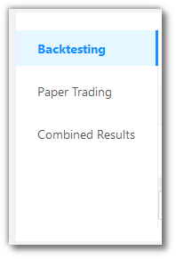

# Paper Trading and Backtesting

<iframe width="560" height="315" src="https://www.youtube.com/embed/wc0h930E1AU" frameborder="0" allow="accelerometer; autoplay; encrypted-media; gyroscope; picture-in-picture" allowfullscreen></iframe>

You can view and manage all your strategies of Paper Trading and Backtesting here.

There are 3 menu options here - `Backtesting`, `Paper Trading` and `Combined Results`.

## Backtesting/Paper Trading Fields
---
`Table Fields` - The table covers the following fields: Last Activity At, Code, Strategy, Tag, Source, Customize, Instrument(s), Qty. (Lots), Status, Reports, Logs, Add to Portfolio, Action.

## A look at the Backtesting/Paper Trading/Combined Results toolbar
---

`Refresh` - If you are not able to see an entry (possibly a most recent one) in the table, click Refresh to check again.

`Density` - Choose the density of the data you see. Options are Larger, Middle and Compact

`Full Screen` - The current tab on your browser goes Full Screen. Click again to go back to normal. This is similar to pressing F11 on most browsers and operating systems.

`Settings` - You can select which columns should be visible through here. 

## Table Fields for Backtesting and Paper Trading
---
The table covers the following fields: 

* `Last Activity At` - Shows last time the strategy was run.
* `Code` - Code of the Strategy.
* `Strategy` - Name of the Strategy
* `Tag` - User defined tag for the strategy. User can tag different strategies under different tags from Tweak.
* `Source` - Type of Strategy for eg: Build, Tweak or Develop.
* `Customize` - 
* `Instrument(s)` - Instrument on which the strategy is being run.
* `Qty. (Lots)` - Quantity/Lots being traded.
* `Status` - States the Status of the strategy if it is Started or Stopped.
* `Reports` - 
* `Logs` - You can access the logs from here.
* `Add to Portfolio` - Adds strategy to Portfolio.
* `Action` - Option to whether Start or Stop the Strategy.

## Combined Results Fields
---
The table covers the following fields: 

* `Last Activity At` - Shows last time the strategy was run.
* `Code` - Code of the Strategy.
* `Strategy` - Name of the Strategy.
* `Tag` - User defined tag for the strategy. User can tag different strategies under different tags from Tweak.
* `Source` - Type of Strategy for eg: Build, Tweak or Develop.
* `Backtesting PnL` - Net PnL of the strategy.
* `Backtesting PnL %` - Net PnL of the strategy in absolute percentage.
* `Max Drawdown` - Max drawdown the strategy suffered during backtesting period.
* `Number of Trades` - No. of signals strategy generated during the backtesting.
* `Number of Wins` - No. of wins during the backtesting period.
* `Number of Losses` - No. of losses during the backtesting period.
* `Number of Long Trades` - No. of Long Trades strategy generated during backtesting period.
* `Number of Short Trades` - No. of Short Trades strategy generated during backtesting period.
* `Max Gain` - Max Gain during backtesting period.
* `Min Gain` - Min Gain during backtesting period. This is different than Drawdown in a way that it considers minimum possible return from strategy.
* `Avg. Profit per winning trade` - Cumulative Profit for winning trades divided by No. of Wins.
* `Avg. Profit per losing trade` - Cumulative Loss for winning trades divided by No. of Wins.
* `Add to Portfolio` - Adds the Strategy to Portfolio from where it can be traded in live market.
* `Action` - Lets users delete the strategy card from the account.

!!! note
    The `Source` field will have one of the three values - CHOOSE, CHOOSE (TWEAK), BUILD_PYTHON (TWEAK). 
    
    Choose reflects in `Choose Strategy` from the `Summary Bar`.
    
    Choose Tweak reflects in `Tweak Strategy` from the `Summary Bar`.
    
    Choose Premium reflects in `Build Strategy` from the `Summary Bar`.
