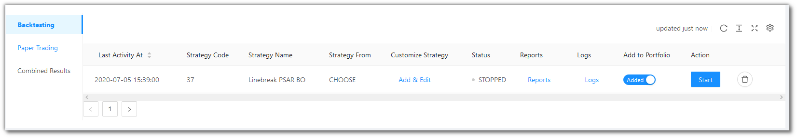

# Paper Trading and Backtesting

<iframe width="560" height="315" src="https://www.youtube.com/embed/wc0h930E1AU" frameborder="0" allow="accelerometer; autoplay; encrypted-media; gyroscope; picture-in-picture" allowfullscreen></iframe>

You can view and manage all your strategies of Paper Trading and Backtesting here.

The ...(Ellipsis) to the right give some navigation options, like switching to [Portfolio](portfolio.md) or jumping to Paper Testing.

There are 3 menu options here - `Backtesting`, `Paper Trading` and `Combined Results`.

## Backtesting Fields
---
`Table Fields` - The table covers the following fields: Last Activity At, Strategy Code, Strategy Name, Strategy From, Customize Strategy, Status, Reports, Logs, Add to Portfolio, Action.

!!! note
    The `Strategy From` field will have one of the three values - Choose / Choose Tweak / Choose Premium. 
    
    Choose reflects in `Choose Strategy` from the `Summary Bar`.
    
    Choose Tweak reflects in `Tweak Strategy` from the `Summary Bar`.
    
    Choose Premium reflects in `Build Strategy` from the `Summary Bar`.

## A look at the Backtesting toolbar
---

`Refresh` - If you are not able to see an entry (possibly a most recent one) in the table, click Refresh to check again.

`Density` - Choose the density of the data you see. Options are Larger, Middle and Compact

`Full Screen` - The current tab on your browser goes Full Screen. Click again to go back to normal. This is similar to pressing F11 on most browsers and operating systems.

`Settings` - You can select which columns should be visible through here. 

## Paper Trading Fields
---
`Table Fields` - The table covers the following fields: Last Activity At, Strategy Code, Strategy Name, Strategy From, Customize Strategy, Status, Reports, Logs, Add to Portfolio, Action.

!!! note
    The `Strategy From` field will have one of the three values - Choose / Choose Tweak / Choose Premium. 
    
    Choose reflects in `Choose Strategy` from the `Summary Bar`.
    
    Choose Tweak reflects in `Tweak Strategy` from the `Summary Bar`.
    
    Choose Premium reflects in `Build Strategy` from the `Summary Bar`.

## A look at the Paper Trading toolbar
---

`Refresh` - If you are not able to see an entry (possibly a most recent one) in the table, click Refresh to check again.

`Density` - Choose the density of the data you see. Options are Larger, Middle and Compact

`Full Screen` - The current tab on your browser goes Full Screen. Click again to go back to normal. This is similar to pressing F11 on most browsers and operating systems.

`Settings` - You can select which columns should be visible through here. 

## Combined Results Fields
---
`Table Fields` - The table covers the following fields: Last Activity At, Strategy Code, Strategy Name, Strategy From, Backtesting PnL, Backtesting PnL %, Max Drawdown, , Number of Trades, Number of Wins, Number of Losses, Number of Long Trades, Number of Short Trades, Max Gain, Min Gain, Avg. Profit per winning trade, Avg. Profit per losing trade, Add to Portfolio, Action.

!!! note
    The `Strategy From` field will have one of the three values - Choose / Choose Tweak / Choose Premium. 
    
    Choose reflects in `Choose Strategy` from the `Summary Bar`.
    
    Choose Tweak reflects in `Tweak Strategy` from the `Summary Bar`.
    
    Choose Premium reflects in `Build Strategy` from the `Summary Bar`.

## A look at the Combined Results toolbar
---

`Refresh` - If you are not able to see an entry (possibly a most recent one) in the table, click Refresh to check again.

`Density` - Choose the density of the data you see. Options are Larger, Middle and Compact

`Full Screen` - The current tab on your browser goes Full Screen. Click again to go back to normal. This is similar to pressing F11 on most browsers and operating systems.

`Settings` - You can select which columns should be visible through here. 

Note: You can also log-out by clicking on your account name and choosing the Log Out option.