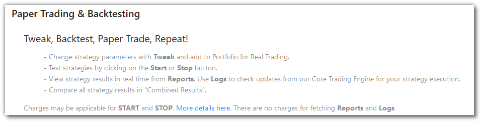
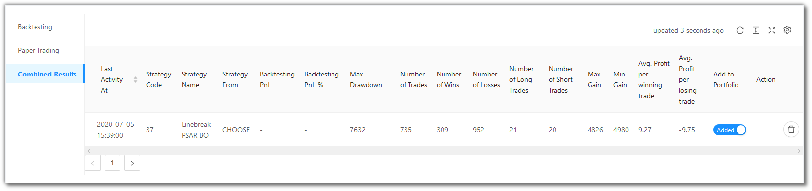

# Paper Trading and Backtesting

<iframe width="560" height="315" src="https://www.youtube.com/embed/wc0h930E1AU" frameborder="0" allow="accelerometer; autoplay; encrypted-media; gyroscope; picture-in-picture" allowfullscreen></iframe>

You can view and manage all your strategies of Paper Trading and Backtesting here.

There are 3 menu options here - `Backtesting`, `Paper Trading` and `Combined Results`.

## Backtesting/Paper Trading Fields
---
`Table Fields` - The table covers the following fields: Last Activity At, Code, Strategy, Tag, Source, Customize, Instrument(s), Qty. (Lots), Status, Reports, Logs, Add to Portfolio, Action.

## A look at the Backtesting/Paper Trading/Combined Results toolbar
---

`Refresh` - If you are not able to see an entry (possibly a most recent one) in the table, click Refresh to check again.

`Density` - Choose the density of the data you see. Options are Larger, Middle and Compact

`Full Screen` - The current tab on your browser goes Full Screen. Click again to go back to normal. This is similar to pressing F11 on most browsers and operating systems.

`Settings` - You can select which columns should be visible through here. 

## Table Fields for Backtesting and Paper Trading
---
The table covers the following fields: 

* `Last Activity At` - 
* `Code` - 
* `Strategy` - 
* `Tag` - 
* `Source` - 
* `Customize` - 
* `Instrument(s)` - 
* `Qty. (Lots)` - 
* `Status` - 
* `Reports` -
* `Logs` - 
* `Add to Portfolio` -
* `Action` - 

## Combined Results Fields
---
The table covers the following fields: 

* `Last Activity At` - 
* `Code` - 
* `Strategy` - 
* `Tag` - 
* `Source` - 
* `Backtesting PnL` - 
* `Backtesting PnL %` - 
* `Max Drawdown` - 
* `Number of Trades` - 
* `Number of Wins` - 	
* `Number of Losses` - 	
* `Number of Long Trades` - 	
* `Number of Short Trades` - 	
* `Max Gain` - 	
* `Min Gain` - 	
* `Avg. Profit per winning trade` - 
* `Avg. Profit per losing trade` - 
* `Add to Portfolio` -
* `Action` - 

!!! note
    The `Source` field will have one of the three values - CHOOSE, CHOOSE (TWEAK), BUILD_PYTHON (TWEAK). 
    
    Choose reflects in `Choose Strategy` from the `Summary Bar`.
    
    Choose Tweak reflects in `Tweak Strategy` from the `Summary Bar`.
    
    Choose Premium reflects in `Build Strategy` from the `Summary Bar`.
