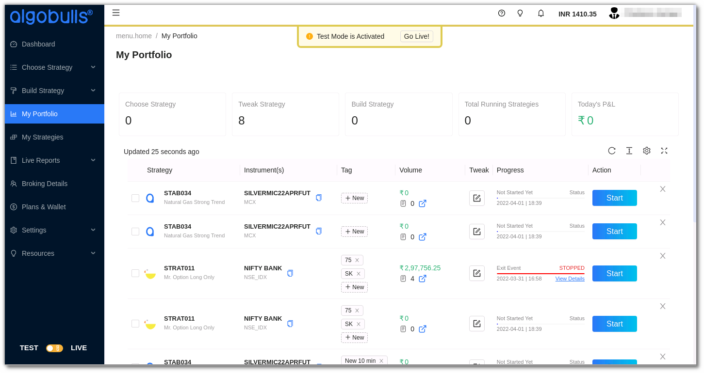
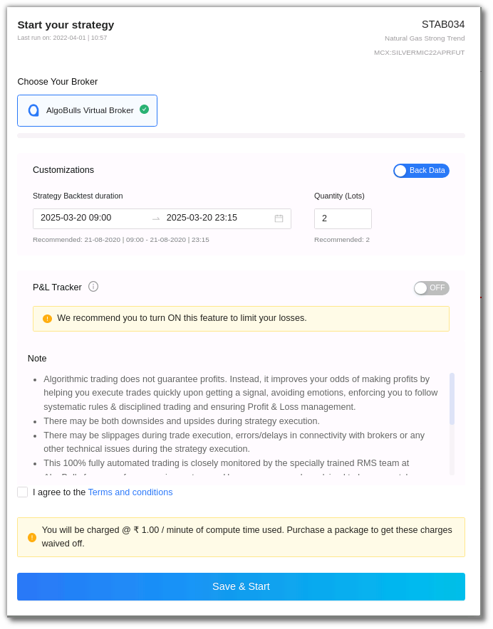
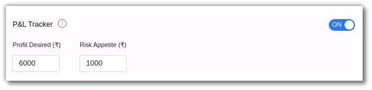

# P&L Tracker
The P&L Tracker feature allows you to gain profit or limit losses at (or near) predefined values for your plan. You can access the P&L Tracker when you start a strategy in the ‘My Portfolio’ section in Test or Live Mode. 

To use the P&L Tracker, first turn the toggle button ON, then enter the desired profit and risk appetite. 

The P&L Scan Frequency for Real Trading and Paper Trading is currently refreshed in 30 seconds. This may change in the future.

`Profit Desired` - Enter the desired profit amount here. This is the maximum profit you would like to make from this strategy, after which you would like the strategy to stop. If the strategy exceeds this amount, all positions will be squared off and the strategy will stop the execution. 

`Risk Appetite` - Enter the risk appetite amount here. This is the most loss that you would like to bear in this strategy, after which you would like the strategy to stop.  If the strategy exceeds this amount, all positions will be squared off and the strategy will stop the execution. 

This feature is available and live for:

`Test Mode` - Backtesting & Paper Trading 

`Live Mode` - Real Trading in Live Markets 

AlgoBulls Risk Management System will try its best to book your P&L at the given Profit Desired or limit it at the given Risk Appetite.

You can either enter both values or leave them blank. It is not allowed to enter one of the values while leaving the other value blank. In other words:

This feature can be turned ON by giving both values.

This feature can be turned OFF by keeping both values blank.

!!! NOTE 

        * Turn OFF this feature by using the toggle button, if you want to keep both the values blank 
        
        * For Real Trading - These values are not guaranteed as there are various factors into play outside the control of AlgoBulls systems, like market liquidity, momentum, delays introduced due to network, and so on.
        
        * For Real Trading - For P&L tracker to function effectively, please do not run multiple strategies on the same instrument(s).
        
