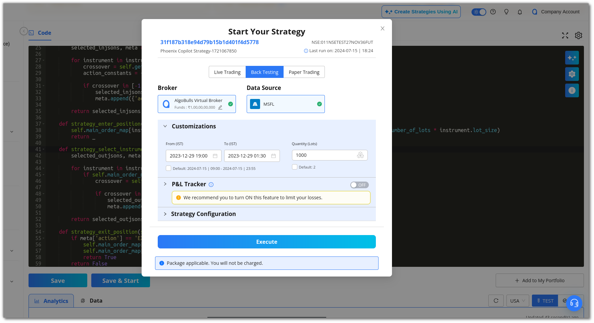
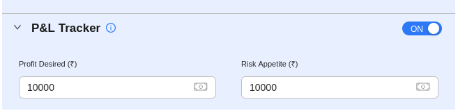

# P&L Tracker

<iframe width="560" height="315" src="https://www.youtube.com/embed/3f6iuMSCOLs" frameborder="0" allow="accelerometer; autoplay; encrypted-media; gyroscope; picture-in-picture" allowfullscreen></iframe>

## 1. Introduction

The P&L Tracker feature allows you to gain profit or limit losses at (or near) predefined values for your plan. You can access the P&L Tracker when you start a strategy in the **My Portfolio** section.

## 2. How to Use the P&L Tracker

Go to My Portfolio page and select a strategy you want to execute. Click **start** button in the action bar to open the **Execute modal**.

Turn the P&L toggle button **ON** after adding the **date, duration, and lots** in the customisation section. Then, enter the **desired profit and risk appetite** in the P&L Tracker.

Click on **Save & Start** after agreeing to the terms and conditions if you are in live mode. The strategy will then begin.

!!! note "Note"

    * The P&L **scan frequency** for **live trading and paper trading** is currently refreshed every **30 seconds**. This may change in the future.

    [Choose a strategy](https://app.algobulls.com/marketplace) from Odyssey and begin trading now!

## 3. Fields

**Profit Desired**: Enter the desired profit amount here. This is the maximum profit you would like to make from this strategy, after which the strategy will stop. If the strategy exceeds this amount, all positions will be squared off and the
strategy will stop execution.

**Risk Appetite**: Enter the risk appetite amount here. This is the maximum loss you are willing to bear for this strategy, after which the strategy will stop. If the strategy exceeds this amount, all positions will be squared off and the strategy
will stop execution.

!!! note "Note"
    * This feature is available for:
    
    i. Test Mode
    
    [Virtual Trading](https://help.algobulls.com/member/live-trading.html) (Backtesting & Paper Trading)
    
    ii. Live Mode
    
    [Live Trading](https://help.algobulls.com/member/virtual-trading.html) in Live Markets
    
    * AlgoBulls' Risk Management System will try its best to book your P&L at the given Profit Desired or limit it at the given Risk Appetite.
    
      * You can either enter both values or leave them blank. It is not allowed to enter one value while leaving the other blank. In other words:
          * This feature can be turned ON by providing both values.
          * This feature can be turned OFF by keeping both values blank.
          * Turn OFF this feature by using the toggle button if you want to keep both values blank.
    
      * **For Live Trading**: These values are not guaranteed as various factors outside the control of AlgoBulls' systems come into play, such as market liquidity, momentum, and delays introduced due to network issues. For the P&L tracker to function effectively, please avoid running multiple strategies on the same instrument(s).