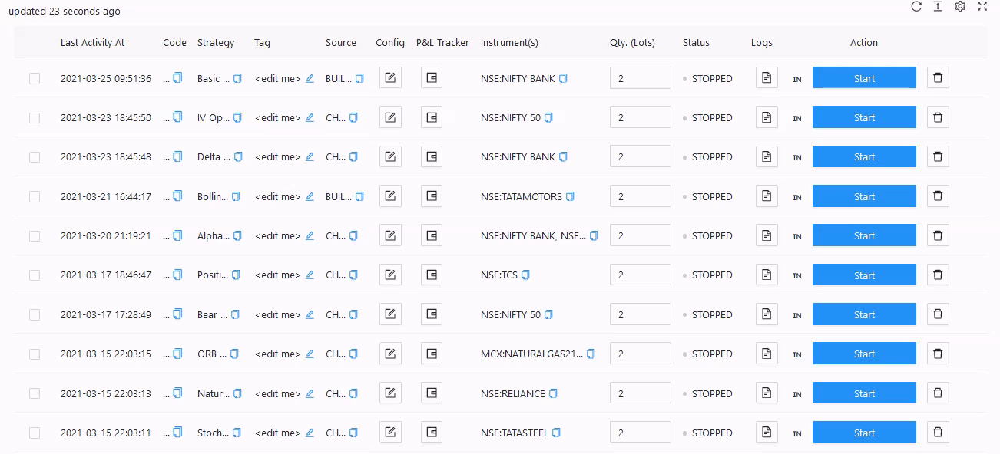

# P&L Tracker

Define your `Desired Profit` and `Risk Appetite` to trade for that particular instrument.

AlgoBulls Risk Management System will try its best to book your P&L at the given Profit Desired or limit it at the given Risk Appetite.

You can set and use the P&L Tracker values for Real Trading, Paper Trading, and Backtesting as well.

You can either give both values or keep both values blank. Giving one of the values and keeping the other value blank is not allowed.

In other words:

* P&L Tracker is enabled if both values are given.
  
* P&L Tracker is disabled if both values are blank.

This feature is in Beta mode, so if you are not sure, keep both values blank.

Currently, The P&L Scan Frequency for Real Trading and Paper Trading is 1 minute (i.e. 60 seconds). This may change in the future.

!!! note
        * For Real Trading - These values are not guaranteed as there are various factors into play outside the control of AlgoBulls systems, like market liquidity, momentum, delays introduced due to network, and so on.
