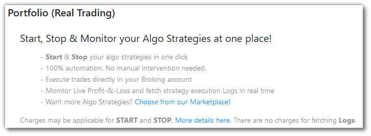
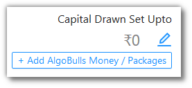
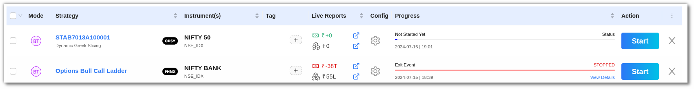

# Portfolio
    
<iframe width="560" height="315" src="https://www.youtube.com/embed/qC_Kbf1KwFg" frameborder="0" allow="accelerometer; autoplay; encrypted-media; gyroscope; picture-in-picture" allowfullscreen></iframe>

The Portfolio page is your complete overview of the strategies availed by you. 

If this page does not have any entries, you can add a strategy using the `Choose from our Marketplace!` link. 

Click the `+ Add AlgoBulls Money / Packages` button to add money into your account and/or choose a package taht suits your needs.

Click  to edit/set the `Capital Drawn Set Upto` field. (This feature is in beta, currently)

The `Summary Bar` shows the following metrics:

`Choose Strategy` - How many strategies from the [Marketplace](marketplace.md) are in your Portfolio.

`Tweak Strategy` - How many strategies have been tweaked by you.

`Build Strategy` - How many custom strategies have you gotten built from us.

`Total Running Strategies` - How many of the above 3 are running right now (during the market hours).

`Today's P&L` - Today's P&L value.

## Fields
---
The table covers the following fields: 

* `Last Activity At` - 
* `Code` - 
* `Strategy` - 
* `Tag` - 
* `Source` - 
* `Config` - 
* `Instrument(s)` - 
* `Qty. (Lots)` - 
* `Status` - 
* `Logs` - 
* `Action` - 

!!! note
    The `Source` field will have one of the three values - CHOOSE, CHOOSE (TWEAK), BUILD_PYTHON (TWEAK). 
    
    Choose reflects in `Choose Strategy` from the `Summary Bar`.
    
    Choose Tweak reflects in `Tweak Strategy` from the `Summary Bar`.
    
    Choose Premium reflects in `Build Strategy` from the `Summary Bar`.

## A look at the toolbar
---

`Refresh` - If you are not able to see an entry (possibly a most recent one) in the table, click Refresh to check again.

`Density` - Choose the density of the data you see. Options are Larger, Middle and Compact

`Full Screen` - The current tab on your browser goes Full Screen. Click again to go back to normal. This is similar to pressing F11 on most browsers and operating systems.

`Settings` - You can select which columns should be visible through here. 

