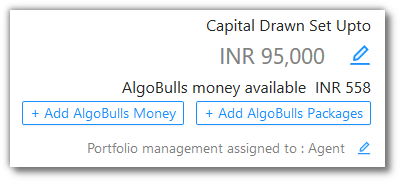

# Portfolio

The Portfolio page is your complete overview of the strategies availed by you. 

If this page does not have any entries, you can add a strategy using the `Choose Algo Strategy` link. 

Click the `Add AlgoBulls Money` button to add funds into your account.

These funds are used to fire trades through your account.

You can use the same AlgoBulls money in your wallet to purchase a package that suits your needs.

Click the `Add AlgoBulls Packages` button to [know more]() and choose a package.

Click  to edit/set the `Capital Drawn Set Upto` field.

You can also set/edit whether an agent will be mnanaging your Portfolio be checking out the `Portfolio management assigned to` field. 

The `Summary Bar` shows the following metrics:

`Choose Strategy` - How many strategies from the [Marketplace](member/marketplace.md) are in your Portfolio.

`Tweak Strategy` - How many strategies have been tweaked by you.

`Build Strategy` - How many custom strategies have you gotten built from us.

`Total Running Strategies` - How many of the above 3 are running right now (during the market hours).

`Today's P&L` - Today's P&L value.

## Fields
---
`Table Fields` - The table covers the following fields: Last Activity At, Strategy Code, Strategy Name, Strategy From, No of Trades, Current P&L, Quantity, Status, Logs, Action.

!!! note
    The `Strategy From` field will have one of the three values - Choose / Choose Tweak / Choose Premium. 
    
    Choose reflects in `Choose Strategy` from the `Summary Bar`.
    
    Choose Tweak reflects in `Tweak Strategy` from the `Summary Bar`.
    
    Choose Premium reflects in `Build Strategy` from the `Summary Bar`.

## A look at the toolbar
---

`Refresh` - If you are not able to see an entry (possibly a most recent one) in the table, click Refresh to check again.

`Density` - Choose the density of the data you see. Options are Larger, Middle and Compact

!!! info
    Ask J if the above can be
    
     * Larger / Normal / Smaller
     
     OR
     
     * Expanded / Standard / Compact 

`Full Screen` - The current tab on your browser goes Full Screen. Click again to go back to normal. This is similar to pressing F11 on most browsers and operating systems.

`Settings` - You can select which columns should be visible through here. 

