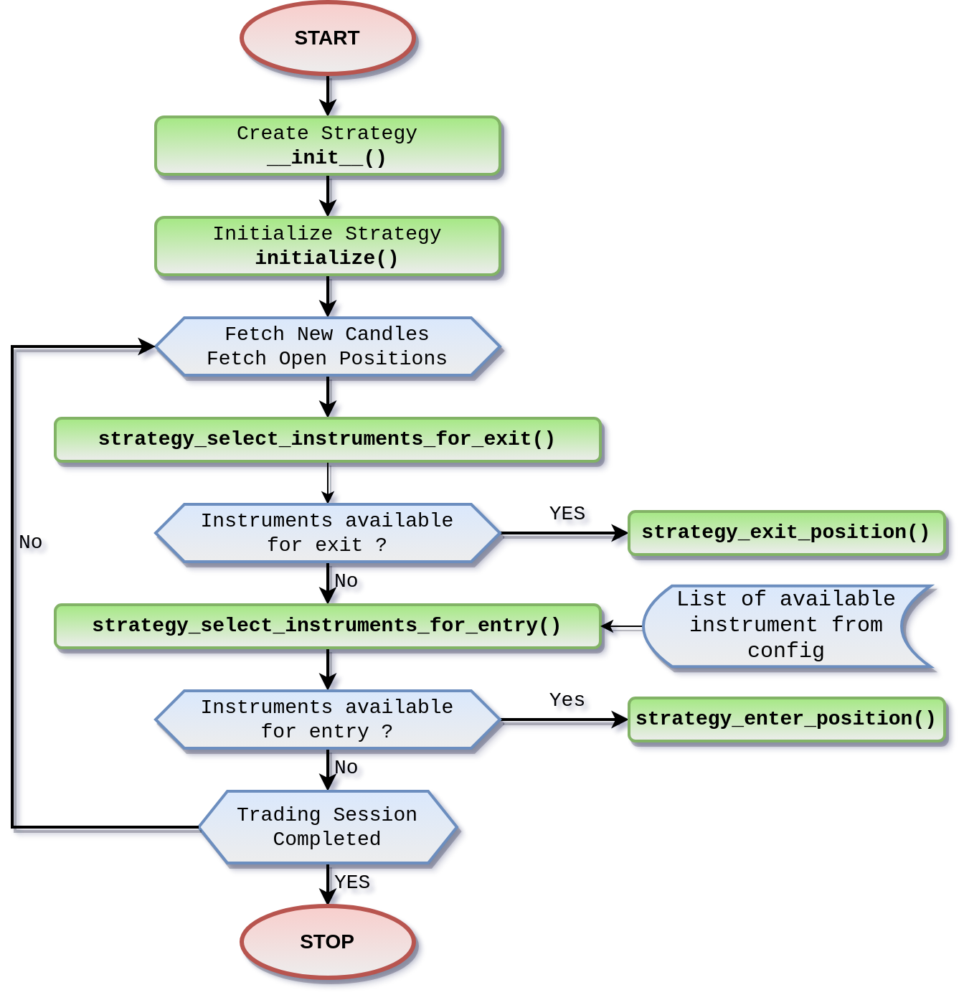

# Code Structure of Strategy

!!! Tips "Coding Prerequisites"
    * For pyalgotrading check [here](../../pyalgotrad/prerequisites.md).
    * For Phoenix Web check [here](../../python_build/python-build-getstarted.md).

## Methods

1. ### **strategy_select_instruments_for_entry()**  
  This function helps you choose which trading instruments you want your strategy to work with. The system will use this function to go through each instrument one by one, at each candle's time. You get to write code that decides whether to place an order for a specific instrument or not.

2. ### **strategy_enter_position()**  
  This function is where you can place orders for the instruments you selected earlier. It's executed for each instrument you picked in the previous function.

3. ###  **strategy_select_instruments_for_exit()**  
  After you've entered a position for an instrument, this function is called for each of those instruments at each candle interval. You can use it to decide whether an instrument should be exited from the position.

4. ###  **strategy_exit_position()**  
  In this function, you can close or exit positions for the instruments you marked for exiting in the previous function. It's done instrument by instrument.

---
## Supporting Methods
You have the following supporting methods:

1. ### **__init__()**
This method is like a starter for your strategy. It checks if the values you give it make sense and sets up some useful information for your strategy to use.

2. ### **initialize()**
This method is called when your strategy begins, both at the very start and at the beginning of each trading day. It's like setting up your strategy's workspace and giving your tools a starting position.

3. ### **name()**
This method gives your strategy a special name. It's like giving your strategy a unique nickname.

4. ### **versions_supported()**
This method lets you specify which version of the AlgoBulls Platform your strategy works well with. It's like saying, "My strategy is ready for this specific version of the platform."

---
## Utility Functions

You have the following utility function to be used in this strategy :

1. ### **get_crossover_value()**  
This handy function calculates something called the "crossover value" for you. It's like having a calculator that figures out this specific value for your strategy.

---

!!! Links
    - **[Strategy Structure (regular)](../../strategies/strategy_guides/common_regular_strategy.md)**
    - **[Strategy Structure (options)](../../strategies/strategy_guides/common_options_strategy.md)**

---

## Flowchart

Once you create your own strategy or use a ready strategy from the [pyalgostrategypool](https://github.com/algobulls/pyalgostrategypool) package, this is how it works internally on the AlgoBulls Core Trading Engine.

