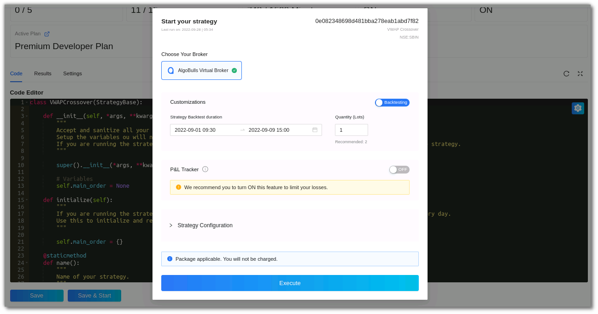
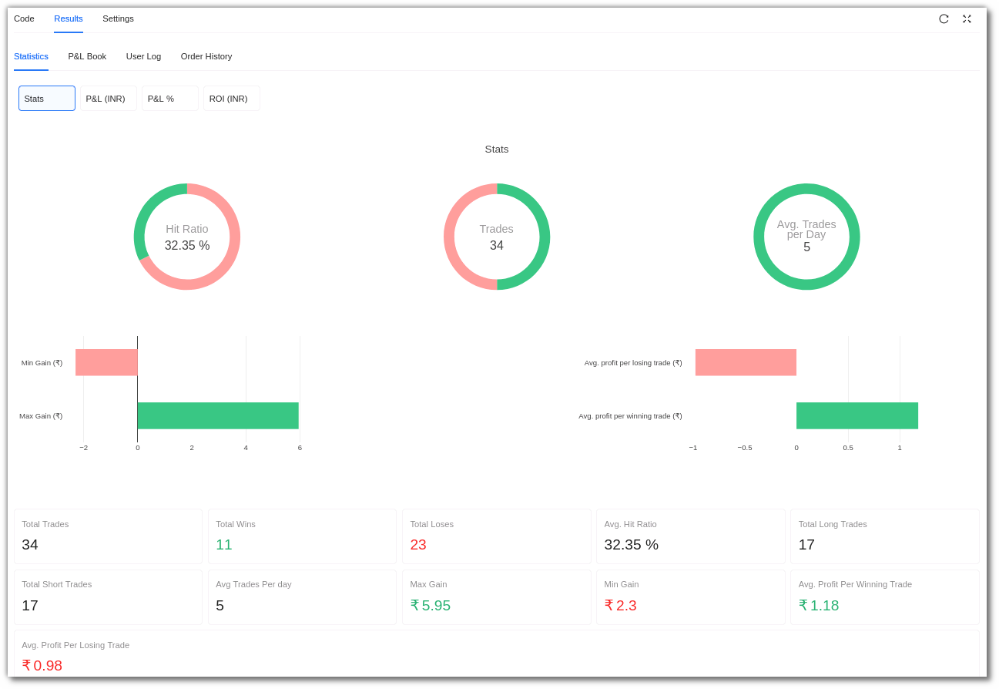
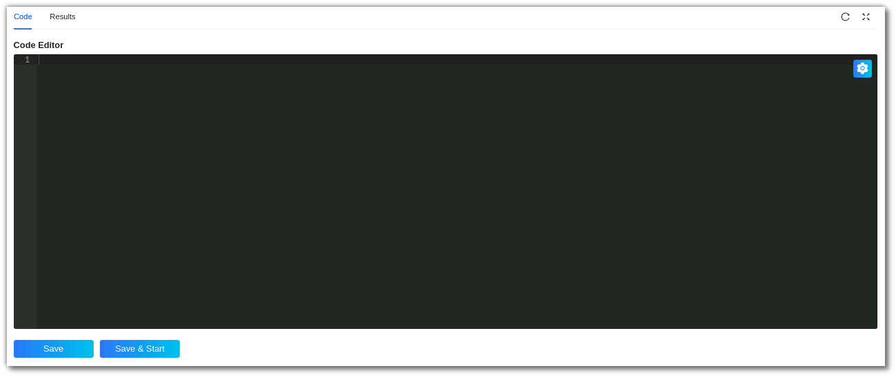
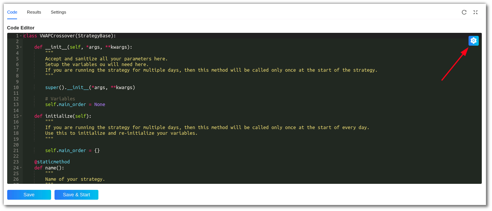

# Python Build

## 1. Introduction
---

Now you can code your own strategy easily using our Python Build service! Begin coding your own strategy from scratch or modify some of our readymade templates to suit your needs. Get access to our state-of-the-art AlgoBulls Core Trading Engine, which automatically leverages our infra so that you can access latest historical data to gauge the performance of your strategies. Tweak the various parameters of your strategy to choose the ideal instrument, indicator values, and profit loss percentages as per your needs! View the performance of your strategy using our visual analytics feature and continue to tweak till you are satisfied with the performance. Get your strategy approved for live trading from our experts and deploy it on 30+ supported brokers without coding any broker integration logic.

Go to **Build Strategy** in the sidebar navigation and select **Python Build** to know more

**An overview:**

**Running Strategies:** This section shows how many strategies are currently active and running in your account. 

**Strategies Saved:** This displays the number of strategies saved in your AlgoBulls account. 

**Time Consumed:** You can view the number of minutes that have been used for backtesting strategies.

!!! note "Note:"

    The use of backtesting is limited to one month. On weekends and after midnight (post 12 AM), you won't be able to backtest strategies.
 
**Analytics Support:** This shows whether or not your analytics support is active. Analytics support is not available to free plan users.

**Professional Support:** This section connects you to other professional support forums for additional support while developing the strategy. 

**Active Plan:** This section displays the current plan active on your AlgoBulls account. 

**Ready Templates:** Ready-to-use templates that you can modify and test.

**My Coded Strategies:** Strategies that have been coded and saved by you are displayed here. This includes new and modified strategies developed by you.

**Quick Help:** Resources to help you code better.

**How to get started with Python Build?**

To start developing your own strategy, you must first activate a plan from the **Plans & Wallet** section. Select the **Developers** option in the **Explore Plans** section and select a plan of your choice. There are currently two developer plans available:

* **Premium Developer Plan** - Develop your own Algorithmic Trading Strategy with Analytics support, concurrent Strategy Executions, Professional Support, and more.

* **Free Developer Plan** - Develop your own Algorithmic Trading Strategy for Free.

After selecting your preferred plan, you will be able to begin coding. You can either edit the pre-loaded **Ready Template** or use the **My Coded Strategies** section to create your own strategies.

**How to code strategies using Ready Templates?**

Select a template that you would like to modify from the **Ready Template** section. To view all the ready-to-use templates click on **More**.

Click on the **Code button** placed in the bottom right corner of the selected template to view the strategy code.

You should now see the **code editor**, where you can start modifying the code as required.

To save the strategy, click the Save button. This strategy will be added to your list of **My coded strategies**.

To test the strategy's performance, click the **Save & Start button**.

**Step 1**

After clicking **Save & Start**, a pop-up window will appear.

**Step 2**

In the **customizations** section choose **back data for backtesting** or **live data for paper trading**.

Select the duration option in the customizations section. Add the desired date and time, as well as the quantity/lots. In backtesting you will need to put the start date and end date along with time.

In paper trading you only need to add the start and end time.

**Step 3**

Once you scroll below,below you will see the P&L tracker. Switch the P&L tracker ON and enter your desired profit and risk appetite.

**Step 4**

In the Configuration section,section you can check the parameters added or modified by you. You can only view the configuration and not change it. To configure the parameters, go to the top right corner of the code editor and click the config button.
 
**Step 5**

Ensure you read the terms and conditions and then check the I agree to the Terms and conditions box. Save & Start the strategy.

Step 6

Go to the **Results** section to see how the strategy has performed.

!!! note "Note:" 

    Backtesting/Paper Trading would be available from Monday - Friday (excluding NSE holidays) from 9 AM to 11:30 PM. You can code your strategy & analyse the strategy results 24x7.

[//]: # ()
[//]: # (![pnltracker]&#40;imgs/python_build_plans.png&#41;)
[//]: # ()
[//]: # (![pnltracker]&#40;imgs/python_build_plans.png&#41;)
[//]: # ()
[//]: # (![pnltracker]&#40;imgs/python_build_plans.png&#41;)

You can **rename** a strategy by clicking the edit symbol besides the strategy name.

!!! note "Note:" 
    The Analytics & Graph sections are only visible to premium plan users. If you are using a free plan, switch to a [premium developer plan now](https://devel.appv2.algobulls.com/wallet/checkout?packageType=PackageCombo&plan=5&type=renew).

**How to view the Results?**

Switch to the Results tab after you run your strategy. Ensure that you have saved your strategy before switching tabs, as you may lose unsaved changes.
Premium developer plans users will be able to view the strategy analytics values & graphs while the free developer plan users can view the analytics value only in the Results section.

**Statistics:** In the statistics section you can view a strategy’s Stats, P&L (INR), P&L%, ROI (INR) and ROI % 

**i. Stats -** In this section you can see the hit ratio, number of trades, average trades per day.

**ii. P&L (INR) -** The cumulative backtesting P&L.

**iii. P&L % -** The cumulative backtesting P&L percentage.

**iv. ROI (INR) -** Cumulative P&L absolute value divided by minimum capital required, ROI indicates a simulated yet accurate representation of return on capital employed.

**v. ROI% -** You will be able to view the ROI in percentage here.

**vi. Equity Curve (INR) -** Find the Equity Curve here, formula used:

**Equity Curve = (Minimum Capital Required) + (P&L Cumulative)**

**vii. Drawdown % -** The maximum loss your strategy has encountered during the execution in percentage.

[**viii. The Graph Tool**](https://help.algobulls.com/member/strategy-card.html#6-graph-toolbar) 

**P&L Book:** You can view a strategy’s Gross Profit & Loss, Trading Volume & Total number of Trades. Premium users can view a heatmap for the same.

**User Log:** Real time logs are displayed in this section. You can download the logs too.

**Order History:** Displays the order status with a timestamp. 

**How to code a new strategy?**

If you want to create your own strategy, click on the **+ Sign** in the **Code New Strategy** option under the **My Coded Strategies** section.

A new blank code editor will open, allowing you to start coding your new strategy. After you've finished coding, click **Save** to save this strategy in the **My Coded Strategies** section.

If you wish to test the strategy’s performance click on **Save & Start**. The performance of the strategy will soon be available in the **Results** section.

You can rename a strategy by clicking the edit symbol besides the strategy name.

**How to Configure Strategy Parameters?**
You can only configure a strategy’s parameters when it is saved in the **My Coded Strategies** section.

You can configure the strategy’s parameters by clicking on the settings symbol on the top right corner of the code editor. In this section you can view a strategy’s parameters or edit these parameters too. 
