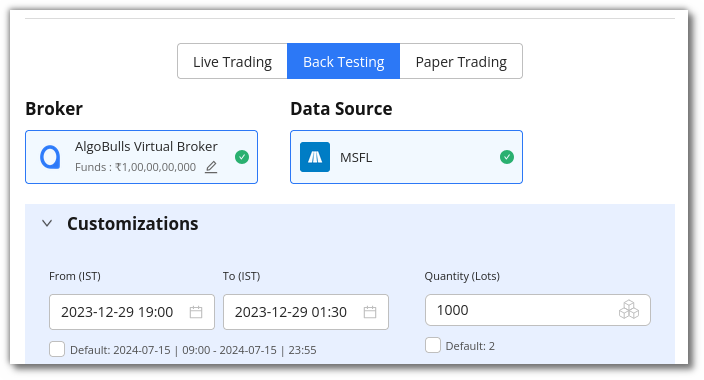
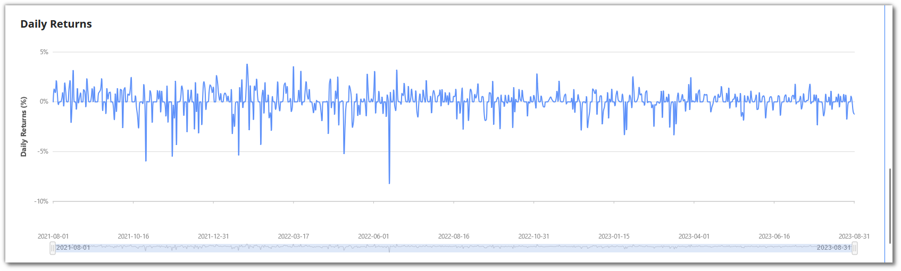

# Phoenix

## 1. Introduction
---

Now you can code your own strategies easily using our DIY(Do-It-Yourself) product called Phoenix. Begin coding your own strategy from scratch, or modify some of our ready-made templates to suit your needs. Additionally,
leverage our Generative AI technology to generate your strategy codes using plain english. Get access to our state-of-the-art AlgoBulls
Core Trading Engine, which automatically leverages our infra so that you can access the latest historical data to gauge the performance of your strategies. Tweak the various parameters of your strategy to choose the ideal instrument, indicator
values, and profit loss percentages as per your needs! View the performance of your strategy using our visual analytics feature and continue to tweak till you are satisfied with the performance.
Deploy it on 50+ supported brokers without coding any broker integration logic.

- Go to **Algo Products** section in the sidebar navigation and select **[Phoenix](https://app.algobulls.com/build/python)** to start your algotrading journey.

  

## 2. An overview
---

**Total Running Strategies:** This section shows how many strategies are currently active and running concurrently in your account.

**LT Running Strategies:** This section shows how many **Live Trading** strategies are currently active and running concurrently in your account.

**Strategies Saved:** This displays the number of strategies saved in your AlgoBulls account. It also shows the number of maximum strategies that you can save as per your current plan.

**Execution Time Consumed:** You can view the number of minutes that have been used for Backtesting or Paper Trading your strategies.

**Analytics Support:** This shows whether your analytics support is active. Analytics support is not available to free plan users.

**Professional Support:** This section connects you to other professional support forums for additional support while developing the strategy.

**Active Plan:** This section displays the current plan active on your AlgoBulls account.

**Ready Templates:** Ready-to-use templates that you can modify and test.

**My Coded Strategies:** Strategies that have been coded and saved by you are displayed here. This includes new and modified strategies developed by you.

**Quick Help:** Resources to help you code better.

## 3. How to get started with Phoenix?
---

- To start developing your own strategy, you must first activate a plan from the **[Pricing](https://app.algobulls.com/wallet)** page. Select **[Phoenix](https://app.algobulls.com/wallet?category=Developers)** from the **Pricing** category tab and
  choose a plan of your choice.

  

- After selecting your preferred plan, you will be able to begin coding. You can either edit the preloaded **Ready templates** or use **My Coded Strategies** section to create your own strategies or click on **Create Strategies Using AI** to get your
  strategy generated using **Phoenix Copilot**.

## 4. How to code strategies using Ready Templates?
---

- Select a template that you would like to modify from the **Ready Template** section. To view all the ready-to-use templates click on **[View All](https://app.algobulls.com/build/python?key=samplestrategies)**.

  

- Click on the **Code button** placed in the bottom right corner of the selected template to view the strategy code.

  

You should now see the **code editor**, where you can start modifying the code as required.

To save the strategy, click the Save button. This strategy will be added to your list of **My coded strategies**.

Follow these simple steps to test the strategy's performance

**Step 1**

Click on **Save & Start** button, a pop-up window will appear.

**Step 2**

In the **Execute modal** that appears, choose **Backtesting** to back test or **Paper Trading** to Paper Trade a strategy.

Select the duration option in the customisations section. Add the desired date and time, as well as the quantity/lots. In Backtesting you will need to put the start date and end date along with time.

In Paper Trading, you only need to add the start and end time.

**Step 3**

Once you scroll below, you will see the P&L tracker. Switch the P&L tracker ON and enter your desired profit and risk appetite. To keep things simple, you can also leave it turned off.

**Step 4**

In the Configuration section, you can check the parameters added or modified by you.

**Step 5**

To begin testing the strategy, click on Execute.

## 5. How to view the Results?
---

View the performance of your strategy in the Analytics/Data section. Go to the **Analytics** section to see how the strategy has performed.

* You can analyse your strategy output using various charts and heatmaps shown below.

- Cumulative Returns

  

- Profit and Loss (P&L)

  

- EOY (End of Year) Returns

  

- Monthly Returns (%)

  

- Daily Returns

  

- Underwater Drawdown Plot

  

- Heatmap

  

- You can also check P&L table and Logs by clicking on **Data** button.

- Logs

  

- P&L Table

  

## 6. You can **rename** a strategy by clicking the edit symbol besides the strategy name.
---

## 7. Choose Layout
---

- There are three layouts to view your strategy. You can select layout by clicking on the settings wheel icon on the right side.

  

- The Following three modes will look like this.

  

## 8. How to code a new strategy?
---

- If you want to create your own strategy, click on the **+ Sign** in the **Code New Strategy** option under the **My Coded Strategies** section.

- A new blank code editor will open, allowing you to start coding your new strategy. You can check out the basic building blocks of a strategy [here](https://algobulls.github.io/pyalgotrading/strategies/strategy_guides/common_strategy_guide/) to help you with your code structure. After
  you've finished coding, click **Save** to save this strategy in the **My Coded Strategies** section.

- Next, you need to configure the strategy’s parameters by clicking on the settings symbol in the top right corner of the code editor. In this section you can add, view & edit the strategy parameters.

- To test the behaviour and performance of the strategy, click on **Save & Start** and follow the directions given earlier. The performance of the strategy will soon be available in the **Results** section.

## 9. How to Configure Strategy Parameters?
---

- You can configure the strategy’s parameters by clicking on the settings symbol in the top right corner of the code editor. In this section, you can view a strategy’s parameters or edit these parameters too.

  

- To know more about the parameters, [click here](https://help.algobulls.com/member/tweak.html).

  

- **User Parameters:** In this section, you can change instruments, customise/create your own parameters for the strategy. Click on **+Add New Parameter** to begin adding them. They should match with the parameters you have defined in your Python
  class.

## 10. Live Test Mode
---

- Phoenix gives support to run strategy in Live and Test mode. So user can choose to see results for the strategy in different modes. User can select the Live/Test mode using the Live/Test button.

  

