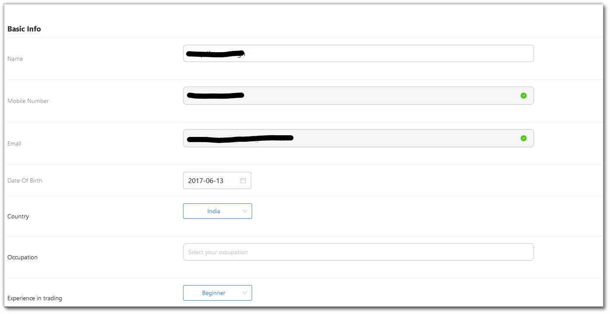
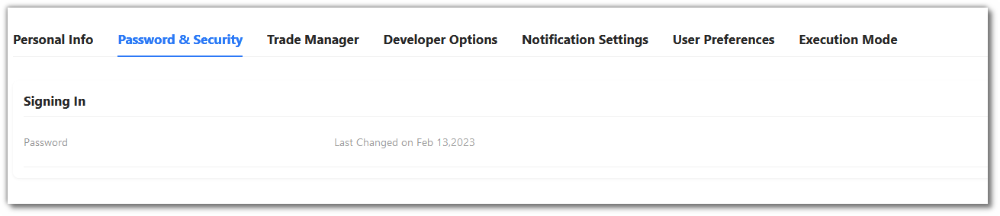
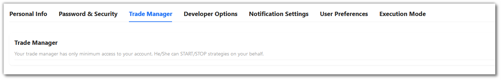
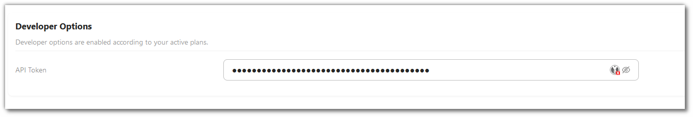
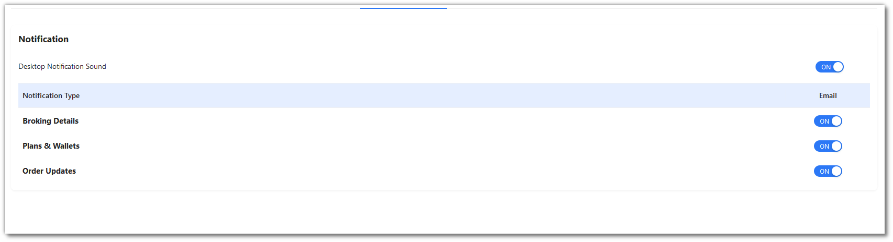
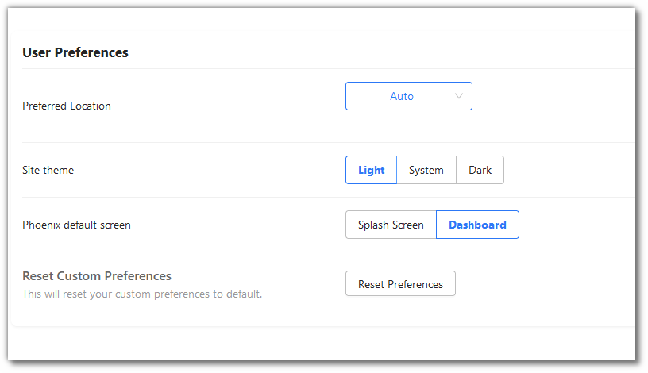
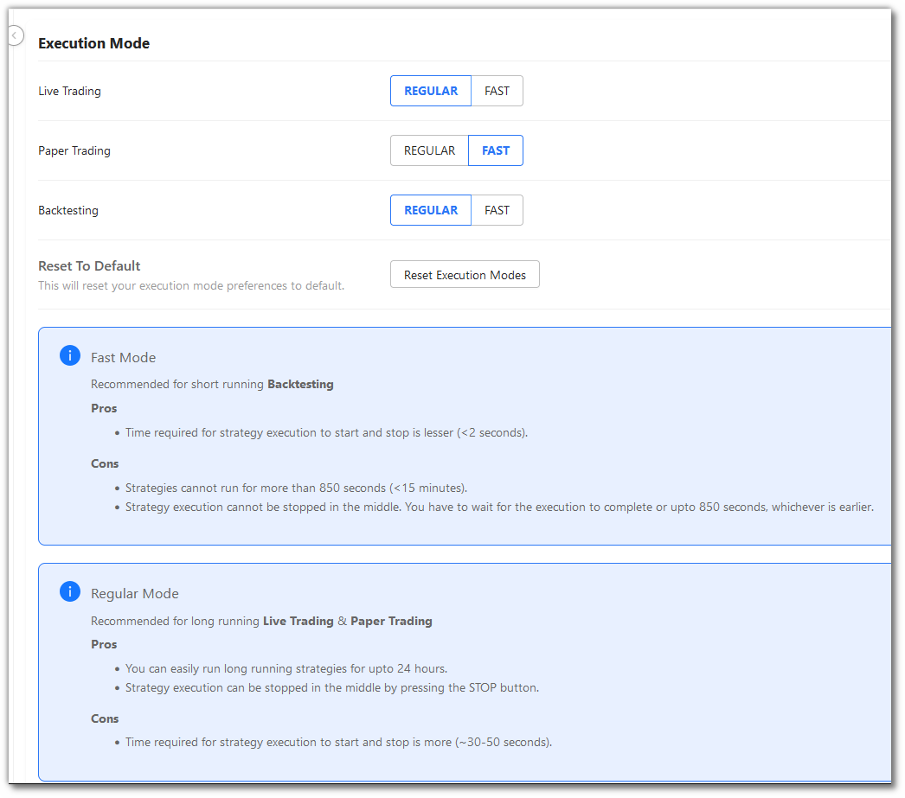

# Settings

The AlgoBulls Settings page allows users to customise their account and trading experience. Below is a detailed description of each section and its functionalities.

## Accessing the Settings Page

You can access the settings page by visiting [AlgoBulls Settings](https://app.algobulls.com/settings).

## Sections and Features

### 1. **Personal Info**
   - **Basic Info**: Update personal details including Name, Mobile Number, Email, Date of Birth, Country, Occupation, and Trading Experience. These informations are necessary for better service and we suggest to fill these details properly, so that we can provide you custom features and better experience.
   - **Detailed Profiling**:
     - **Trading Goals**: Select your trading goals.
     - **Preferred Trading Style**: Choose your preferred trading style.
     - **Current Challenges in Trading**: Share your current challenges.
     - **Coding Experience**: Indicate your coding experience level.
     - **Favorite Trading Platforms/Tools**: List your favorite tools.
     - **Preferred Learning Methods**: Select how you prefer to learn.
     - **Main Source of Trading Information**: Choose your primary source of information.
     - **Interested Products**: Select from Phoenix and Odyssey.
     - **Link Social Media Accounts**: Connect LinkedIn, Twitter, Facebook, Instagram, and YouTube.

### 2. **Password & Security**
   - **Signing In**: View and update your password.
   - **Password Last Changed**: Display the date when the password was last changed.

### 3. **Trade Manager**
   - **Access**: Your trade manager has limited access and can only START/STOP strategies on your behalf.

### 4. **Developer Options**
   - **API Token**: Manage your API tokens.
   - **Developer Options**: Enabled according to your active plans.

### 5. **Notification Settings**
   - **Desktop Notification Sound**: Toggle sound notifications.
   - **Notification Types**:
     - **Email**: customise email notifications for Broking Details, Plans & Wallets, and Order Updates.

### 6. **User Preferences**
   - **Preferred Location**: Set your preferred location.
   - **Site Theme**: Choose between Light and Dark themes.
   - **Phoenix Default Screen**: Select between Splash Screen and Dashboard.
   - **Reset Custom Preferences**: Reset to default custom preferences.

### 7. **Execution Mode**
   - **Live Trading**: Choose between REGULAR and FAST modes.
   - **Paper Trading**: Choose between REGULAR and FAST modes.
   - **Backtesting**: Choose between REGULAR and FAST modes.
   - **Reset to Default**: Reset execution mode preferences to default.

## Support

For assistance, contact AlgoBulls support at [support@algobulls.com](mailto:support@algobulls.com) or visit our [Help Center](https://support.algobulls.com).
