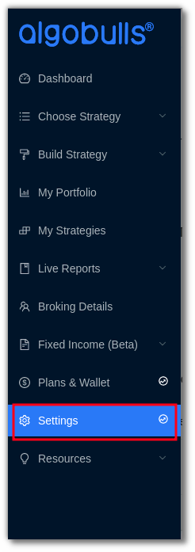
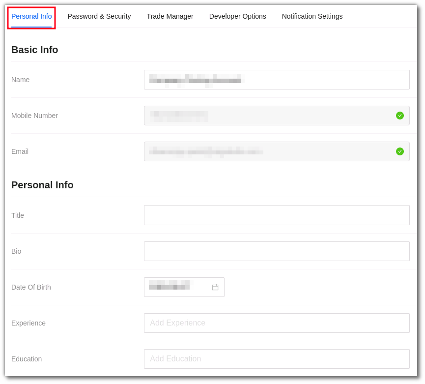
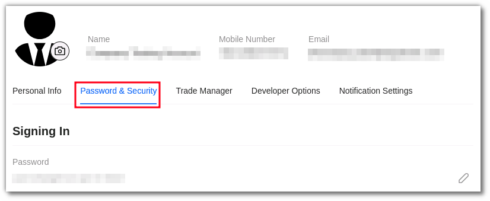

# Settings

Add or edit your basic profile, set your trading risk, grant access to your trading manager, and explore your developer options.

The Settings section is divided into 4 parts: 

## Personal Info

You add or edit your personal details here 

`Name` - Your full name. Preferably, in accordance with a legal document, such as an Aadhar Card.

`Avatar` – The 'Change Avatar' button allows you to upload or change your profile picture.
 
`E-mail` - Your relationship manager or an AlgoBulls representative will reach out to you via email or phone.
    
`Phone Number` - This displays the phone number you registered with. This field is not editable.
    
`Date of Birth` - Set up your date of birth.
    
`Aadhar Card` - Your Aadhar ID number.
    
`PAN Card Number` – This is the number on your PAN Card. 
    
`Title` - A suitable one liner description for your bio.
    
`Bio` - A short About Me section that allows us to learn more about you and interact with you suitably. Any links to your LinkedIn profile or other social media accounts are also beneficial.
    
`Experience` - If we know the degree of your market knowledge, our experts will be able to connect with you more effectively over the phone/email.
    
`Education` - If we know whether you have any past financial background, our specialists will be able to connect with you more effectively over the phone/email. (For example, Commerce, MBA Finance, and so on.)

## Password & Security

You can edit your password and check other security options here 

## Trade Manager

Enter your agent's details here if your AlgoBulls platform account will be managed by them.

!!! NOTE - 

    Please do not share your AlgoBulls credentials with your agent. Once you add your agent details here, the agent gets a separate set of credentials with limited account access to manage your trades.
    
    AlgoBulls will not be responsible for any issues occurring because of deliberate or leaked credentials of your account.

## Developer Options

We offer the Python Build service to the developers through our platform. Developers can use the [pyalgotrading](https://github.com/algobulls/pyalgotrading/)  package to create and test their own strategies. To learn more, visit the [Developer Options](../developers.md)  Help page.
