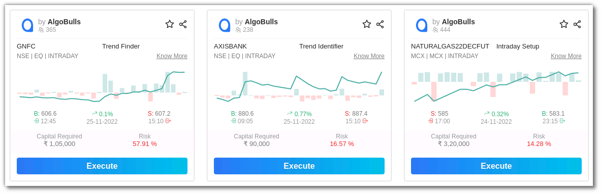

# Strategist Profile

## Introduction
AlgoBulls provides a variety of trading strategies, but the brains behind these strategies are market experts who work extremely hard to create complex yet simple strategies. The Strategist profile will help you recognize the strategist's work and strategies. Let’s take a look at what the strategist profile offers

## Strategist Details

View the strategist's details such as Name, Bio & Contact Information.

## Strategist Profile Summary

Get the strategist’s profile summary details such as the total number of strategies, deployments, trades, wins, total loss, long trades, short trades, max gain, and more.

## Explore the market experts’ strategies

Explore the strategies developed by the strategist as per the marketplace. Analyze the growth, trading volume, and total trades of the strategists' strategy using the Heatmap. The marketplace is divided into 3 parts - Retail, Premium & HNI.

The Retail Marketplace displays all retail strategies. View the Premium Marketplace to see all premium strategies, and the HNI Marketplace features all HNI Strategies.

## Strategy Cards

View the Strategy Cards created by the market expert here.

## Filters

Use this search bar to look for strategies developed by the strategist. You can Filter or Sort these strategies. You can also search the strategies based on their duration.

## Pagination

You can click the < and > for changing pages. You can also choose to view 4/8/12 strategies per page.

## Density

Adjust the density by choosing the compact, regular or list mode.

### 1. Compact Mode

In this mode, the strategies are displayed in a compact view. You can click on the know more button to view the whole strategy.

### 2. Regular Mode

This is the AlgoBulls' default mode. In comparison to any other mode, the strategy card in regular mode has the most information.

### 3. List Mode

This mode displays all the strategies in the marketplace in a list view.

